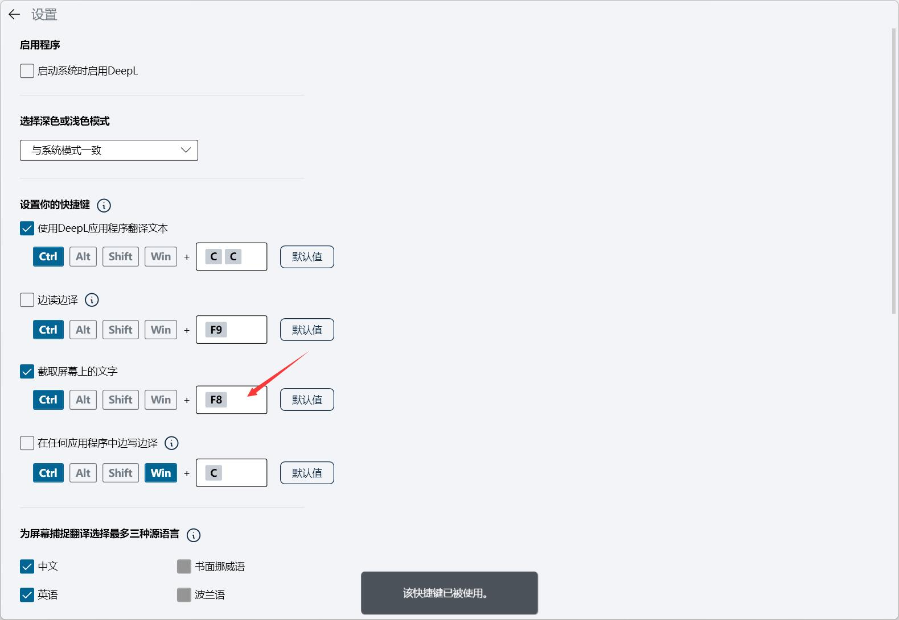
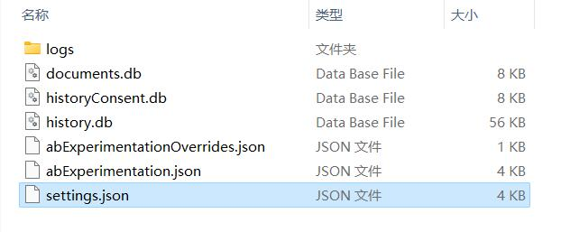
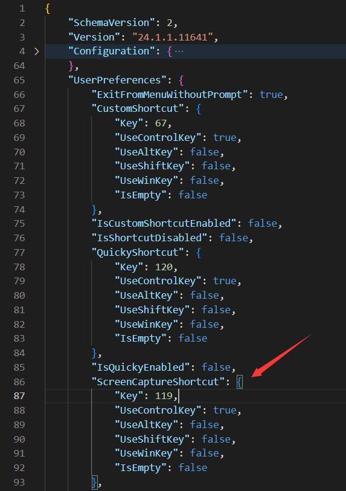
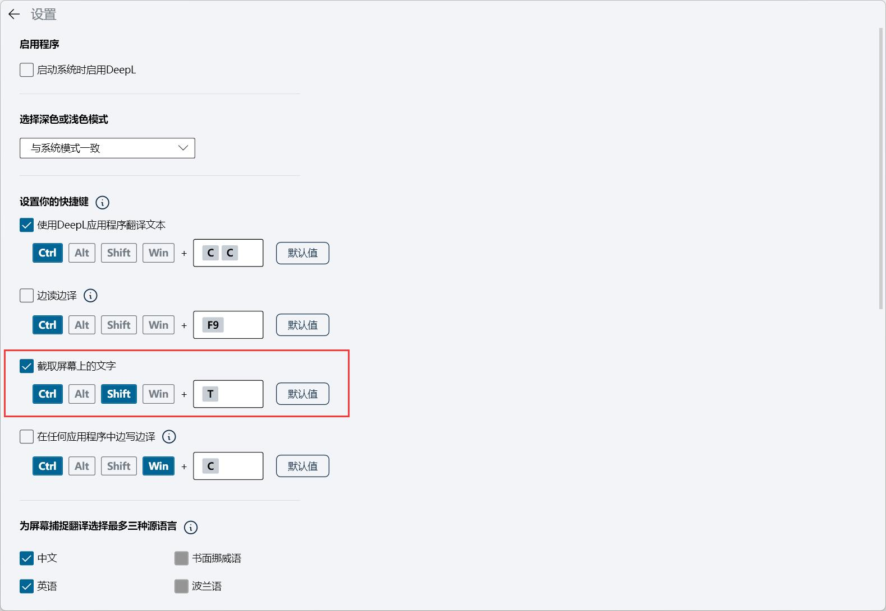

最近使用DeepL，想配置截屏翻译的快捷键为`Ctrl`+`Shift`+`T`，结果在我的电脑上修改时不管按什么键，都显示"该快捷键已被使用"。

<!-- @xprops width="100%" filterDarkTheme -->



#### 解决办法：直接修改配置文件

找到路径`C:\Users\你的用户名\AppData\Roaming\DeepL_SE`下的`settings.json`文件。

<!-- @xprops width="600px" -->



打开以后（用记事本就可以）搜索字符串`ScreenCaptureShortcut`，看到快捷键的配置，`119`（十六进制为`0x77`）就是`F8`对应的键码：

<!-- @xprops width="500px" -->



从微软的[Virtual-Key Codes表](https://learn.microsoft.com/en-us/windows/win32/inputdev/virtual-key-codes)查到`T`键对应`0x54`也就是`84`；<br>因此把`"Key"`修改为`84`；然后因为我想设置为同时使用`Ctrl`+`Shift`，还要把`"UseShiftKey"`改为`true`。

```js
"ScreenCaptureShortcut": {
    "Key": 84,
    "UseControlKey": true,
    "UseAltKey": false,
    "UseShiftKey": true,
    "UseWinKey": false,
    "IsEmpty": false
},
```

> 注意：修改配置文件的时候要退出DeepL！

修改以后保存、关闭、再打开DeepL就发现已经更改了，经测试可以正常使用。

<!-- @xprops width="100%" filterDarkTheme -->


