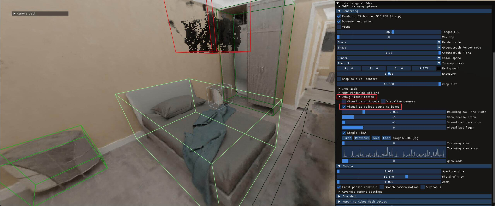
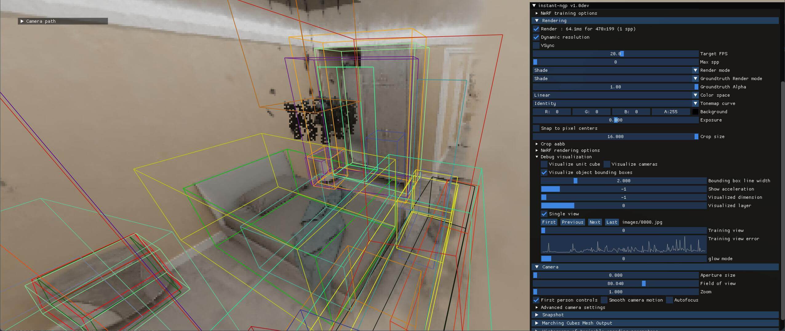

## 说明

复现仓库：[https://github.com/lyclyc52/NeRF_RPN](https://github.com/lyclyc52/NeRF_RPN)

这项研究在NeRF中引入RPN，用于3D物体检测和相关任务。作者提供了改写的Instant-NGP以供可视化3D提议框。我自己在尝试复现的时候绕了一些弯子，因此借这篇博客复盘一下当时的过程。仓库提供的脚本多为适用于Linux系统的`.sh`文件，而我自己的设备是Windows系统，因此示例中会给出适用于Windows系统的相应指令。

## 环境相关

### 克隆仓库

```bash
git clone https://github.com/lyclyc52/NeRF_RPN.git NeRFrpn
```

环境配置参照[官方仓库说明文档](https://github.com/lyclyc52/NeRF_RPN)即可。

### 配置Instant-NGP Fork for NeRF Feature Extraction

作者修改了Instant-NGP的仓库，添加了一些包括可视化bbox在内的功能。说明文档在[这里](https://github.com/zymk9/instant-ngp/tree/master/scripts)。

```bash
git clone --recursive https://github.com/zymk9/instant-ngp.git InstantNGPforked
```

这是Instant-NGP一个早期版本，执行下面的命令运行`build`过程。更多细节可以参考[这里](https://github.com/zymk9/instant-ngp)。

```bash
cd InstantNGPforked
cmake . -B build
cmake --build build --config RelWithDebInfo -j
```

> #### 问题解决
>
> #### git clone 失败，报错 fatal: early EOF
>
> 报错：
>
> ```text
> error: xxxx bytes of body are still expected
> fetch-pack: unexpected disconnect while reading sideband packet
> fatal: early EOF
> fatal: fetch-pack: invalid index-pack output
> ```
>
> 解决：增大缓冲区（`1048576000`是`1G`）
>
> ```bash
> git config --global http.postBuffer 1048576000
> ```
>
> #### 子模块没有一次性下载成功
>
> 解决：进入目录手动重新下载
>
> ```bash
> cd InstantNGPforked
> git submodule update --init --recursive
> ```

### 下载数据集

作者提供了数据集的[OneDrive链接](https://hkustconnect-my.sharepoint.com/:f:/g/personal/bhuai_connect_ust_hk/Ekjf3YC0W9BMsc-jHWXI4xEBy5s_OJBLEbebNVIprd4zMg?e=FgbN9S)，这里以`3D-FRONT`数据集作为例子，需要从作者提供的链接中下载`front3d_nerf_data.zip`和`front3d_rpn_data.zip`。

假设数据集解压的路径为`E:\front3d_nerf_data`和`E:\front3d_rpn_data`。

### 可视化数据集

在完成上面步骤后，就可以先利用Instant-NGP的UI可视化数据集中标注的Ground Truth了，这里以场景`3dfront_0004_00`为例：

```bash
cd InstantNGPforked
.\build\testbed --scene E:\front3d_nerf_data\3dfront_0004_00\train
```

执行上述命令后，勾选UI`Debug visualization`下的`Visualize object bounding boxes`就可以看到如下结果：

<!-- @xprops width="100%" -->



### 下载预训练的权重

本博客给出的示例需要在上面的OneDrive链接中下载`nerf_rpn_model_release\front3d_anchor_resnet50.pt`。

假设预训练权重保存的路径为`NeRFrpn\\nerf_rpn\weights\front3d_anchor_resnet50.pt`。

## 生成proposals

接下来，利用预训练的权重，写一个`test`脚本生成提议框。

```bash
# NeRFrpn\nerf_rpn\test.bat

set DATA_ROOT=E:\front3d_rpn_data
cd NeRFrpn\nerf_rpn

python -u run_rpn.py ^
    --mode "eval" ^
    --dataset_name front3d ^
    --resolution 160 ^
    --backbone_type resnet ^
    --features_path %DATA_ROOT%\features ^
    --boxes_path %DATA_ROOT%\obb ^
    --dataset_split %DATA_ROOT%\3dfront_split.npz ^
    --save_path .\results\front3d_test ^
    --checkpoint .\weights\front3d_anchor_resnet50.pt ^
    --rpn_nms_thresh 0.3 ^
    --normalize_density ^
    --rotated_bbox ^
    --batch_size 1 ^
    --gpus 0 ^
    --output_proposals
```

由于我的设备显存小，所以把`batch_size`改为了`1`。原始的参数是`2`。

运行后会在`NeRFrpn\\nerf_rpn\\results\\front3d_test`中得到`eval.json`文件和储存了`17`个测试场景的提议框的`proposals`目录。

> #### 问题解决
>
> #### CUDA device 不匹配
>
> 报错：
>
> ```text
> RuntimeError: Attempting to deserialize object on CUDA device 4 but torch.cuda.device_count() is 1.
> Please use torch.load with map_location to map your storages to an existing device.
> ```
>
> 解决：在`run_rpn.py`找到下面这行代码：
>
> ```python
> checkpoint = torch.load(args.checkpoint)
> ```
>
> 我的设备上只有一个GPU，因此修改为：
>
> ```python
> checkpoint = torch.load(args.checkpoint, map_location={'cuda:4':'cuda:0'})
> ```

## 运行proposals2ngp.py

下一步是生成Instant-NGP所需的`transform.json`。

```bash
# NeRFrpn\nerf_rpn\proposals2ngp.bat

set DATA_DIR=E:\
cd NeRFrpn\nerf_rpn

python scripts\proposals2ngp.py ^
    --bbox_format obb ^
    --dataset front3d ^
    --dataset_path %DATA_DIR%\front3d_nerf_data ^
    --features_path %DATA_DIR%\front3d_rpn_data\features ^
    --proposals_path .\results\front3d_test\proposals ^
    --output_dir .\results\proposals_to_ngp
```

运行后会在`NeRFrpn\\nerf_rpn\\results\\proposals_to_ngp`中得到`17`个测试场景的`3dfront_xxxx_xx.json`文件。

接下来，把文件`3dfront_0004_00.json`复制到路径`E:\\front3d_nerf_data\\3dfront_0004_00\\train`下，然后启动Instant-NGP的UI并指定这个新的`json`文件：

```bash
cd InstantNGPforked
.\build\testbed --scene E:\front3d_nerf_data\3dfront_0004_00\train\3dfront_0004_00.json
```

可以看到如下结果：

<!-- @xprops width="100%" -->



## 文件结构参考

这里展示了前面我们生成、或需要用到的各个文件的路径示意。注意这并不是仓库中的全部内容，而是只展示了前面提及的文件。

```text
<work_dir>
├── InstantNGPforked
└── NeRFrpn
    └── nerf_rpn
        ├── results
            ├── front3d_test
                └── proposals
                        3dfront_0004_00.npz
                        3dfront_0019_00.npz
                        ...
                        3dfront_1006_02.npz
                        3dfront_1014_02.npz
                    eval.json
            └── proposals_to_ngp
                    3dfront_0004_00.json
                    3dfront_0019_00.json
                    ...
                    3dfront_1006_02.json
                    3dfront_1014_02.json
        ├── scripts
                proposals2ngp.py
        └── weights
                front3d_anchor_resnet50.pt
            proposals2ngp.bat
            test.bat

E:\
├── front3d_nerf_data
    ├── 3dfront_0000_00
    ├── 3dfront_0000_01
    ├── ...
    ├── 3dfront_0004_01
        ├── overview
        └── train
            └── images
                model.msgpack
                transforms.json
                3dfront_0004_00.json (copied from NeRFrpn\nerf_rpn\results\proposals_to_ngp)
    ├── ...
    ├── 3dfront_1015_02
    └── 3dfront_1015_04
└── front3d_rpn_data
```
