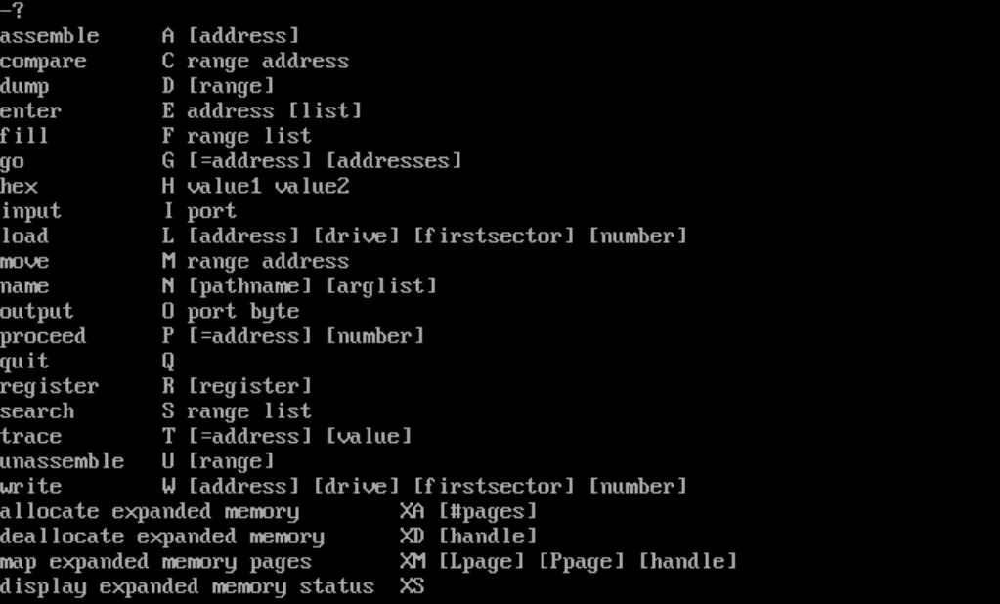
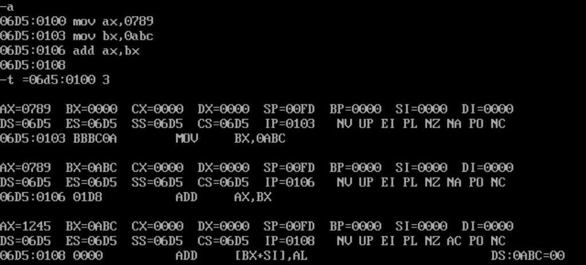
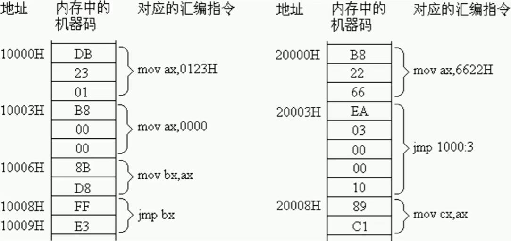
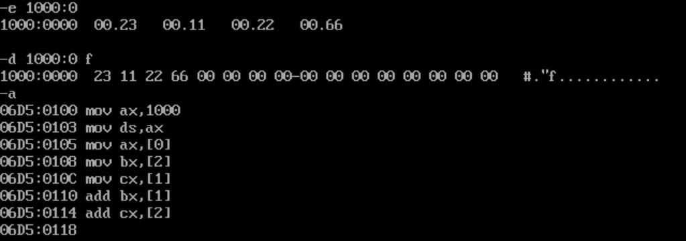
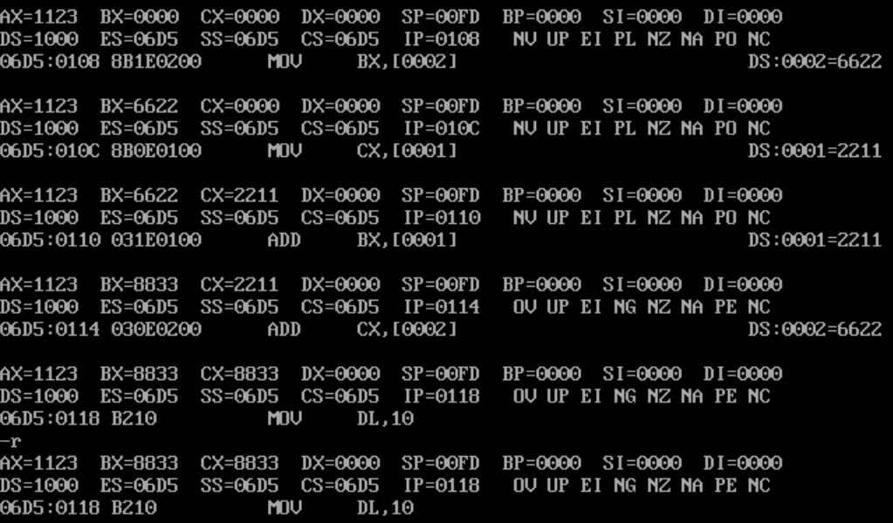
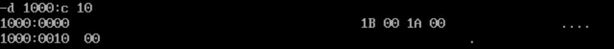
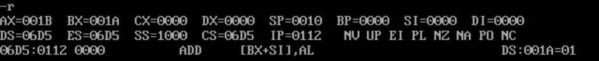

## 前言

汇编指令是机器指令的助记符，相当于把本是`01`串的机器指令，用便于人类理解的字符表示出来。汇编指令表达的语义与机器指令是一样的。汇编程序的主体是汇编指令。

对于不同的硬件平台，汇编指令集都是不同的。这里学习的是8086 CPU的汇编语言。

## 环境配置

- DOSBox：[https://www.dosbox.com/](https://www.dosbox.com/)
- MASM（民间版本）：[https://github.com/froginwell/assembly/tree/master/software](https://github.com/froginwell/assembly/tree/master/software)
- MASM（[B站教学](https://www.bilibili.com/video/BV1Wu411B72F)版本）：[8086汇编环境](/files/8086_asm_env.zip)

`dosbox.conf`文件拉到最下，`[autoexec]`部分添加：

<!-- @xprops diffAddedLines="3-4" -->

```text
[autoexec]
# Lines in this section will be run at startup.
mount C: <path/to/masm>
C:
```

下次启动DOSBox时会自动挂载`C`盘到`masm`目录。

## 寄存器

8086 CPU有`14`个寄存器，包括：

- 通用寄存器：`AX`、`BX`、`CX`、`DX`
- 变址寄存器：`SI`、`DI`
- 指针寄存器：`SP`、`BP`
- 指令指针寄存器：`IP`
- 段寄存器：`CS`、`DS`、`SS`、`ES`
- 标志寄存器：`PSW`

对应的名称及释义如下：

| 寄存器名 | 英文                  | 解释               |
| -------- | --------------------- | ------------------ |
| `AX`     | `Accumulator`         | `累加器`           |
| `BX`     | `Base`                | `基址寄存器`       |
| `CX`     | `Counter`             | `计数寄存器`       |
| `DX`     | `Data`                | `数据寄存器`       |
| `SI`     | `Source Index`        | `源变址寄存器`     |
| `DI`     | `Destination Index`   | `目的变址寄存器`   |
| `SP`     | `Stack Pointer`       | `栈指针寄存器`     |
| `BP`     | `Base Pointer`        | `基址指针寄存器`   |
| `IP`     | `Instruction Pointer` | `指令指针寄存器`   |
| `CS`     | `Code Segment`        | `代码段寄存器`     |
| `DS`     | `Data Segment`        | `数据段寄存器`     |
| `SS`     | `Stack Segment`       | `栈段寄存器`       |
| `ES`     | `Extra Segment`       | `附加段寄存器`     |
| `PSW`    | `Program Status Word` | `程序状态字寄存器` |

8086 CPU所有寄存器都是`16`位的，可以存放`2`个字节。有时还会见到`AH`、`AL`的表示方法，它们分别表示`AX`的高、低`8`位。

## 8086 CPU物理地址表示

8086 CPU有`20`位地址总线，最大寻址空间是`1MB`，但由于字长是`16`位，所以需要两个`16`位地址（**段地址**、**偏移地址**）相加合成一个`20`位地址。

段地址$\times$`16`$+$偏移地址$=$物理地址

- 一个段的起始地址一定是`16`的倍数
- 由于偏移地址是`16`位，所以一个段的最大长度为`64KB`

例如数据在`21f60h`内存单元中，段地址是`2000h`，表示方法可以是：

- 数据在内存`2000:1f60`单元中；
- 数据在内存的`2000h`段的`1f60h`单元中；

有四个专门存放段地址的寄存器：

- `CS`：代码段寄存器
- `DS`：数据段寄存器
- `SS`：栈段寄存器
- `ES`：附加段寄存器

## mov指令

```asm8086
mov ax,1
mov bx,ax
```

`mov`指令的功能是将后一个操作数（数据的来源位置）送入前一个（数据的目标位置），上述指令的作用是将`1`送入`AX`，然后将`AX`的内容送入`BX`。

## add指令

```asm8086
add ax,1
add bx,ax
```

`add`指令的功能是将后一个操作数的值加到前一个操作数上，上述指令的作用是将`1`加到`AX`上，然后将`AX`的值加到`BX`上。

## CS、IP寄存器与jmp指令

8086 CPU执行程序时，`CS`寄存器存放的是代码段的段地址，`IP`寄存器存放的是代码段中的偏移地址。<br>CPU将内存中`CS:IP`指向的内容当作指令执行。

既然执行何处的指令取决于`CS:IP`，那么就需要有一种方法可以改变`CS`和`IP`的值，这就是`jmp`指令。8086 CPU不支持用立即数修改`CS`和`IP`的值（例如`mov cs,2000`），但是可以通过转移指令`jmp`来实现。

- 同时修改`CS`、`IP`的内容：`jmp 段地址:偏移地址`，用指令给出的段地址修改`CS`，偏移地址修改`IP`，例如：

    ```asm8086
    jmp 2000:3
    jmp 4:0b16
    ```

- 仅修改`IP`的内容：`jmp 某合法寄存器`，将寄存器值赋给`IP`，例如：

    ```asm8086
    jmp ax
    ```

## 内存中字的存储

低位字节存放在低地址，高位字节存放在高地址，也就是小端序。

例：在起始地址为`0`的单元中，存放`4e20h`；在起始地址为`2`的单元中，存放`0012h`；内存情况为：

```text
0: 20h
1: 4eh
2: 12h
3: 00h
```

- `0`地址单元存放的**字节型**数据是：`20h`
- `0`地址**字**单元存放的**字型**数据是：`4e20h`
- `2`地址单元存放的**字节型**数据是：`12h`
- `2`地址**字**单元存放的**字型**数据是：`0012h`

## 8086 CPU从内存单元读取数据

用`DS`寄存器存放要访问的数据的段地址，偏移地址用`[...]`的形式给出，例如：

```asm8086
mov bx,1000
mov ds,bx
mov al,[0]
```

以上代码的作用是将`1000:0`也就是`10000h`中的数据读到`AL`中。

`DS`也不支持立即数赋值，需要将数据先存入通用寄存器，再送入段寄存器。

8086 CPU也可以一次性传输一个字，假如`DS`寄存器的值为`1000h`，则`mov ax,[0]`就表示将`1000:0`中的字送入`AX`中；`mov [0],cx`就表示将`CX`中的字送入`1000:0`中。

## 栈操作（push指令、pop指令）

基于8086 CPU编程，可以将一段内存当作栈来使用。8086 CPU有两个与栈相关的寄存器，`SS`存放栈顶的段地址，`SP`存放栈顶的偏移地址。在任意时刻，`SS:SP`指向栈顶元素。

`push`和`pop`指令用于栈操作：

- `push 寄存器`：`SP`自动减`2`，将寄存器的内容送入`SS:SP`，此时`SS:SP`指向新栈顶。
- `pop 寄存器`：将`SS:SP`指向的内容送入寄存器，`SP`自动加`2`。

> 8086 CPU只知道栈顶的位置，不知道栈的大小有多大，并不能保证栈操作不会越界。编程时需要程序员主动避免栈溢出风险。

## DEBUG.EXE的使用

在终端输入`debug`即可，在`-`后输入参数。

- `r`：查看所有寄存器内容
- `r [reg]`：修改寄存器`reg`内容
- `d [start addr]`：列出`start addr`开始的`128`字节内容
- `d [start addr] [end offset addr]`：列出地址范围内的内存内容，第二个参数表示结尾偏移地址
- `e [addr]`：修改内存`addr`处的数据
- `u`：将内存中的数据视作机器码，反汇编为汇编指令，用法与`d`命令类似，可以接地址范围
- `a [addr]`：在内存`addr`处写入汇编指令的机器码
- `t`：单步执行`CS:IP`处的指令
- `t [cnt]`：执行`cnt`步`CS:IP`处的指令（`cnt`是`16`进制数）
- `t [=addr] [cnt]`：执行`cnt`步`addr`处的指令

<!-- @xprops width="100%" -->



## 练习

### A+B

<!-- @xprops background="blue" -->

> 使用`debug`编写、运行一个程序，计算`0789h + 0abch`的值。

<!-- @xprops width="100%" -->



运行后`AX`的值为`1245h`。

### jmp指令

<!-- @xprops background="blue" -->

> 编程实现下图所示的程序，并分析从`2000:0`开始的执行流程。
>
> <!-- @xprops width="600px" -->
>
> 

1. `mov ax,6622`
2. `jmp 1000:3`（注意此时会把`CS`的值设为`1000h`）
3. `mov ax,0000`
4. `mov bx,ax`
5. `jmp bx`（也就是`jmp 0000`，相当于跳转到`1000:0`）
6. `mov ax,0123`
7. `mov ax,0000`（回到第三步，循环了）

### 从内存单元读取数据

<!-- @xprops background="blue" -->

> 使用`debug`将内存单元赋值为：
>
> ```text
> 10000h: 23h
> 10001h: 11h
> 10002h: 22h
> 10003h: 66h
> ```
>
> 然后运行以下指令，观察寄存器值的结果。
>
> ```asm8086
> mov ax,1000
> mov ds,ax
> mov ax,[0]
> mov bx,[2]
> mov cx,[1]
> add bx,[1]
> add cx,[2]
> ```

写入内存数据和代码：

<!-- @xprops width="100%" -->



执行`-t 7`后，使用`-r`查看寄存器值，`AX`为`1123h`，`BX`为`8833h`，`CX`为`8833h`。

<!-- @xprops width="100%" -->



注意操作对象是字型数据，一次操作`16`位数据，例如`mov cx,[1]`是将`2211h`送入寄存器`CX`。

### 栈操作

<!-- @xprops background="blue" -->

> 使用`debug`编写、运行如下程序，分析最终寄存器`AX`、`BX`的值。
>
> ```asm8086
> mov ax,1000
> mov ss,ax
> mov sp,0010
>
> mov ax,001a
> mov bx,001b
>
> push ax
> push bx
>
> pop ax
> pop bx
> ```

执行完两次`push`后，内存数据应为：

```text
1000bh: ...
1000ch: 1bh
1000dh: 00h
1000eh: 1ah
1000fh: 00h
10010h: ...
```

<!-- @xprops width="100%" -->



此时`SP`值为`000ch`，执行两次`pop`时，先将`001bh`送入`AX`，再将`001ah`送入`BX`。

<!-- @xprops width="100%" -->


