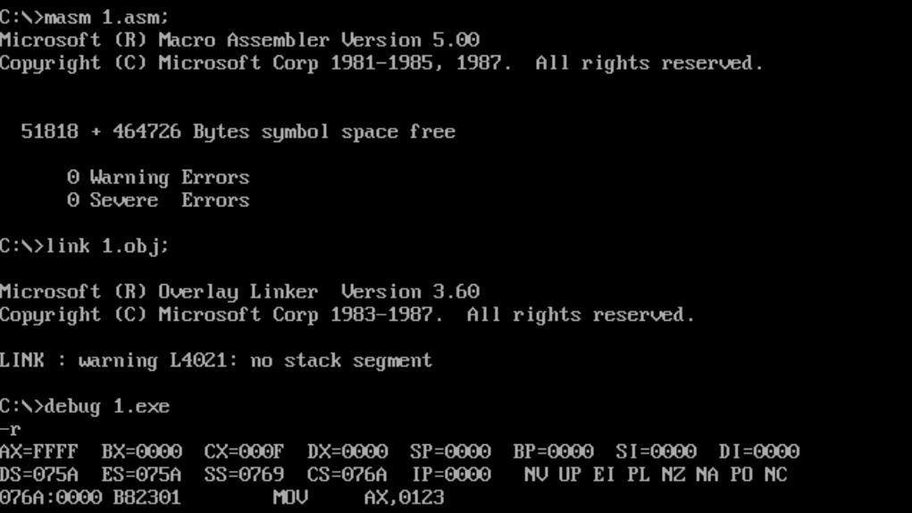
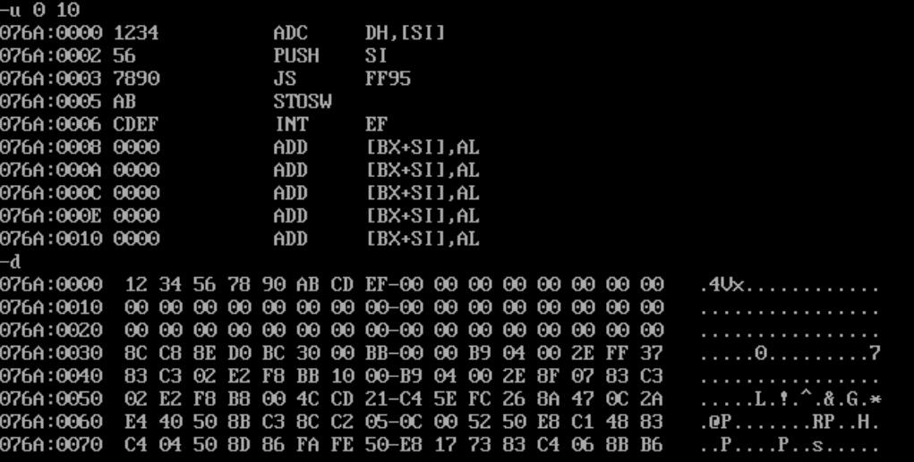
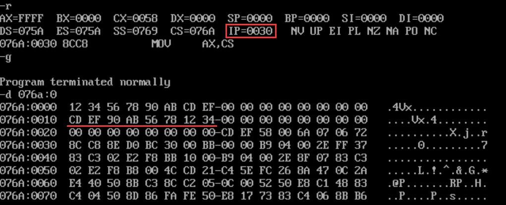
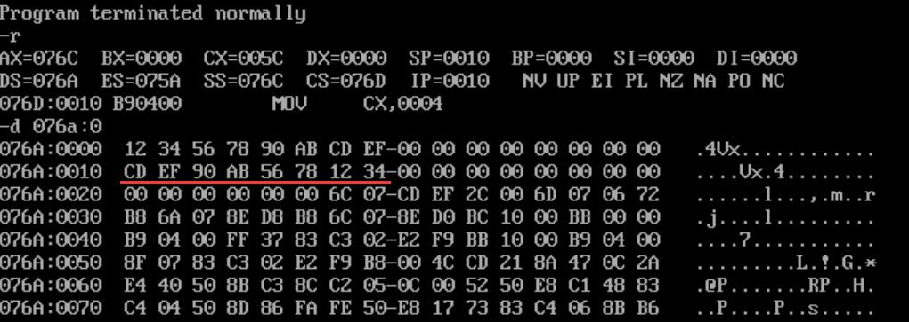
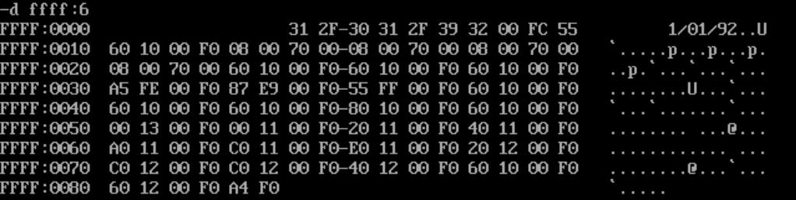
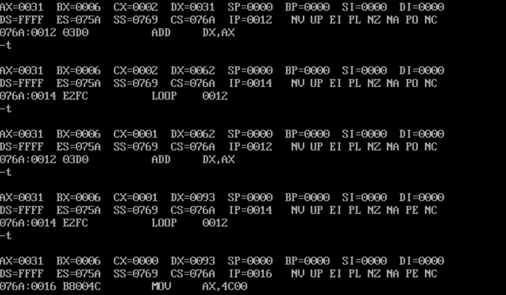
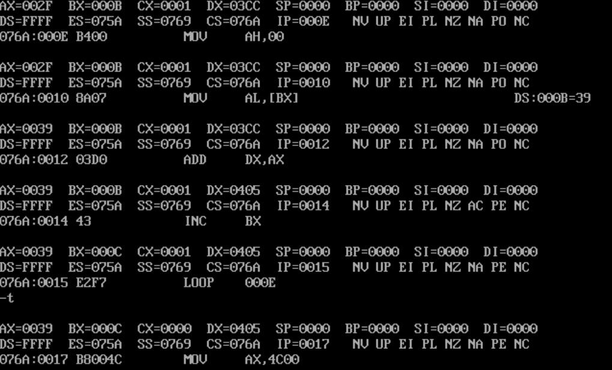
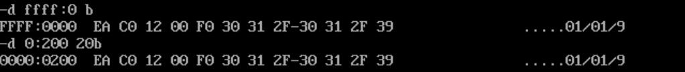

> 本章将开始介绍汇编语言编程。与上一章[【汇编语言】访问寄存器和内存](/24c/assembly-1/)不同的是，上一章的汇编代码是直接在DOSBox终端中，通过`debug`交互输入的，数据默认为`16`进制数；而本章将使用文本编辑器编写汇编代码，然后通过汇编器生成可执行文件，数据默认为`10`进制数，在编程时需要结尾以`h`标明，请注意区分！

## 基本结构示例

<!-- @xprops highlightLines="1-2,11-12" -->

```asm8086
assume cs:codesg
codesg segment
           mov ax,0123h
           mov bx,0456h
           add ax,bx
           add ax,ax

    ;程序返回的套路
           mov ax,4c00h
           int 21h
codesg ends
end
```

### 伪指令

上面的示例代码高亮部分为**伪指令**，剩下的主体部分为汇编指令。伪指令没有对应的机器指令，最终不被CPU执行，而是由汇编器处理的指令。上面的示例代码出现了三种伪指令：

#### 段定义

一个汇编程序是由多个段组成的，这些段被用来存放代码、数据或当作栈空间来使用。一个有意义的汇编程序至少要有一个用来存放代码的段。每个段都需要有段名，段定义的格式如下：

```asm8086
segname segment
    ;...
segname ends
```

#### end

汇编程序的结束标记。

#### assume

`assume`伪指令用来指定段寄存器和段名之间的关系。在这个例子中，`assume cs:codesg`表示`CS`寄存器与`codesg`段相关联，将定义的`codesg`当作程序的代码段使用。

## 运行一个汇编程序

写好一个汇编程序（文本文件）`1.asm`后，在终端执行：

```text
masm 1.asm;
```

其中的分号表示使用默认文件名，此操作会得到`1.obj`文件；然后执行：

```text
link 1.obj;
```

分号含义同上，此操作会得到`1.exe`，如果想在终端直接运行，输入`1.exe`即可：

```text
1.exe
```

如果想借助`debug`跟踪程序的执行，则输入命令：

```text
debug 1.exe
```

<!-- @xprops width="100%" -->



## 一些符号约定

### [...]和(...)

`[...]`是汇编语法，表示一个内存单元，段地址在`DS`中，偏移地址由`...`给出；<br>`(...)`是为了学习方便做出的约定，表示一个内存单元或寄存器中的内容。

例如，`pop ax`的功能可以描述为：

- `(ax)=((ss)*16+(sp))`
- `(sp)=(sp)+2`

### idata

用符号`idata`表示常量。（也就是立即数，`immediate data`）

## loop指令

```asm8086
assume cs:codesg
codesg segment
           mov  ax,2
           mov  cx,7
    s:     add  ax,ax
           loop s

           mov  ax,4c00h
           int  21h
codesg ends
end
```

`loop`指令功能是实现计数型循环，会**默认使用**`CX`寄存器的值作为循环计数器，当执行`loop`指令时会进行操作：

- `(CX)=(CX)-1`；
- 判断`(CX)`是否为`0`，如果不为`0`，则跳转到标号处继续执行循环体；如果为`0`，则继续执行下一条指令。

## inc指令

```asm8086
inc ax  ;(ax)=(ax)+1
```

`inc`指令的功能是自增。

## 段前缀

在`debug`中使用`-a`编写汇编代码访问内存时，可以直接使用`mov ax,[idata]`，但在汇编程序中，需要使用段前缀，写为`mov ax,ds:[idata]`。例如在汇编程序中，`mov ax,[7]`等同于`mov ax,7`，如果是想访问`ds:7`则需要改写为`mov ax,ds:[7]`。

汇编程序也可以间接访问内存，例如`mov ax,[bx]`是没问题的，同时和`mov ax,ds:[bx]`也是等价的。

```asm8086
mov ax,[7]     ;(ax)=7
mov ax,ds:[7]  ;(ax)=((ds)*16+7)

mov ax,[bx]    ;(ax)=((ds)*16+(bx))
mov ax,ds:[bx] ;(ax)=((ds)*16+(bx))
```

## 在代码段中使用数据

此前的演示中，在汇编程序中直接访问物理地址其实是危险的，因为原处可能有其他的重要数据。规范的做法是在程序的段中存放数据，运行时会由操作系统分配空间。

<!-- @xprops highlightLines="3-5" -->

```asm8086
assume cs:codesg
codesg segment
           dw   3412h,7856h,0ab90h,0efcdh,0,0,0,0
           dw   0,0,0,0,0,0,0,0
           dw   0,0,0,0,0,0,0,0

           mov  ax,cs
           mov  ss,ax
           mov  sp,30h

    ;入栈
           mov  bx,0
           mov  cx,4
    s1:    push cs:[bx]
           add  bx,2
           loop s1

    ;出栈
           mov  bx,10h
           mov  cx,4
    s2:    pop  cs:[bx]
           add  bx,2
           loop s2

           mov  ax,4c00h
           int  21h
codesg ends
end
```

上面的代码希望将数据通过栈倒序存放。使用`dw(define word)`关键字定义了一片数据空间，类似的操作还有：

- `db`：定义一个字节的数据
- `dw`：定义一个字的数据
- `dd`：定义一个双字的数据

<!-- @xprops width="100%" -->



通过`-u`指令反汇编发现CPU将`dw`定义的数据当成了指令，通过`-d`命令能够清楚的看到指令应该从`076a:0030`处开始。因此还需要定义一个标号，指示代码开始的位置：

<!-- @xprops highlightLines="7,20" -->

```asm8086
assume cs:codesg
codesg segment
           dw   3412h,7856h,0ab90h,0efcdh,0,0,0,0
           dw   0,0,0,0,0,0,0,0
           dw   0,0,0,0,0,0,0,0

    start:
           mov  ax,cs
           mov  ss,ax
           mov  sp,30h

    ;入栈
           ;...

    ;出栈
           ;...

           mov  ax,4c00h
           int  21h
codesg ends
end start
```

<!-- @xprops width="100%" -->



可以看到`IP`的初值是`30`，是正确的指令开始的位置；结果也正确的保存在`076a:0010`开始的空间中。

## 将数据、代码、栈放入不同段

下面是一种实用的程序结构，将数据、代码、栈放入不同段中，仍然使用上一节的例子：

<!-- @xprops highlightLines="26,33" -->

```asm8086
assume cs:codesg,ds:datasg,ss:stcksg

datasg segment
           dw 3412h,7856h,0ab90h,0efcdh,0,0,0,0
           dw 0,0,0,0,0,0,0,0
datasg ends

stcksg segment
           dw 0,0,0,0,0,0,0,0
stcksg ends

codesg segment
    start:
    ;初始化寄存器
    ;由于程序至少要有一个代码段，所以会自动给CS赋值
    ;此处不需要手动初始化CS
           mov  ax,datasg
           mov  ds,ax
           mov  ax,stcksg
           mov  ss,ax
           mov  sp,10h

    ;入栈
           mov  bx,0
           mov  cx,4
    s1:    push ds:[bx]
           add  bx,2
           loop s1

    ;出栈
           mov  bx,10h
           mov  cx,4
    s2:    pop  ds:[bx]
           add  bx,2
           loop s2

           mov  ax,4c00h
           int  21h
codesg ends
end start
```

注意现在入栈、出栈操作时段地址寄存器是`DS`。

<!-- @xprops width="100%" -->



## 练习

### loop指令实现乘法

<!-- @xprops background="blue" -->

> 编程计算`ffff:6`字节单元的数值乘以`3`（连加三次），结果保存在`DX`中。

```asm8086
assume cs:codesg
codesg segment
           mov  bx,0ffffh
           mov  ds,bx
           mov  bx,6
           mov  ah,0
           mov  al,[bx]

           mov  dx,0
           mov  cx,3
    s:     add  dx,ax
           loop s

           mov  ax,4c00h
           int  21h
codesg ends
end
```

<!-- @xprops width="100%" -->



<!-- @xprops width="100%" -->



注：在汇编程序中数据不能以字母开头，因此`ffffh`要写为`0ffffh`。

### 计算连续内存单元之和

<!-- @xprops background="blue" -->

> 编程计算`ffff:0`~`ffff:b`字节单元的数据之和，结果保存在`DX`中。

注意我们要计算的字节单元（`8`位），每个单元最大为`255`，理论上总和一定不会超过`DX`的上限值（`16`位），但单次相加时要注意需要取出`8`位的数据，同时加到`16`位的寄存器，以保证结果正确且单次相加不会溢出。

```asm8086
assume cs:codesg
codesg segment
           mov  bx,0ffffh
           mov  ds,bx

           mov  bx,0         ;第i个数
           mov  dx,0         ;总和
           mov  cx,0ch       ;注意边界，(cx)=0bh+1=0ch
    s:     mov  ah,0
           mov  al,[bx]      ;取出8位数据
           add  dx,ax        ;计算16位数据
           inc  bx
           loop s

           mov  ax,4c00h
           int  21h
codesg ends
end
```

结果是`405h`。

<!-- @xprops width="100%" -->



### 复制内存（使用loop和段前缀）

<!-- @xprops background="blue" -->

> 编程实现将`ffff:0`~`ffff:b`的数据复制到`0:200`~`0:20b`。

在本题中需要两个段的数据，默认的段前缀是`DS`，我们再使用附加段寄存器`ES`，使得`(ds)=ffffh`，`(es)=20h`，这样就可以对齐两个段的数据（`ds:[bx]`直接对应`es:[bx]`），可以使得程序更简明。

```asm8086
assume cs:codesg
codesg segment
           mov  bx,0ffffh
           mov  ds,bx
           mov  ax,20h
           mov  es,ax         ;使用附加段寄存器

           mov  bx,0          ;第i个数
           mov  cx,0ch        ;注意边界，(cx)=0bh+1=0ch
    s:     mov  al,[bx]       ;默认DS为段地址
           mov  es:[bx],al    ;这里使用ES做段前缀
           inc  bx
           loop s

           mov  ax,4c00h
           int  21h
codesg ends
end
```

<!-- @xprops width="100%" -->


