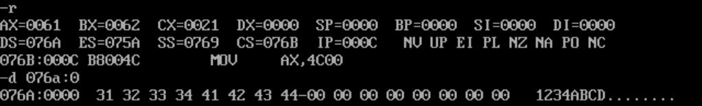
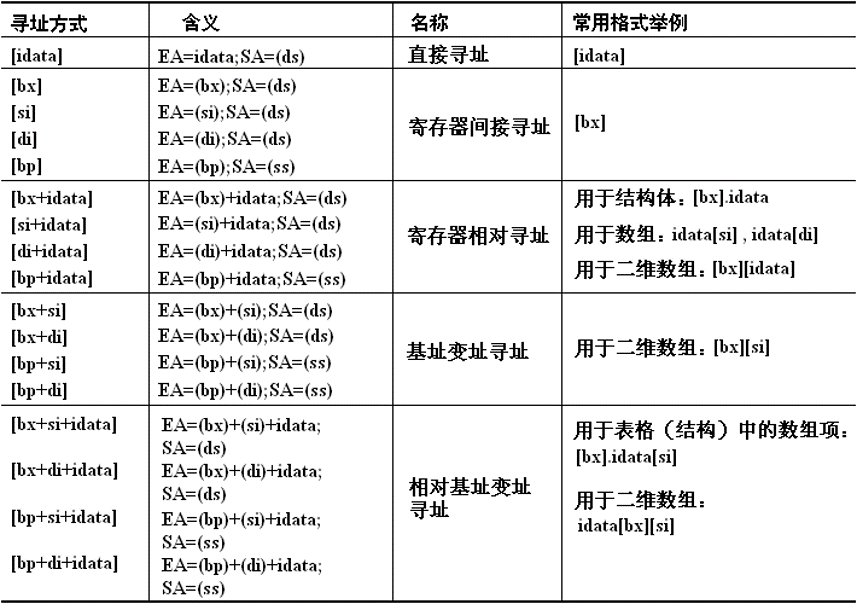
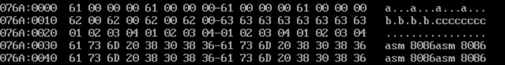
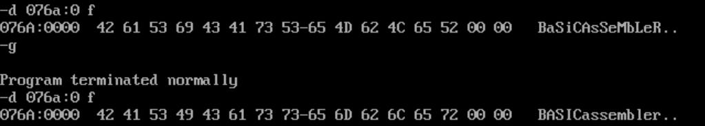
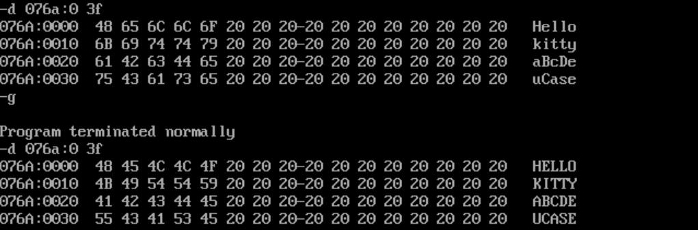

## 处理字符

```asm8086
assume cs:codesg,ds:datasg

datasg segment
           db '1234'
           db 'ABCD'
datasg ends

codesg segment
    start:
           mov ax,datasg
           mov ds,ax
           mov ax,0
           mov al,'a'
           mov bl,'b'

           mov ax,4c00h
           int 21h
codesg ends
end start
```

常用`db`指令定义字符串。字符类型的数据会被编译器自动转为ASCII码。

<!-- @xprops width="100%" -->



> ASCII码在设计上满足一些规律：
>
> - 在`16`进制下，`3xh`就代表了字符`10`进制数`'x'`，例如`'1'`的ASCII码为`49`也就是`31h`
> - 在`16`进制下，大写字母和小写字母的ASCII码相差`20h`，例如`'A'`的ASCII码为`41h`，`'a'`的ASCII码为`61h`

## and指令、or指令

位运算指令，用法与`add`类似。这两个指令可以在不需要分支结构的情况下，实现大小写字符转换：

- 转大写：

```asm8086
and al,11011111b
```

- 转小写：

```asm8086
or al,00100000b
```

## 寻址方式

### [bx+idata]方式

```asm8086
mov ax,[bx+200]  ;(ax)=((ds)*16+(bx)+200)
```

和以下三种写法都是等价的：

```asm8086
mov ax,[200+bx]
mov ax,200[bx]
mov ax,[bx].200
```

### SI和DI寄存器

`SI`和`DI`寄存器被称为变址寄存器，常执行与地址有关的操作，是与`BX`功能相近的寄存器。

- `BX`：通用寄存器，常作为基址寄存器使用
- `SI`：源变址寄存器`(Source Index)`
- `DI`：目的变址寄存器`(Destination Index)`

<!-- @xprops background="red" -->

> `SI`和`DI`不能够像`BX`一样分成`BH`和`BL`两个`8`位寄存器使用。

### [bx+si]和[bx+di]方式

```asm8086
mov ax,[bx+si]  ;(ax)=((ds)*16+(bx)+(si))
```

和以下写法等价：

```asm8086
mov ax,[bx][si]
```

### [bx+si+idata]和[bx+di+idata]方式

```asm8086
mov ax,[bx+si+200]  ;(ax)=((ds)*16+(bx)+(si)+200)
```

### BP寄存器

`BP`和`BX`类似，也是基址寄存器。它们的区别在于`BX`的默认段寄存器是`DS`，而`BP`的默认段寄存器是`SS`。`BP`多用于栈操作。

到现在为止，已经学习了`BX`、`SI`、`DI`、`BP`四个寄存器，它们都是与地址操作有关的寄存器。只有这四个寄存器可以以`[...]`的格式对内存进行寻址。

按照基址寄存器和变址寄存器分类，则`BX`和`BP`是基址寄存器，`SI`和`DI`是变址寄存器。在使用时，基址寄存器和变址寄存器可以任意组合，例如`[bx+si]`、`[bx+di]`、`[bp+si]`、`[bp+di]`，但内部不能互相组合，例如`[bx+bp]`、`[si+di]`是**错误的**写法。

### 总结

<!-- @xprops width="800px" filterDarkTheme -->



## 指明要访问数据的大小

观察下面的代码：

```asm8086
mov bx,0
mov [bx],100h
```

编译会报错！这是因为按照上面代码的参数，没有办法确定操作的数据是字型还是字节型（如果第二个操作数是寄存器，则可以根据是`AX`还是`AH`/`AL`判断）。因此，此时需要显式的指出操作的数据类型，语法为：

```asm8086
mov word ptr [bx],100h
add byte ptr [bx],23h
```

## 使用dup关键字设置重复数据

在之前开辟数据空间或栈空间时，都是计算好大小后手动输入对应数量的`0`（或其他初值）；`dup`关键字可以简洁的完成设置重复数据的操作，格式为：`db/dw/dd 重复次数 dup(数据)`，例如：

```asm8086
dd 4 dup('a')
dw 4 dup('b')
db 8 dup('c')
db 4 dup(1,2,3,4)
db 4 dup('asm',32,'8086')
```

初始化后的数据为：

<!-- @xprops width="100%" -->



## 练习

### 大小写转换

<!-- @xprops background="blue" -->

> 编程操作数据段中的字符串，将第一个字符串小写字母转换为大写字母，第二个字符串大写字母转换为小写字母。
>
> ```asm8086
> assume cs:codesg,ds:datasg
>
> datasg segment
>            db 'BaSiC'
>            db 'AsSeMbLeR'
> datasg ends
>
> codesg segment
>     start:
>     ;...
> codesg ends
> end start
> ```

```asm8086
assume cs:codesg,ds:datasg

datasg segment
           db 'BaSiC'
           db 'AsSeMbLeR'
datasg ends

codesg segment
    start:
           mov  ax,datasg
           mov  ds,ax

           mov  bx,0
           mov  cx,5
    s1:    mov  al,[bx]
           and  al,11011111b
           mov  [bx],al
           inc  bx
           loop s1

           mov  bx,5
           mov  cx,9
    s2:    mov  al,[bx]
           or   al,00100000b
           mov  [bx],al
           inc  bx
           loop s2

           mov  ax,4c00h
           int  21h
codesg ends
end start
```

<!-- @xprops width="100%" -->



### 二重循环将字符串全部转大写

<!-- @xprops background="blue" -->

> 编程操作数据段中的字符串，把所有字母都改为大写。
>
> ```asm8086
> assume cs:codesg,ds:datasg
>
> datasg segment
>            db 'Hello           '
>            db 'kitty           '
>            db 'aBcDe           '
>            db 'uCase           '
> datasg ends
>
> codesg segment
>     start:
>     ;...
> codesg ends
> end start
> ```

```asm8086
assume cs:codesg,ds:datasg,ss:stcksg

datasg segment
           db 'Hello           '
           db 'kitty           '
           db 'aBcDe           '
           db 'uCase           '
datasg ends

stcksg segment
           dw 0,0,0,0,0,0,0,0
stcksg ends

codesg segment
    start:
           mov  ax,datasg
           mov  ds,ax

           mov  bx,0
           mov  cx,4            ;遍历4个字符串
    str:   push cx              ;保存外层循环的CX

           mov  di,0
           mov  cx,5            ;遍历5个字符
    chr:   mov  al,[bx+di]
           and  al,11011111b
           mov  [bx+di],al
           inc  di
           loop chr

           add  bx,10h          ;下一个字符串的首字符的地址
           pop  cx              ;恢复外层循环的CX
           loop str

           mov  ax,4c00h
           int  21h
codesg ends
end start
```

由于字符串长度相同，考虑使用二重循环批量操作。然而由于只有一个寄存器`CX`控制着循环计数器，所以进入内层循环时需要先保存外层循环的`CX`，内层循环结束后再恢复外层循环的`CX`。保存的方式可以是借助其他寄存器例如`DX`，但由于寄存器资源比较宝贵，常见的做法是利用栈保存数据。

<!-- @xprops width="100%" -->


