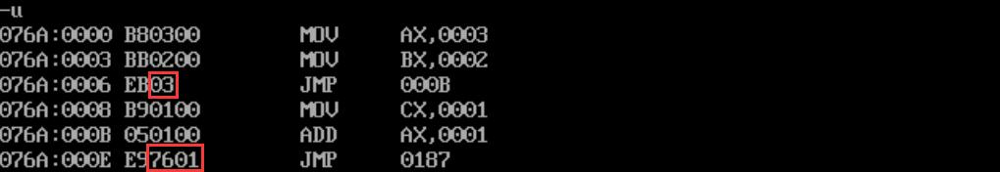
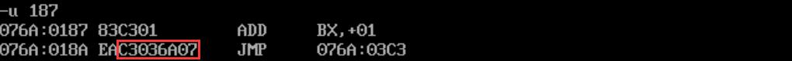
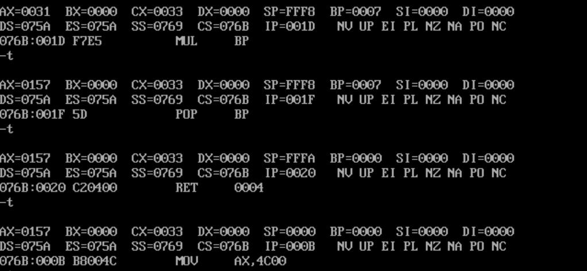
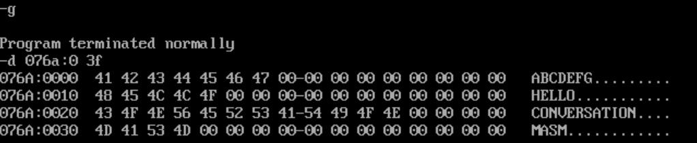

## nop指令

`nop`指令的机器码占一个字节，起占位作用。

```asm8086
nop
```

## 用offset取得标号的偏移地址

例如下例，由于有共`2`字节的`nop`占位指令，`offset s`相当于`2`。

```asm8086
assume cs:codesg
codesg segment
    start:
           nop
           nop
    s:     mov ax, offset s    ;相当于mov ax,2
codesg ends
end start
```

## jmp指令高级用法

### 段内转移

- 短转移：`short`指明此处位移为`8`位位移，范围为`-128`~`127`；

```asm8086
jmp short s  ;(ip)=(ip)+8位位移
```

- 近转移：`near ptr`指明此处位移为`16`位位移，范围为`-32768`~`32767`。

```asm8086
jmp near ptr s  ;(ip)=(ip)+16位位移
```

### 段间转移

- 远转移：

```asm8086
jmp far ptr s
```

段内转移指明**转移位移**，而段间转移指明**目的地址**，这一区别要在汇编指令中才能体现出来，考虑如下程序：

```asm8086
assume cs:codesg
codesg segment
    start:
           mov ax,3
           mov bx,2
           jmp short s1
           mov cx,1
    s1:    add ax,1
           jmp near ptr s2
           db  176h dup(0)
    s2:    add bx,1
           jmp far ptr s3
           db  234h dup(0)
    s3:    add cx,1

           mov ax,4c00h
           int 21h
codesg ends
end start
```

看前两个段内转移，注意到机器码包含的数值是偏移值`03h`和`176h`；（这与程序中定义的`0`字节数量是一致的）

<!-- @xprops width="100%" -->



然后看第三个段间转移指令，机器码中包含的数值就是目的地址。

<!-- @xprops width="100%" -->



### 转移地址在寄存器中

```asm8086
jmp bx  ;(ip)=(bx)
```

### 转移地址在内存中（段内）

从内存单元地址处开始，存放一个字，是转移的**目的偏移地址**。

```asm8086
jmp word ptr [...]
```

### 转移地址在内存中（段间）

从内存单元地址处开始，存放两个字，高地址的字是转移的**目的段地址**，低地址的字是转移的**目的偏移地址**。

```asm8086
jmp dword ptr [...]
```

## jcxz指令

有条件转移指令，格式同样为`jcxz 标号`，功能为：如果`(CX)=0`则转移到标号处执行，功能也是`(IP)=(IP)+8位位移`；否则什么也不做，程序向下执行。

> `jcxz`和前面提到的`jmp`段内转移中的`8`位位移和`16`位位移都是编译阶段由编译器计算的，也都是偏移地址，不是目的地址。

## call指令和ret指令

汇编语言中可以通过`call`指令调用一个过程，过程中可以通过`ret`指令返回到调用点，可以利用它们实现模块化编程。它们的实质也是流程转移指令，都是修改`IP`、或同时修改`CS`和`IP`。

### 段内转移

```asm8086
call s

;逻辑上相当于：
;push ip
;jmp near ptr s
```

### 段间转移

```asm8086
call far ptr s

;逻辑上相当于：
;push cs
;push ip
;jmp far ptr s
```

### 转移地址在寄存器中

```asm8086
call bx

;逻辑上相当于：
;push ip
;jmp bx
```

### 转移地址在内存中（段内）

```asm8086
call word ptr [...]

;逻辑上相当于：
;push ip
;jmp word ptr [...]
```

### 转移地址在内存中（段间）

```asm8086
call dword ptr [...]

;逻辑上相当于：
;push cs
;push ip
;jmp dword ptr [...]
```

### ret指令

```asm8086
ret

;逻辑上相当于：
;pop ip
```

`ret`指令还可以后接一个数值，例如：

```asm8086
ret 5

;逻辑上相当于：
;pop ip
;add sp,5
```

### retf指令

`f`就是`far`的意思。

```asm8086
retf

;逻辑上相当于：
;pop ip
;pop cs
```

> 注意`call`和`ret`指令都用到了栈，所以使用它们时需要初始化栈空间。

## mul指令

`mul`指令的格式为`mul 寄存器`或`mul [...]`，其中被乘数默认存储在`AX`中，乘法指令分为`8`位乘法和`16`位乘法：

<!-- @xprops thead="all" -->

| /              | `8`位乘法             | `16`位乘法             |
| -------------- | --------------------- | ---------------------- |
| 被乘数（默认） | `AL`                  | `AX`                   |
| 乘数           | `8`位寄存器或内存单元 | `16`位寄存器或内存单元 |
| 结果           | `AX`                  | 高位`DX`，低位`AX`     |

例：

```asm8086
mul bl               ;(ax)=(al)*(bl)
mul byte ptr ds:[0]  ;(ax)=(al)*((ds)*16+0)

mul word ptr [bx+si+8]
;乘积ANS=(ax)*((ds)*16+(bx)+(si)+8)
;(dx)=ANS的高16位
;(ax)=ANS的低16位
```

## 用栈传递参数和保护数据

前面说到的`call`和`ret`指令可以实现类似C语言函数的效果，但并没有参数传递的功能，而参数传递可以使用栈来实现。同时，汇编编程中寄存器是非常宝贵的资源，而编写子程序时原则上不应该知晓调用者的寄存器使用情况，但又需要保护调用者的数据不被覆盖，这时也可以使用栈来保护数据。

下面的代码实现计算$(x+y)^3$：

```asm8086
assume cs:codesg,ss:stcksg

stcksg segment
           db 16 dup(0)
stcksg ends

codesg segment
    start:
           mov  ax,2
           push ax
           mov  ax,5
           push ax
           call cube
           mov  ax,4c00h
           int  21h

    cube:  push bp           ;保存BP
           mov  bp,sp
           mov  ax,[bp+4]
           add  ax,[bp+6]
           mov  bp,ax        ;再次利用BP，把x+y的结果保存在BP中
           mul  bp
           mul  bp
           pop  bp           ;恢复BP
           ret  4            ;返回时清除参数
codesg ends
end start
```

首先分两次把参数`x`和`y`入栈。在`cube`子程序中，取出参数时，栈顶是`BP`的旧值，栈顶下一个元素是`call`指令入栈的`IP`，所以`(bp+4)`是`x`，`(bp+6)`是`y`。

<!-- @xprops width="100%" -->



$7^3=343$也就是`157h`。

## 练习

### 将字符串全部转大写

<!-- @xprops background="blue" -->

> 编程操作数据段中的字符串，把所有字母都改为大写。
>
> ```asm8086
> datasg segment
>            db 'abcdefg',9 dup(0)
>            db 'hello',11 dup(0)
>            db 'conversation',4 dup(0)
>            db 'masm',12 dup(0)
> datasg ends
> ```

```asm8086
assume cs:codesg,ds:datasg,ss:stcksg

datasg segment
           db 'abcdefg',9 dup(0)
           db 'hello',11 dup(0)
           db 'conversation',4 dup(0)
           db 'masm',12 dup(0)
datasg ends

stcksg segment
           db 16 dup(0)
stcksg ends

codesg segment
    start:
           mov  ax,datasg
           mov  ds,ax

           mov  bx,0
           mov  cx,4
    s:     mov  si,bx
           call func
           add  bx,10h
           loop s

           mov  ax,4c00h
           int  21h

    func:
           push cx
           push si
           mov  ch,0
    w:     mov  cl,[si]                    ;遇到0就停止
           jcxz return
           and  byte ptr [si],11011111b
           inc  si
           jmp  w
    return:
           pop  si
           pop  cx
           ret
codesg ends
end start
```

在字符串长度不定时，仿照C语言以`\0`作为结束符，读到`0`值就利用`jcxz`指令进入返回阶段。

<!-- @xprops width="100%" -->


