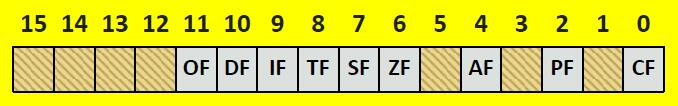
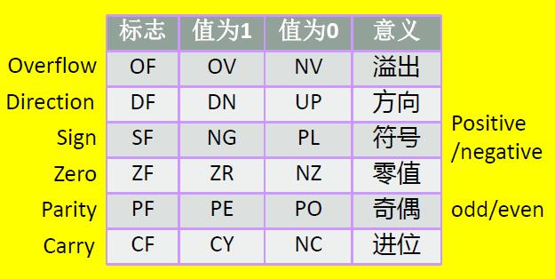
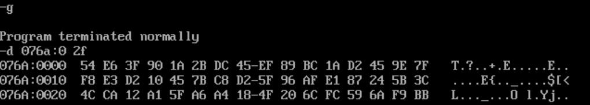
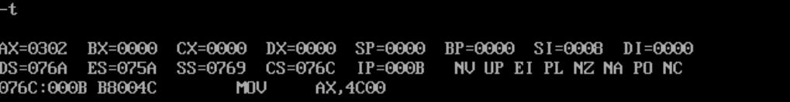
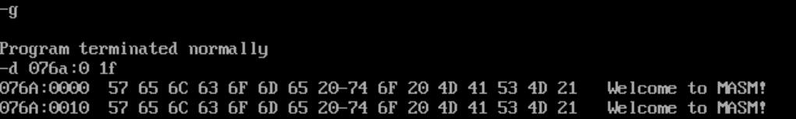

## 标志寄存器

标志寄存器是按位起作用的，8086CPU中没有使用标志寄存器的`1`、`3`、`5`、`12`、`13`、`14`、`15`位，这些位不具有任何含义。

标志位用来存储相关指令的某些执行结果、用来为CPU执行相关指令提供行为依据、或用来控制CPU的相关工作方式。

<!-- @xprops width="600px" filterDarkTheme -->



<!-- @xprops width="600px" filterDarkTheme -->



8086 CPU的指令集中，有些指令执行后会改变标志寄存器中的标志位，比如`add`、`sub`、`mul`、`div`、`inc`、`or`、`and`等指令，它们大多数是算术运算指令。

### ZF(Zero Flag)零标志

`ZF=1`表示"结果为`0`"，`ZF=0`表示"结果不为`0`"。

### PF(Parity Flag)奇偶标志

`PF=1`表示"结果的二进制位中`1`的个数为偶数"，`PF=0`表示"结果的二进制位中`1`的个数为奇数"。

### SF(Sign Flag)符号标志

`SF=1`表示"结果为负数"，`SF=0`表示"结果为非负数"。<br>讨论`SF`时，默认将结果看作有符号数；如果将数据看作无符号数，那么`SF`就没有意义。

### CF(Carry Flag)进位标志

`CF=1`表示"结果有进位或借位"，`CF=0`表示"结果没有进位或借位"。

### OF(Overflow Flag)溢出标志

在进行有符号数运算时，`OF=1`表示"有溢出"，`OF=0`表示"没有溢出"。

## adc指令

`adc`指令是带进位的加法指令，功能类似`add`指令，但是在`add`的基础上，还要加上`CF`标志位的值。

```asm8086
adc ax,bx  ;(ax)=(ax)+(bx)+CF
```

## cmp指令

`cmp`指令是比较指令，功能类似减法指令，但不保存结果，而是根据结果对标志寄存器产生影响。

通过标志位的值，可以得到比较的结果，下表为无符号数比较的判断：

| 比较关系 | `(ax) ? (bx)`  | `(ax) - (bx)`特点                    | 标志寄存器     |
| -------- | -------------- | ------------------------------------ | -------------- |
| 等于     | `(ax) == (bx)` | `(ax) - (bx) == 0`                   | `ZF=1`         |
| 不等于   | `(ax) != (bx)` | `(ax) - (bx) != 0`                   | `ZF=0`         |
| 小于     | `(ax) < (bx)`  | `(ax) - (bx)`将产生借位              | `CF=1`         |
| 大于等于 | `(ax) >= (bx)` | `(ax) - (bx)`不产生借位              | `CF=0`         |
| 大于     | `(ax) > (bx)`  | `(ax) - (bx)`不产生借位，且不等于`0` | `CF=0`且`ZF=0` |
| 小于等于 | `(ax) <= (bx)` | `(ax) - (bx)`产生借位，或者结果为`0` | `CF=1`或`ZF=1` |

如果是有符号数，则需要通过`SF`和`OF`判断，此处略。

## 条件转移指令

条件转移指令是根据标志寄存器的状态来判断是否转移，一般的套路是：

```asm8086
cmp op1,op2
jxxx 标号
```

其中`jxxx`是条件转移指令的一般格式，常见的有：

根据单个标志位转移：

| 指令              | 含义                      | 测试条件 |
| ----------------- | ------------------------- | -------- |
| `je`/`jz`         | 等于/结果为`0`            | `ZF=1`   |
| `jne`/`jnz`       | 不等于/结果不为`0`        | `ZF=0`   |
| `js`              | 结果为负                  | `SF=1`   |
| `jns`             | 结果为非负                | `SF=0`   |
| `jo`              | 结果有溢出                | `OF=1`   |
| `jno`             | 结果没有溢出              | `OF=0`   |
| `jp`              | 结果二进制位包含偶数个`1` | `PF=1`   |
| `jnp`             | 结果二进制位包含奇数个`1` | `PF=0`   |
| `jb`/`jnae`/`jc`  | 低于/不高于等于/有借位    | `CF=1`   |
| `jnb`/`jae`/`jnc` | 不低于/高于等于/无借位    | `CF=0`   |

根据无符号数比较结果转移：

| 指令              | 含义         | 测试条件       |
| ----------------- | ------------ | -------------- |
| `jb`/`jnae`/`jc`  | 低于则转移   | `CF=1`         |
| `jnb`/`jae`/`jnc` | 不低于则转移 | `CF=0`         |
| `ja`/`jnbe`       | 高于则转移   | `CF=0`且`ZF=0` |
| `jna`/`jbe`       | 不高于则转移 | `CF=1`或`ZF=1` |

根据有符号数比较结果转移：

| 指令        | 含义         | 测试条件         |
| ----------- | ------------ | ---------------- |
| `jl`/`jnge` | 小于则转移   | `SF!=OF`         |
| `jnl`/`jge` | 不小于则转移 | `SF=OF`          |
| `jg`/`jnle` | 大于则转移   | `ZF=0`且`SF=OF`  |
| `jng`/`jle` | 不大于则转移 | `ZF=1`或`SF!=OF` |

上述指令包含了很多具有特定含义的字母，可以了解以便记忆。它们是：`j - jump`、`n - not`、`z - zero`、`p - parity`、`s - sign`、`c - carry`、`o - overflow`、`e - equal`、`b - below`、`a - above`、`l - less`、`g - greater`。

## 串传送指令和DF(Direction Flag)方向标志

`DF`标志在串传送指令中起作用，控制每次传送后`SI`和`DI`的自动递增或递减。`DF=0`表示递增，`DF=1`表示递减。

串传送指令有：`movsb`（传送字节）和`movsw`（传送字）。

### movsb指令

```asm8086
movsb

;((es)*16+(di))=((ds)*16+(si))
;如果DF=0，则(si)=(si)+1，(di)=(di)+1
;如果DF=1，则(si)=(si)-1，(di)=(di)-1
```

### movsw指令

```asm8086
movsw

;((es)*16+(di))=((ds)*16+(si))
;如果DF=0，则(si)=(si)+2，(di)=(di)+2
;如果DF=1，则(si)=(si)-2，(di)=(di)-2
```

### 设置DF的值

通过`cld`和`std`指令可以设置`DF`的值：

```asm8086
cld  ;DF=0
std  ;DF=1
```

## pushf指令和popf指令

`pushf`指令是将标志寄存器的内容压入栈中，`popf`指令是将栈中的内容弹出到标志寄存器中，后面不需要其他参数。注意标志寄存器大小是两个字节。

```asm8086
pushf
popf
```

## rep指令

`rep`指令是重复指令，根据`CX`的值重复执行后面的指令，常常使用`rep movsb`和`rep movsw`。

```asm8086
rep movsb

;相当于：
;s: movsb
;   loop s
```

## 练习

### 大整数加法

<!-- @xprops background="blue" -->

> 编程实现`128`位大整数加法。
>
> ```asm8086
> datasg segment
>     ;0x7f9e_45d2_1abc_89ef_45dc_2b1a_903f_e654
>            dw 0e654h,903fh,2b1ah,45dch,89efh,1abch,45d2h,7f9eh
>     ;0x3c5b_2487_e1af_965f_d2c8_7b45_10d2_e3f8
>            dw 0e3f8h,10d2h,7b45h,0d2c8h,965fh,0e1afh,2487h,3c5bh
>
>     ;ans = 0xbbf9_6a59_fc6c_204f_18a4_a65f_a112_ca4c
>     ;答案在内存中应该是：4C CA 12 A1 5F A6 A4 18 - 4F 20 6C FC 59 6A F9 BB
> datasg ends
> ```

```asm8086
assume cs:codesg,ds:datasg,ss:stcksg

datasg segment
    ;0x7f9e_45d2_1abc_89ef_45dc_2b1a_903f_e654
           dw 0e654h,903fh,2b1ah,45dch,89efh,1abch,45d2h,7f9eh
    ;0x3c5b_2487_e1af_965f_d2c8_7b45_10d2_e3f8
           dw 0e3f8h,10d2h,7b45h,0d2c8h,965fh,0e1afh,2487h,3c5bh
    ;sum
           dw 8 dup(0)
datasg ends

stcksg segment
           db 16 dup(0)
stcksg ends

codesg segment
    start:
           mov  ax,datasg
           mov  ds,ax

           call add128

           mov  ax,4c00h
           int  21h

    add128:
           push ax
           push cx
           push si
           mov  si,0
           mov  cx,8
           sub  ax,ax         ;确保CF为初值为0
    s:     mov  ax,[si]
           adc  ax,[si+16]
           mov  [si+32],ax
           inc  si            ;这里不能用add si,2
           inc  si            ;因为add会影响CF
           loop s
           pop  si
           pop  cx
           pop  ax
           ret
codesg ends
end start
```

<!-- @xprops width="100%" -->



### 条件分支：统计数据

<!-- @xprops background="blue" -->

> 编程统计数据段中的数据，将大于`9`的数据个数存放在`AH`，小于`9`的数据个数存放在`AL`。
>
> ```asm8086
> datasg segment
>            db 9,11,9,1,9,5,63,38
> datasg ends
> ```

```asm8086
assume cs:codesg,ds:datasg,ss:stcksg

datasg segment
           db 9,11,9,1,9,5,63,38
datasg ends

stcksg segment
           db 16 dup(0)
stcksg ends

codesg segment
    start:
           mov  ax,datasg
           mov  ds,ax

           mov  ax,0
           call stats

           mov  ax,4c00h
           int  21h

    stats:
           push cx
           push si
           mov  si,0
           mov  cx,8
    s:     cmp  byte ptr [si],9
           jl   lt
           jg   gt
           jmp  endif
    lt:    inc  al
           jmp  endif
    gt:    inc  ah
           jmp  endif
    endif: inc  si
           loop s
           pop  si
           pop  cx
           ret
codesg ends
end start
```

`endif`并不是关键字，只是自定义的标号名；执行结束后`AX`的值为`0302h`。

<!-- @xprops width="100%" -->



### 复制字符串

<!-- @xprops background="blue" -->

> 将字符串复制到它后面的空间中。
>
> ```asm8086
> datasg segment
>            db 'Welcome to MASM!'
>            db 16 dup(0)
> datasg ends
> ```

```asm8086
assume cs:codesg,ds:datasg,ss:stcksg

datasg segment
           db 'Welcome to MASM!'
           db 16 dup(0)
datasg ends

stcksg segment
           db 16 dup(0)
stcksg ends

codesg segment
    start:
           mov  ax,datasg
           mov  ds,ax
           mov  es,ax

           call copy

           mov  ax,4c00h
           int  21h

    copy:
           push si
           push di
           mov  si,0
           mov  di,16
           cld               ;设置si和di为增
           mov  cx,16        ;设置CX，复制16个字节
           rep  movsb        ;重复执行
           pop  di
           pop  si
           ret
codesg ends
end start
```

<!-- @xprops width="100%" -->


