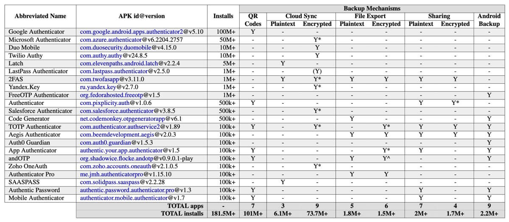
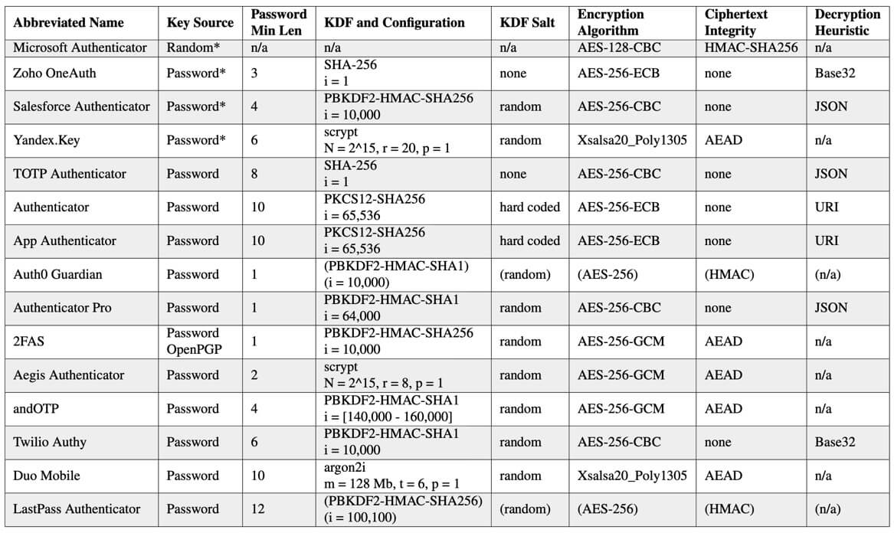

相关链接：

- [Security and Privacy Failures in Popular 2FA Apps](https://www.usenix.org/system/files/sec23summer_198-gilsenan-prepub.pdf)

<!-- @xprops background="blue" -->

> #### 笔记
>
> #### TOTP
>
> TOTP`(Time-based One-Time Passwords)`是一种常见的2FA形式。常见的工作流程是：
>
> - 初始化：在首次配置TOTP时，服务器（例如注册X网站的账号，此处就是X网站的服务器）会为用户生成一个TOTP密钥，并以某种形式（如QR码）分享给用户；用户需要用TOTP应用扫描这个密钥，此时这个密钥就会保存在用户设备本地，此操作的目的是让用户的TOTP应用和服务器共享一个密钥。
> - 生成TOTP：利用密钥和时间戳计算出一个哈希值，截取（通常是）`6`位。这里不会直接使用时间戳的原值，而是一般会利用整数除法得到（通常是）`30s`为粒度的时间值，以保证生成的TOTP有一定的有效期，留给用户足够的输入和操作时间。
> - 验证：登录网站时，用户查看TOTP应用为此网站生成的实时验证码，并在有效期（如`30s`）内提交给网站。由于服务端和用户设备在初始化时就同步了一个密钥，而时间又是一个天然同步的值，因此服务端可以同样计算出一个验证码，与用户提供的进行匹配。
>
> #### 对比TOTP 2FA和SMS 2FA
>
> SMS 2FA是平时最熟悉的短信验证码，它的操作比TOTP 2FA更为简单，但是安全性不如TOTP 2FA。首先，存在针对短信的攻击手段；其次，SMS 2FA的可靠性基于移动运营商（认证设备被停机、断网、信号不好都无法正常工作），而TOTP只需要认证设备本地存储的密钥（并且不需要认证设备联网）。
>
> #### PII
>
> 个人可识别信息`(Personally Identifiable Information, PII)`是可以用来识别某人的任何数据，所有直接或间接与个人相关的信息都被视为PII，例如一个人的姓名、电子邮件地址、电话号码、银行账号和政府颁发的身份证号码等。
>
> 两种主要的PII类型是：直接识别某人的信息、间接识别某人的信息。
>
> - 有些信息可以直接识别一个人，例如社会保险号或身份证号。
> - 有些信息不能直接识别、但与其他信息相结合时可用于识别一个人，例如姓名+地址。

## 1.Introduction

TOTP是一种常见的2FA形式，通常被认为比SMS 2FA更安全；然而TOTP 2FA也为用户带来了一些易用性负担，用户常常丢失设备、更换设备或卸载TOTP应用，如果无法生成OTP就无法登录账户。为了应对这种易用性问题，许多TOTP应用程序提供自定义备份机制，以帮助用户从设备丢失中恢复。论文主要研究这些备份机制的安全问题和隐私问题：

- RQ1：备份机制将哪些个人信息泄露给开发TOTP应用程序的机构，或其他第三方？（如果有的话）
- RQ2：攻击者获得TOTP备份的风险有多大？
- RQ3：如果攻击者获得了TOTP备份，危及TOTP密钥的风险有多大？

论文的主要贡献是：

- 论文提出了一种方法，使用动态分析和密码分析来评估TOTP应用程序中备份机制的安全和隐私属性；
- 论文发现许多流行的2FA应用都存在易受攻击的安全机制，从而泄露TOTP密钥；
- 论文发现许多流行的2FA应用泄露了用户的个人信息。

## 2.TOTP Overview

在启用TOTP 2FA之前，用户通常被要求使用TOTP应用程序扫描一个QR码，这样做的目的是与TOTP应用程序共享三个关键信息：

- `Issuer`：用户当前正在设置TOTP 2FA的网站/服务的名称
- `Label`：用户账户的用户名
- `Secret`：一个由网站/服务随机生成的密钥

## 3.Related Work

略。

## 4.Methods

论文挑选了`22`个TOTP应用程序，并按照下面三个阶段分析每个`APK`：

1. Exploring the App：探索、记录各种功能和设置，例如是否需要个人信息才能使用、支持何种备份机制等等，然后启用备份机制，最终执行恢复过程。
2. Capturing & Reviewing Network Traffic：进行备份操作，审查网络流量，观察哪些信息需要传输。
3. Performing Cryptanalysis：如果网络流量中包含加密字段，则进行加密分析。

## 5.Results

这一节讨论各种备份机制。

<!-- @xprops width="100%" themeAdaptive -->

### 离线：Backup without the Network

数据集中`7`个应用程序支持以二维码的形式导出到其他设备，由于不涉及网络请求，该方法安全性较高，但缺乏易用性。

### 在线、无加密：Remote Backups without Encryption

数据集中`12`个应用程序可以以明文形式备份TOTP数据、有`3`个应用程序可以直接以明文形式进行云同步。

### 在线、有加密：Remote Backups with Encryption

数据集中`15`个应用程序支持TOTP数据的加密备份，但许多应用程序的实现方式存在漏洞。

<!-- @xprops width="100%" themeAdaptive -->

其中有`14`个应用的加密密钥直接来源于用户密码，这使得攻击者破解TOTP数据密文的操作就像破解一个哈希过后的密码一样。这类攻击的可行性取决于密码本身的强度和散列函数的配置（见上表）。更多密码学的分析见论文原文。

### 安卓自动备份：Android Auto Backup (AAB)

Android 6.0及更高版本支持自动将应用程序数据上传到用户的谷歌云端硬盘的备份系统。默认情况应用程序会加入AAB，但官方文档建议如果应用程序需要处理Android不应该自动备份的敏感信息，就应该设置`android:allowBackup="false"`来退出AAB。数据集中`12`个应用程序明确声明了退出AAB。

### 备份机制的隐私影响

有`2`个应用程序要求提供个人信息（邮件地址/电话号码）才能使用该应用。支持自动将备份云同步的应用程序普遍要求用户提供PII，以便在恢复期间进行身份验证。在支持云同步备份机制的`11`个应用程序中，`8`个需要用户的电子邮件地址，`5`个需要用户的电话号码才能使用此功能。

泄露TOTP的`Issuer`和`Label`：支持加密云同步的几个应用程序仅加密了TOTP密钥，并将备份中的所有其他TOTP字段作为明文。（这意味着用户会把他们使用的网站/服务的名称以及用户名上传给TOTP应用程序的服务器）

### 对传统认证方式的依赖（密码、SMS、电子邮件等）

论文这一节的内容的中心思想是：TOTP 2FA本意是想取代安全性较差的密码登录、SMS 2FA等机制，但由于账户恢复这一难题，对于云同步的TOTP备份机制，用户仍然使用密码、SMS等方式进行恢复时的身份验证，从而把安全性又降回到这些传统机制上。

## 6.Discussion

### 明文备份的风险

首先，显然地，知道了明文TOTP数据的攻击者不仅知道了TOTP密钥，还知道了对应的网站/服务和用户名，这就可以进行经典的密码攻击。

支持明文备份的应用程序易于在不同应用程序之间迁移（许多应用程序支持从其他TOTP应用程序中移植明文备份），但远程发送明文备份（例如用户选择将文件保存到云端）会将TOTP数据泄露给上传行为的每一个参与者。

### 建议

- 应用程序应考虑不支持明文备份。
- 应用程序应加密所有TOTP字段，包括`Issuer`、`Label`和`Secret`。
- 依赖远程密钥服务器生成/存储随机密钥的应用不应将密钥和密文存放在一起。
- 对于利用用户密码获取密钥的应用程序，应该实施既定的最佳实践；并且不要允许备份密码离开应用程序。
- ……

## 7.Supplementary Materials

见[https://github.com/blues-lab/totp-app-analysis-public](https://github.com/blues-lab/totp-app-analysis-public)。
