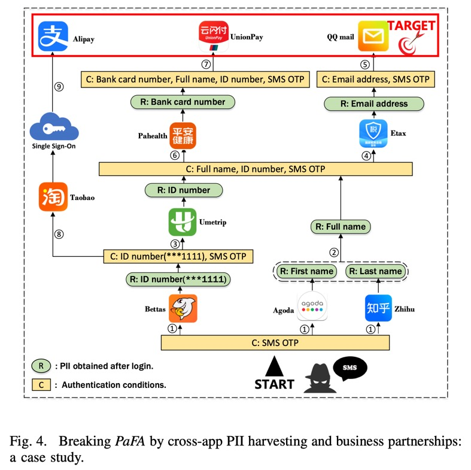

相关链接：

- [Maginot Line: Assessing a New Cross-app Threat to PII-as-Factor Authentication in Chinese Mobile Apps](https://www.ndss-symposium.org/wp-content/uploads/2024-241-paper.pdf)

## 1.Introduction

个人可识别信息`(Personally Identifiable Information, PII)`（如身份证号）在中国的移动应用程序中被广泛用作身份认证因素，在本文中这种身份认证方法被称为PaFA`(PII-as-Factor Authentication)`。PaFA旨在提供更强的身份认证限制。不过对于不同类型的软件，身份认证的限制也会不同。例如相比于银行App，电子书软件的身份认证通常限制更小。

论文发现了一个新的威胁：在中国，PII被移动应用程序供应商广泛收集和存储；如果攻击者能够获得用户的SMS OTP并登录一些认证强度低的App，就可以通过在这些App上收集用户的PII，最终绕过目标App的PaFA认证机制。

> 跨程序认证绕过（原文是`Bypass Authentication by Cross App Exploitation`，简写为`Bacae Attack`）的一个实例是：支付宝本来需要四个身份认证因素：SMS OTP、银行卡号、全名和身份证号；但如果是通过淘宝授权登录，攻击者只需要两个认证因素登录淘宝：SMS OTP和身份证号。

论文的主要贡献是：

- 发现了用户在同时使用多个应用程序的情况下，可能会对其他应用程序产生重要安全影响，使得PaFA认证机制的强度在大多数情况下仅与SMS OTP相同。
- 提出了分析模型和对应的半自动工具MAGGIE，可以对于一个给定的应用程序，分析用户使用其他应用程序是否会减弱它的身份认证强度。

## 2.Background and Threat Model

### App中的认证因素

- 账户&密码
- SMS OTP（短信验证码）
- PII：帐户所有者的PII（如身份证号、银行卡号、生日、姓名）也通常用于验证用户，特别是用于密码恢复。例如，在恢复账户时，支付宝首先提示用户输入他们的姓名和身份证号码以查找对应的帐户，然后输入银行卡号进行身份认证。

### 威胁模型

用户A使用了很多热门应用程序，并提供了真实的PII，这些应用程序也保存了A的使用历史记录（如历史订单）。目标应用程序供应商的安全预期是，仅仅拥有不充分的身份验证因素（例如只有SMS OTP）是不足以完成应用程序的密码恢复过程或身份验证过程的。

攻击者M仅能截获A的SMS OTP。M旨在收集A的PII，然后绕过目标应用程序的身份验证机制。

## 3.Design and Implementation of MAGGIE

MAGGIE包含三个核心模块：`XHelper`用于从UI中获取有用的PII，`Model Builder`生成状态机模型，`Model Checker`进行分析并输出攻击路径。

### Extracting Authentication&Reward

定义Authentication&Reward`(AuthR)`为一个四元组：`(App.Op, Cond, Authorz, Reward)`

- `App.Op`：应用程序中的一系列（需要身份认证）的操作，例如登录、付款等；
- `Cond`：一组身份认证因素，表示通过`App.Op`身份认证等条件；
- `Authorz`：与当前`App.Op`有授权关系的第三方操作，例如淘宝账户可以通过SSO`(single sign-on)`登录支付宝；
- `Reward`：PII的集合，指完成`App.Op`后可以从应用程序中获得的`PII`。

`XHelper`根据深度优先策略自动遍历用户程序的UI界面，并通过正则表达式收集显示的PII。

### Formal Modeling with Model Builder

使用一个状态机对攻击过程进行建模：$M=(S,O,T,s_0,s_s)$，$S$是状态集，$s_0$是初始状态（攻击者此时仅有不充分的认证因素），$s_s$是成功状态（攻击已经达成），$O$是能在应用程序上进行的操作的有限集，$T$是状态转移函数（例如$T(s_i, App_x.login)=s_j$）。

### Detecting Security Flaws with a Model Checker

检查是否存在可能的攻击路径。

## 4.Experiment Setup

论文从华为应用商店、Vivo应用商店和腾讯应用程序中心中下载了`39`个类别的总共`234`个应用程序作为测试集。

实验过程中研究人员首先用个人真实信息手动（因为通常需要人机测试）注册和配置应用程序；然后使用`XHelper`探索应用程序，如果过程中出现人机测试同样手动协助它完成；然后基于`Model Builder`生成的模型，使用`Model Checker`生成对于每个`App.Op`的`1000`个优化的攻击路径；最后由研究人员手动验证。

> 论文假设了一种常见的情况：用户通常仅使用一个手机号；不同的手机号会被视为不同的用户。

## 5.Findings and Measurements

### Bacae Attack的根因分析

- 应用程序中无处不在的PII：只能访问到SMS OTP的攻击者可以从身份认证强度低的其他应用程序中收集PII，然后破坏更强的PaFA系统。

    一个真实的案例：

    <!-- @xprops width="800px" themeAdaptive -->

    

    一个值得注意的事实是攻击路径中的每一个应用程序都能够被其他（能够获取到同样PII的）应用程序取代。

- 跨程序的业务合作：通常有两种，账户共享和商业授权
    - 账户共享：SSO（如淘宝和支付宝的例子），或者大公司的产品共享（如Google账户可以登录Gmail和Google Calendar），如果服务的安全设计不一致就会破坏预期的强身份认证。

        > 此外，许多应用程序允许用户同步来自SSO提供商的数据，可能导致意外的PII泄露。例如用户通过支付宝登录Qunar后，支付宝中屏蔽的ID会在Qunar中完整显示。

    - 商业授权：例如银行可以授权给第三方支付App完成支付操作；然而有的第三方App与银行（如中国银行App）相比认证强度较弱。

### 统计结果

略。

### 如果攻击者没有SMS OTP...

给测试工具MAGGIE不同的（攻击者在攻击开始时持有的）初始认证因素（例如从邮箱验证码或FaceID开始），均有可行的攻击路径。

### 影响

- 后果：可能造成账户劫持、未授权的购买等等。
- 影响范围：论文做了一项调查，让参与的实验者选择`234`个应用程序中他们注册并使用了哪些，然后就可以利用测试工具检查是否能够组合出一条攻击路径。结果表明高达`94.2%`的实验者同时使用的应用程序中，至少存在一条对于另一应用程序的攻击路径。

### 讨论

- 风险控制：论文发现有一些应用程序设置了风险控制系统，例如更换设备和IP后需要额外的身份认证因素。然而PII的收集可能会降低这些附加因素的安全性。
- PII的多端不一致：对于同一个PII的显示，网页端和移动端可能存在不一致性。当攻击考虑这些更广的范围时，会进一步降低身份认证的安全性。

## 6.Suggestions and Limitations

### 建议

生物识别身份认证因素更安全，且不要依赖PII进行身份认证。（但一定程度上损害了易用性）

### 局限

- 对风险控制策略的进一步研究：有些风险控制策略可以绕过，例如淘宝的风险控制触发时要求从淘宝联系人中选择一个好友来确认身份，但由于测试账号没有关联的好友，选择屏幕上显示的任何名字都可以通过。
- 让测试工具MAGGIE更加自动化。
- 论文重点研究中国应用程序市场，而不同国家的PII可能具有不同的特点，例如中国的居民身份证号的`7`~`14`位表示生日（但其他国家的ID号未必如此）。外国的身份认证系统设计可能有所不同。
