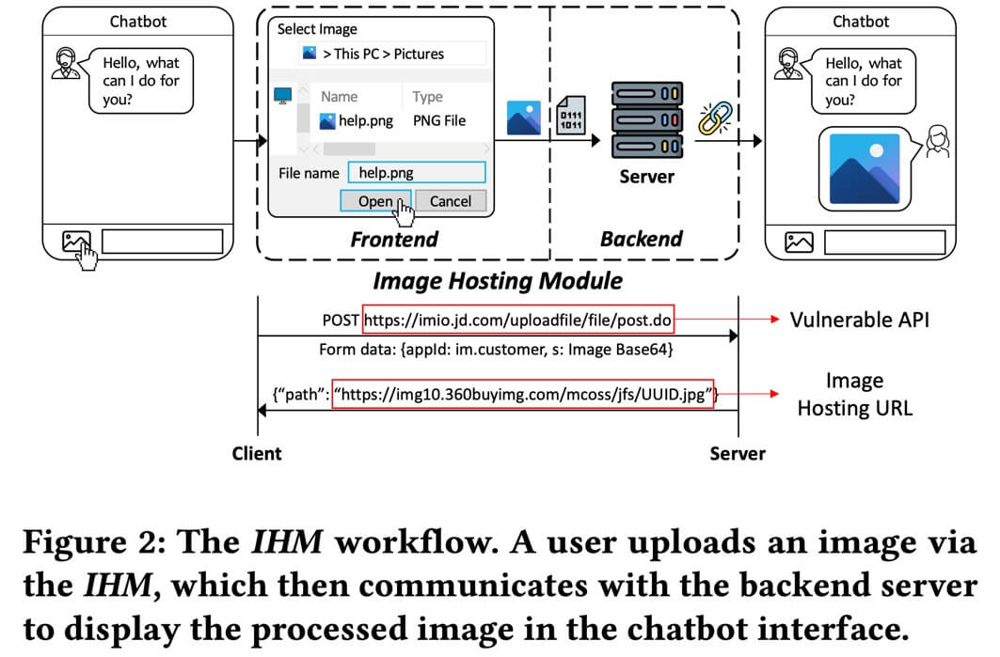
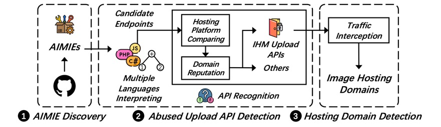
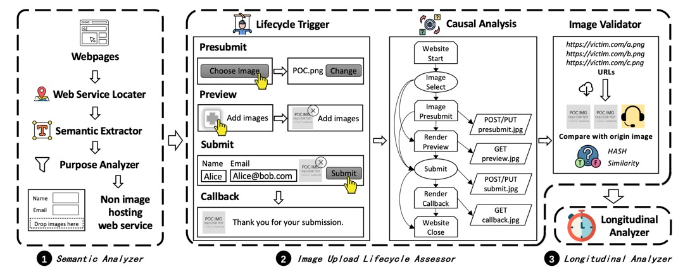
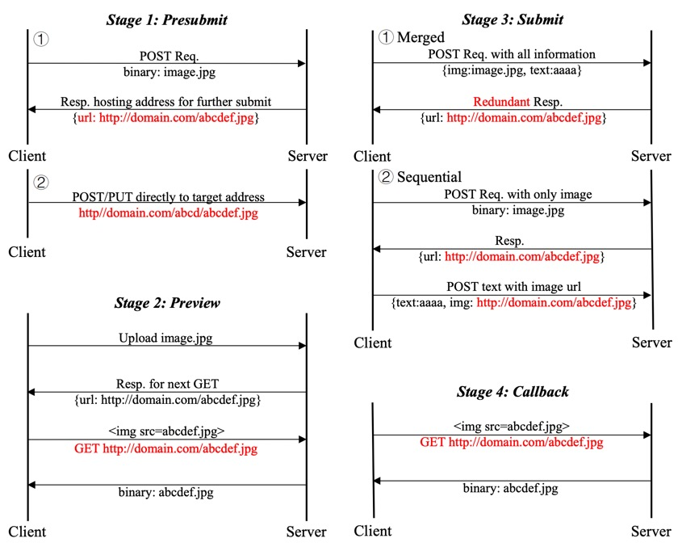

相关链接：

- [Understanding and Detecting Abused Image Hosting Modules as Malicious Services](https://www.xiaojingliao.com/uploads/9/7/0/2/97024238/hong2023understanding.pdf)
- [PPT](https://adl.tw/storage/attachments/25f/voo/crd/25fvoocrdd9fzlguhjhyl33fy.pdf)
- [Github仓库：AIMIE-Group/AIMIE](https://github.com/AIMIE-Group/AIMIE)

## 1.Introduction

很多站点都集成了图床作为服务的一部分，允许用户使用图像与这些产品交互（比如问答平台、聊天机器人允许用户上传图片）；图床本质上也是网络托管服务，有一些开源项目利用这些图床的API搭建服务，进而可能被不法分子利用存储色情、暴力、赌博诈骗等等相关图像，可能浪费受害站点的存储空间，以及对品牌声誉造成恶劣影响。

论文把其研究的这种现象命名为AIMIEs`(*A*bused *I*HMs as *M*al*I*cious s*E*rvices)`，这种服务可以是开源的（比如[AUXPI](https://github.com/0xDkd/auxpi)），也可以是商用的（出于盈利目的）。

论文的主要贡献是：

- 首次系统地研究了AIMIE；
- 对IHM的图片上传生命周期进行建模，并开发了工具Viola，来发现易受攻击的IHM及图像上传API；
- 提出了应对建议、上报了发现的API。

## 2.Background

### IHM

论文提到的IHM`(Image Hosting Module)`可以理解为"私有图床"，这里格外强调了IHM主要是服务于网站的特定业务功能内部使用的，如前面提到的问答平台、聊天功能等，IHM并非旨在作为一个独立图像托管平台运行。

<!-- @xprops width="600px" themeAdaptive -->

### 威胁模型

恶意利用者寻找可以利用的IHM，并利用其API来创建图像托管服务，这可能被用于存储任意非法图像。（利用者只需要具有普通用户权限，也不涉及上传图片马以利用受害站点漏洞）

### 研究范围

尽管一些专门为公共图像托管而设计的平台也会涉及到被用于非预期图像托管，但本文只关注IHM的滥用问题。

## 3.Abused IHM as Malicious Service

论文收集并分析了一些开源的AIMIE，这一节主要介绍分析的方法。

### AIMIE的两个要素

- AIMIE upload API：也就是AIMIE中被滥用的受害IHM上传图片的API
- Image hosting domain：受害IHM存储上传的图像的服务器（然后生成链接，返回给用户）

### 分析方法

<!-- @xprops width="600px" themeAdaptive -->

- AIMIE discovery：在Github上手动找了`89`个开源的AIMIE。
- Abused upload API detection：研究团队开发了一个多语言解释器，先将收集到的AIMIE源码生成AST，然后解析字符串相关操作（拼接、格式化函数等），然后提取并验证出现的字符串值是否为一个URL（比如匹配以`http:`或`https:`开头），然后确定这是否是一个被利用的IHM上传图片的API（如果该API位于一个未被设计用于图片上传、但具有图片上传功能的网站上）。
- Abused hosting domain detection：研究团队部署了其中`14`个开源的AIMIE，触发其中的上传API，并抓包响应流量以确定存储服务器的域名。

## 4.Measurement

这一节是对前面收集到的数据的分析，详见原文。

## 5.Vulnerable IHMs in the Wild

除了分析已有的AIMIE之外，研究团队还设计了工具Viola用于发现互联网中的易被利用的IHM情况。本节会介绍Viola的三个组件。

<!-- @xprops width="100%" themeAdaptive -->

### Semantic Analyzer

首先是在大规模的网络服务中识别出那些使用了IHM的。论文使用了基于语义分析的方法，首先在DOM中查找元素`<input type="file">`，然后参考了[这篇论文](https://web.archive.org/web/20140309050820id_/http://coitweb.uncc.edu:80/~jfan/webimage2.pdf)提出的基于密度的网页分割方法，提取出元素的**文本级**前后文（没有利用DOM结构），经过一些字符串处理后用BERT做嵌入，并与真实的IHM（预先收集的数据）语义做相似度分析。

代码层面，这一阶段筛选出**具有上传图像语义的`input`元素**的页面。

### Upload Lifecycle Assessor

研究团队把图片上传的生命周期整理为`4`个步骤（有些具体实现可能省略了中间的一些步骤）：

<!-- @xprops width="800px" themeAdaptive -->

- Presubmit阶段：在没提交整个表单时，通常会先把图片上传到服务器
- Preview阶段：

    为提供给用户实时反馈，通常上传的图片会被展示到UI上预览，这里有两种方式：
    - 服务端缓存：上传之后获取远程的图像链接
    - 客户端缓存：一个BLOB对象，比如`blob:https://example.com/e8a0216f-93f5-4d9b-8310-32d5c5f14896`

- Submit阶段：提交表单，此处区分了Merged和Sequential方式，区别在于是一次性提交表单的数据，还是先单独传图得到远程URL链接（比如有些站点使用CDN）
- Callback阶段：响应结果

工具中使用Puppeteer爬虫模拟用户的使用过程，前两个阶段上传图像，后两个阶段填写表单内容并模拟点击上传按钮。对于表单内容工具自定义了一组输入，有对应`type`的`input`元素就自动填入。在测试的全程监听页面的`request`和`response`事件，并对请求和响应中出现的可能是图片的URL进行正则提取。

再然后，工具中利用MD5和[blockhash-js（图像感知哈希）](https://www.npmjs.com/package/blockhash)去验证提取的URL是否是上传的图像（MD5一致），或者非常相似（感知哈希值海明距离小于阈值）。

### Longitudinal Analyzer

判断上传的图像是否能有较长的生存时间。如果通过IHM上传的图像可以存在超过`3`天，研究团队将其视为漏洞。

## 6.Mitigation and Discussion

重点整理下论文提出的改进方案：

- 如果需要前端预览，可以使用客户端缓存；
- 为上传的图像设置访问控制：比如需要登录；同时可以设频率限制、过期时间等；
- 有些站点使用验证码，但存在一些设计缺陷，比如只有提交表单时才需要验证码，上传图片不需要；另外有些尽管需要在通过验证之后才能上传图片，但图片上传功能可以被独立地触发；
- 对上传的内容进行合规性检查；
- 对于不需要在前端渲染上传图片的IHM（比如一个用户提交反馈的功能），核心是不要返回完整的图像远程URL链接到客户端，可以只返回一个图片哈希值作为代替。

## 7.Related Work

- Web资源滥用
- Web应用漏洞检测
