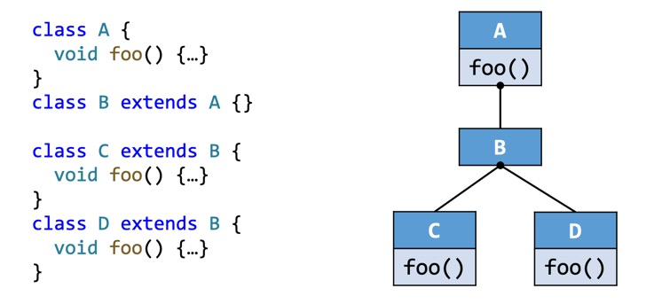

## 参考资料

- [课程主页 - 南京大学《软件分析》](https://tai-e.pascal-lab.net/lectures.html)
- [静态分析基础教程](https://static-analysis.cuijiacai.com/)
- [https://github.com/Ling-Yuchen/Tai-e-assignments](https://github.com/Ling-Yuchen/Tai-e-assignments)
- [https://github.com/MirageLyu/Tai-e-assignments](https://github.com/MirageLyu/Tai-e-assignments)
- [https://github.com/RicoloveFeng/SPA-Freestyle-Guidance](https://github.com/RicoloveFeng/SPA-Freestyle-Guidance)

## L1. Introduction

- [莱斯定理 - 不存在"完美"的静态分析算法](https://cs.nju.edu.cn/tiantan/software-analysis/introduction.pdf#page=23)
- [Soundness vs. Completeness](https://cs.nju.edu.cn/tiantan/software-analysis/introduction.pdf#page=35)
- 静态分析算法大多保证Soundness（允许误报），妥协Completeness

## L2. Intermediate Representation

- [AST vs. IR](https://cs.nju.edu.cn/tiantan/software-analysis/IR.pdf#page=13)
- [三地址码](https://cs.nju.edu.cn/tiantan/software-analysis/IR.pdf#page=18)
- [Control Flow Analysis (Control Flow Graph, CFG)](https://cs.nju.edu.cn/tiantan/software-analysis/IR.pdf#page=46)
- [Basic Blocks (BB)](https://cs.nju.edu.cn/tiantan/software-analysis/IR.pdf#page=49)
- [构建Basic Blocks（算法）](https://cs.nju.edu.cn/tiantan/software-analysis/IR.pdf#page=59)
- [构建Basic Blocks（例子）](https://cs.nju.edu.cn/tiantan/software-analysis/IR.pdf#page=77)
- [构建CFG（算法）](https://cs.nju.edu.cn/tiantan/software-analysis/IR.pdf#page=86)
- [构建CFG（例子）](https://cs.nju.edu.cn/tiantan/software-analysis/IR.pdf#page=96)

## L3-L4. Data Flow Analysis - Applications

- [前向分析、反向分析、Transfer Function](https://cs.nju.edu.cn/tiantan/software-analysis/DFA-AP.pdf#page=31)
- [BB内和BB间的控制流传递（前向分析、meet operator）](https://cs.nju.edu.cn/tiantan/software-analysis/DFA-AP.pdf#page=35)
- [BB内和BB间的控制流传递（反向分析）](https://cs.nju.edu.cn/tiantan/software-analysis/DFA-AP.pdf#page=36)

### 可达定义分析 Reaching Definitions Analysis

- [问题定义：分析某个"定义"是否能到达某个程序点](https://cs.nju.edu.cn/tiantan/software-analysis/DFA-AP.pdf#page=41)
- 应用举例：如果在初始时视为所有变量均定义为`undef`，且该定义能到达某个变量被使用的点，则说明程序可能存在未定义的变量使用。
- [数据抽象：Data Flow Values/Facts](https://cs.nju.edu.cn/tiantan/software-analysis/DFA-AP.pdf#page=44)
- [Transfer Function（例子）](https://cs.nju.edu.cn/tiantan/software-analysis/DFA-AP.pdf#page=48)
- [Transfer Function和控制流的传递](https://cs.nju.edu.cn/tiantan/software-analysis/DFA-AP.pdf#page=50)
- [算法（迭代算法）](https://cs.nju.edu.cn/tiantan/software-analysis/DFA-AP.pdf#page=53)
- [例子](https://cs.nju.edu.cn/tiantan/software-analysis/DFA-AP.pdf#page=121)

### 活跃变量分析 Live Variables Analysis

- [问题定义：分析某个变量在某个程序点是否"活跃"（即在该点之后的某条控制流路径上会被使用）](https://cs.nju.edu.cn/tiantan/software-analysis/DFA-AP.pdf#page=142)
- [数据抽象：Data Flow Values/Facts](https://cs.nju.edu.cn/tiantan/software-analysis/DFA-AP.pdf#page=143)
- [Transfer Function和控制流的传递](https://cs.nju.edu.cn/tiantan/software-analysis/DFA-AP.pdf#page=163)
- [算法（迭代算法）](https://cs.nju.edu.cn/tiantan/software-analysis/DFA-AP.pdf#page=164)
- [例子](https://cs.nju.edu.cn/tiantan/software-analysis/DFA-AP.pdf#page=225)

### 可用表达式分析 Available Expressions Analysis

- [问题定义：分析某个表达式在某个程序点是否"可用"（即在该点之前的所有控制流路径上均已计算过该表达式，且其操作数未被重新定义）](https://cs.nju.edu.cn/tiantan/software-analysis/DFA-AP.pdf#page=228)
- 应用举例：程序优化，在程序点处可以把表达式替换成上一次的计算结果，避免重复计算。
- [数据抽象：Data Flow Values/Facts](https://cs.nju.edu.cn/tiantan/software-analysis/DFA-AP.pdf#page=229)
- [Transfer Function和控制流的传递](https://cs.nju.edu.cn/tiantan/software-analysis/DFA-AP.pdf#page=242)
- [算法（迭代算法）](https://cs.nju.edu.cn/tiantan/software-analysis/DFA-AP.pdf#page=248)
- [例子](https://cs.nju.edu.cn/tiantan/software-analysis/DFA-AP.pdf#page=289)

### 总结

- [三个算法的总结表格](https://cs.nju.edu.cn/tiantan/software-analysis/DFA-AP.pdf#page=298)

### Assignment 1 Tips

- 在活跃变量分析中，`newInitialFact`和`newBoundaryFact`都是空集，本次作业中用不到`newBoundaryFact`的参数`cfg`。

    ```java
    public SetFact<Var> newBoundaryFact(CFG<Stmt> cfg)
    ```

    （在下一次常量分析作业中，就需要用到`cfg`来获取方法的参数，`newBoundaryFact`中要把参数初始化成`NAC`）

## L5-L6. Data Flow Analysis - Foundations

- [偏序关系（自反性、反对称性、传递性）](https://cs.nju.edu.cn/tiantan/software-analysis/DFA-FD.pdf#page=30)
- 关于对称性和反对称性：

    若二元关系$R$满足对称性：$a R b \Rightarrow b R a$

    若二元关系$R$满足反对称性：$a R b \wedge b R a \Rightarrow a = b$（即除非相等，否则不能双向成立；例如小于等于关系）

    对称性和反对称性并不是互斥的关系：例如相等关系同时满足对称性和反对称性。

- 关于全序关系和偏序关系：

    全序关系：在偏序关系的基础上，要求任意两个元素都可以比较（$a R b \vee b R a$）

    例如，整数集上的小于等于关系是全序关系（任意两个整数都可以比较大小）；而集合的子集关系是偏序关系（两个集合可能互不包含）。

- [上界和下界](https://cs.nju.edu.cn/tiantan/software-analysis/DFA-FD.pdf#page=61)
- [最小上界和最大下界](https://cs.nju.edu.cn/tiantan/software-analysis/DFA-FD.pdf#page=68)
- [格 (Lattice)：在偏序集中，任意两个元素都有最小上界和最大下界](https://cs.nju.edu.cn/tiantan/software-analysis/DFA-FD.pdf#page=81)
- [完全格 (Complete Lattice)：在偏序集中，任意子集都有最小上界和最大下界](https://cs.nju.edu.cn/tiantan/software-analysis/DFA-FD.pdf#page=97)
- 是格、但不是完全格的例子：整数集上的小于等于关系；考虑正整数子集，显然没有最小上界。
- 有限格一定是完全格，完全格不一定是有限格（例如$[0,1]$区间内实数集上的小于等于关系）。
- [积格 (Product Lattice)](https://cs.nju.edu.cn/tiantan/software-analysis/DFA-FD.pdf#page=103)
- [从格的角度理解数据流分析](https://cs.nju.edu.cn/tiantan/software-analysis/DFA-FD.pdf#page=106)
- [从格的角度理解数据流分析（例子）](https://cs.nju.edu.cn/tiantan/software-analysis/DFA-FD.pdf#page=112)
- [格上函数的单调性](https://cs.nju.edu.cn/tiantan/software-analysis/DFA-FD.pdf#page=118)
- [不动点定理：考虑有限完全格上的单调函数$f$，对$bottom$迭代$f$最终会收敛到最小不动点，对$top$迭代$f$最终会收敛到最大不动点](https://cs.nju.edu.cn/tiantan/software-analysis/DFA-FD.pdf#page=139)
- [从格的角度理解May Analysis和Must Analysis](https://cs.nju.edu.cn/tiantan/software-analysis/DFA-FD.pdf#page=196)
- [Ours (Iterative Algorithm) vs. Meet-Over-All-Paths (1)](https://cs.nju.edu.cn/tiantan/software-analysis/DFA-FD.pdf#page=210)
- [Ours (Iterative Algorithm) vs. Meet-Over-All-Paths (2)](https://cs.nju.edu.cn/tiantan/software-analysis/DFA-FD.pdf#page=223)

### 常量传播 Constant Propagation

- [问题定义：分析某个变量在某个程序点是否保证是一个常量](https://cs.nju.edu.cn/tiantan/software-analysis/DFA-FD.pdf#page=230)
- [数据抽象：格](https://cs.nju.edu.cn/tiantan/software-analysis/DFA-FD.pdf#page=238)
- [Transfer Function](https://cs.nju.edu.cn/tiantan/software-analysis/DFA-FD.pdf#page=247)
- [常量传播的Transfer Function是不满足分配律的（这个例子也解释了为什么MOP更准）](https://cs.nju.edu.cn/tiantan/software-analysis/DFA-FD.pdf#page=253)
- [Worklist算法](https://cs.nju.edu.cn/tiantan/software-analysis/DFA-FD.pdf#page=259)

### Assignment 2 Tips

- [【程序分析】南京大学软件分析Lab2（常量传播）易错样例补充](/25a/tai-e-a2-additional-case/)
- Worklist算法可以使用集合实现，因为同一个Node （或Basic Block）如果同时是多个Node （或Basic Block）的后继，则可能被重复添加多次。

    <!-- @xprops highlightLines="4" -->

    ```text
    while (Worklist is not empty)
        ...
        if (old_OUT != OUT[B])
            Add all successors of B to Worklist
    ```

    具体写法为：

    ```java
    Set<Node> worklist = new HashSet<>();
    ```

    取出一个元素并从集合中删除：

    ```java
    while (!worklist.isEmpty()) {
        Iterator<Node> it = worklist.iterator();
        Node node = it.next();
        it.remove();
        // ...
    }
    ```

### Assignment 3 Tips

- [【程序分析】南京大学软件分析Lab3（死代码消除）思路](/25a/tai-e-a3-solution/)

## L7. Interprocedural Analysis

- [建Call Graph的几种方法（本节讲CHA，后续讲指针分析）](https://cs.nju.edu.cn/tiantan/software-analysis/Inter.pdf#page=17)
- [Static call / Special call / Virtual call](https://cs.nju.edu.cn/tiantan/software-analysis/Inter.pdf#page=21)
- [方法签名](https://cs.nju.edu.cn/tiantan/software-analysis/Inter.pdf#page=25)
- [`Dispatch`：Method Dispatch of Virtual Calls](https://cs.nju.edu.cn/tiantan/software-analysis/Inter.pdf#page=26)
- [`Dispatch`（例子）](https://cs.nju.edu.cn/tiantan/software-analysis/Inter.pdf#page=29)
- [Class Hierarchy Analysis (CHA)](https://cs.nju.edu.cn/tiantan/software-analysis/Inter.pdf#page=32)
- [`Resolve`：Call Resolution of CHA，解析调用点处可能的目标方法](https://cs.nju.edu.cn/tiantan/software-analysis/Inter.pdf#page=39)
- [`Resolve`（例子）](https://cs.nju.edu.cn/tiantan/software-analysis/Inter.pdf#page=46)
- receiver object指的是在面向对象方法调用中，实际接收并执行该方法的对象实例：

    ```java
    obj.func()
    ```

    例子中`obj`就是receiver object。

- 关于`Dispatch`和`Resolve`：

    <!-- @xprops width="600px" filterDarkTheme -->

    

    对于以下代码：

    ```java
    A x = new B();
    x.foo();
    ```

    - `Dispatch(B, A.foo())`用于模拟**运行时**的方法分派，传入的两个参数是receiver object的实际类型`B`和`foo`的部分方法签名（只需要method name + descriptor）。

        注意由于多态允许`x`被赋值为其他子类`C`/`D`或类`A`本身，因此实际上静态分析时，不保证能够确定receiver object的实际类型。

    - `Resolve(callsite of x.foo())`用于**静态**的调用解析，根据receiver object `x`的声明类型`A`（不考虑等号右边）确定可能的目标方法集合。

        当`callsite`是一个virtual call时，由于不确定`x`的实际类型，因此需要考虑`A`及其所有子类中是否有重写`foo`方法的情况。此时`Resolve`会在`A`的直接或间接子类上运行`Dispatch`。

- [Call Graph (CG)](https://cs.nju.edu.cn/tiantan/software-analysis/Inter.pdf#page=51)
- [建CG的算法](https://cs.nju.edu.cn/tiantan/software-analysis/Inter.pdf#page=56)
- [Interprocedural Control-Flow Graph (ICFG)](https://cs.nju.edu.cn/tiantan/software-analysis/Inter.pdf#page=77)
- [ICFG例子](https://cs.nju.edu.cn/tiantan/software-analysis/Inter.pdf#page=81)
- [过程间数据流分析](https://cs.nju.edu.cn/tiantan/software-analysis/Inter.pdf#page=86)
- [过程间常量传播](https://cs.nju.edu.cn/tiantan/software-analysis/Inter.pdf#page=87)
- [过程间常量传播（例子）：保留call-to-return边是为了更高效地传方法内的局部变量](https://cs.nju.edu.cn/tiantan/software-analysis/Inter.pdf#page=99)
- [过程间常量传播（例子）：对于call-to-return边，要kill掉调用点的等号左侧变量（否则与return edge的结果meet时就变成NAC了）](https://cs.nju.edu.cn/tiantan/software-analysis/Inter.pdf#page=103)
- [过程间常量传播（总结）](https://cs.nju.edu.cn/tiantan/software-analysis/Inter.pdf#page=105)

### Assignment 4 Tips

- 在过程内常量分析中，`newBoundaryFact`中要把参数初始化成`NAC`，因为方法被调用时，参数的值是不确定的，为了保证Soundness，只能视为`NAC`。在本次作业做更精细的过程间常量分析，因此不再需要对大部分方法的参数做特殊处理，只需要处理整个ICFG的入口方法（如`main`方法）。

    ```java
    private void initialize() {
        // TODO - finish me
        for (Node node : icfg) {
            result.setInFact(node, analysis.newInitialFact());
            result.setOutFact(node, analysis.newInitialFact());
        }
        icfg.entryMethods().forEach(method -> {
            Node entry = icfg.getEntryOf(method);
            result.setOutFact(entry, analysis.newBoundaryFact(entry));
        });
    }
    ```

    （然而作业只考虑整数类型，`main`的`String[] args`参数不会被考虑，实测不对ICFG的入口方法做`newBoundaryFact`初始化也能过OJ）

- 过程内常量传播分析时，节点的$IN$是其所有前驱节点的$OUT$的meet；过程间常量传播分析时，节点的$IN$是其所有前驱节点的$OUT$先经过`transferEdge`，再meet；`transferEdge`主要是为了解决传参和返回的过程，对于过程内的普通边，`transferEdge`什么都不做。

    `transferEdge`的框架已经实现好了，作业中需要分别实现不同的细分情况。

    ```java
    @Override
    public Fact transferEdge(ICFGEdge<Node> edge, Fact out) {
        if (edge instanceof NormalEdge) {
            return transferNormalEdge((NormalEdge<Node>) edge, out);
        } else if (edge instanceof CallToReturnEdge) {
            return transferCallToReturnEdge((CallToReturnEdge<Node>) edge, out);
        } else if (edge instanceof CallEdge) {
            return transferCallEdge((CallEdge<Node>) edge, out);
        } else {
            return transferReturnEdge((ReturnEdge<Node>) edge, out);
        }
    }
    ```

- 对于call node，`transferCallNode`是恒等函数，不做任何处理。（参数会由`transferCallEdge`处理）

    ```java
    protected boolean transferCallNode(Stmt stmt, CPFact in, CPFact out) {
        // TODO - finish me
        return out.copyFrom(in);
    }
    ```

- `transferCallEdge`时，核心是对应实参和形参，实参可以这样获取：

    ```java
    Invoke invoke = (Invoke) edge.getSource();
    List<Var> actualParams = invoke.getInvokeExp().getArgs();
    ```

    形参可以这样获取：

    ```java
    JMethod callee = edge.getCallee();
    List<Var> formalParams = callee.getIR().getParams();
    ```

    整个`transferCallEdge`的实现：

    ```java
    @Override
    protected CPFact transferCallEdge(CallEdge<Stmt> edge, CPFact callSiteOut) {
        // TODO - finish me

        // 实参
        Invoke invoke = (Invoke) edge.getSource();
        List<Var> actualParams = invoke.getInvokeExp().getArgs();

        // 形参
        JMethod callee = edge.getCallee();
        List<Var> formalParams = callee.getIR().getParams();

        assert actualParams.size() == formalParams.size();

        CPFact result = newInitialFact();
        for (int i = 0; i < actualParams.size(); i++) {
            Var actual = actualParams.get(i);
            Var formal = formalParams.get(i);
            result.update(formal, callSiteOut.get(actual));
        }
        return result;
    }
    ```

    注意`result`是从`newInitialFact`开始添加，而不是基于`callSiteOut`。本地变量不需要流入被调用方法。（本地变量由call-to-return边处理）

- `transferReturnEdge`时，`edge.getReturnVars`在有多个`return`语句时会返回多个`returnVar`，比如这种情况：

    ```java
    int foo(...) {
        if (...) {
            return x;
        } else {
            return y;
        }
    }
    ```

    此时需要对这些返回值做`meetValue`。

## L8. Pointer Analysis

- [指针分析：分析指针（变量或字段）可能指向哪些对象，是 May-Analysis](https://cs.nju.edu.cn/tiantan/software-analysis/PTA.pdf#page=18)
- [指针分析（Pointer Analysis）和别名分析（Alias Analysis）的区别](https://cs.nju.edu.cn/tiantan/software-analysis/PTA.pdf#page=29)
- 指针分析的四个要素：
    - [1. 堆抽象（其中最常用的是分配点抽象）](https://cs.nju.edu.cn/tiantan/software-analysis/PTA.pdf#page=47)
    - [2. 上下文敏感/上下文不敏感](https://cs.nju.edu.cn/tiantan/software-analysis/PTA.pdf#page=52)
    - [3. 流敏感/流不敏感](https://cs.nju.edu.cn/tiantan/software-analysis/PTA.pdf#page=69)
    - [4. 分析范围，全程序/需求驱动](https://cs.nju.edu.cn/tiantan/software-analysis/PTA.pdf#page=76)
    - [本课程中学习的范围（也是目前主流的做法）](https://cs.nju.edu.cn/tiantan/software-analysis/PTA.pdf#page=78)

- Java中的指针：Local variable、Static field、Instance field、Array element
    - [对Array element的建模](https://cs.nju.edu.cn/tiantan/software-analysis/PTA.pdf#page=86)
    - [本课程只关注Local variable和Instance field两种指针](https://cs.nju.edu.cn/tiantan/software-analysis/PTA.pdf#page=87)

- [指针影响型语句：Pointer-Affecting Statements](https://cs.nju.edu.cn/tiantan/software-analysis/PTA.pdf#page=90)

## L9-L10. Pointer Analysis - Foundations

- [符号约定](https://cs.nju.edu.cn/tiantan/software-analysis/PTA-FD.pdf#page=6)
- [规则推导式](https://cs.nju.edu.cn/tiantan/software-analysis/PTA-FD.pdf#page=8)
- [规则推导式（图示）](https://cs.nju.edu.cn/tiantan/software-analysis/PTA-FD.pdf#page=13)
- 指针分析的一个关键是，当$pt(x)$变化时，把改变的部分传播给与$x$相关的其他指针

    为此，我们构建一个图来连接相关指针，当$pt(x)$变化时，把改变的部分传播给$x$的后继
    - [（见：实现指针分析的思路）](https://cs.nju.edu.cn/tiantan/software-analysis/PTA-FD.pdf#page=19)

- [指针流图（Pointer Flow Graph, PFG）：有向图，节点是指针（变量或字段），边$x \rightarrow y$表示指针$x$指向的对象可能流向$y$（即也被$y$指向）](https://cs.nju.edu.cn/tiantan/software-analysis/PTA-FD.pdf#page=21)
- [PFG例子：指针分析可以看作求PFG的传递闭包](https://cs.nju.edu.cn/tiantan/software-analysis/PTA-FD.pdf#page=37)
- 指针分析算法（过程内）
    - [算法总览](https://cs.nju.edu.cn/tiantan/software-analysis/PTA-FD.pdf#page=44)
    - [算法中worklist的元素是一个pair，包含一个指针和一个指向集（Points-to Set）：$\langle n,pts \rangle$](https://cs.nju.edu.cn/tiantan/software-analysis/PTA-FD.pdf#page=46)
    - 把$\langle n,pts \rangle$加入worklist，宏观上意味着在随后的过程中$pts$会被并入$pt(n)$
    - [`AddEdge(s,t)`：除了加一条PFG边$s \rightarrow t$之外，还把$\langle t,pt(s) \rangle$加入worklist，确保$s$指向的对象也流向$t$（被$t$指向）](https://cs.nju.edu.cn/tiantan/software-analysis/PTA-FD.pdf#page=52)
    - [`Propagate(n,pts)`：把$pts$并入$pt(n)$，并且对于所有$n$的后继$s$，把$\langle s,pts \rangle$加入worklist](https://cs.nju.edu.cn/tiantan/software-analysis/PTA-FD.pdf#page=57)
    - [差分传播：从worklist取出$\langle n,pts \rangle$后，实际执行`Propagate`的参数是$n$和$pts-pt(n)$，也就是只传播改变的部分](https://cs.nju.edu.cn/tiantan/software-analysis/PTA-FD.pdf#page=64)
    - [处理store和load语句](https://cs.nju.edu.cn/tiantan/software-analysis/PTA-FD.pdf#page=68)
    - [例子](https://cs.nju.edu.cn/tiantan/software-analysis/PTA-FD.pdf#page=91)

- 指针分析算法（过程间）
    - [处理call语句的规则推导式](https://cs.nju.edu.cn/tiantan/software-analysis/PTA-FD.pdf#page=106)

    <!-- @xprops background="red" -->

    > - [不加x -> m_this](https://cs.nju.edu.cn/tiantan/software-analysis/PTA-FD.pdf#page=113)
    - [算法总览](https://cs.nju.edu.cn/tiantan/software-analysis/PTA-FD.pdf#page=116)
    - [`AddReachable(m)`](https://cs.nju.edu.cn/tiantan/software-analysis/PTA-FD.pdf#page=119)
    - [`ProcessCall(x,oi)`：对于所有$x$作receiver object的调用语句`r=x.foo(a1,a2,...)` [TODO]](https://cs.nju.edu.cn/tiantan/software-analysis/PTA-FD.pdf#page=124)
    - [例子](https://cs.nju.edu.cn/tiantan/software-analysis/PTA-FD.pdf#page=152)

<!-- @xprops background="red" -->

> 为什么不用c.f而是obj3.f? [TODO]

## L14. Datalog-Based Program Analysis

- [Datalog语言介绍](https://cs.nju.edu.cn/tiantan/software-analysis/Datalog.pdf#page=17)
- [Pointer Analysis via Datalog](https://cs.nju.edu.cn/tiantan/software-analysis/Datalog.pdf#page=60)
- [Taint Analysis via Datalog](https://cs.nju.edu.cn/tiantan/software-analysis/Datalog.pdf#page=89)
