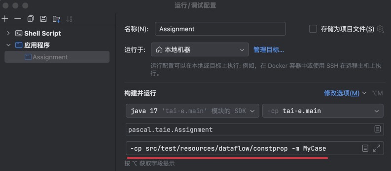
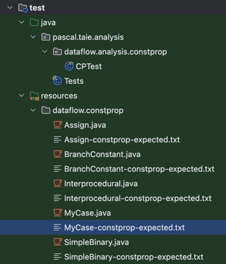
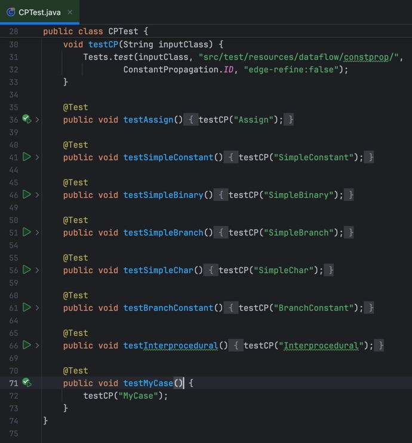

NJU程序分析[常量传播的Lab](https://tai-e.pascal-lab.net/pa2.html)在仓库的测试用例中给出的都是比较简单的例子，有一些易错情况没有包括。这个Lab通过率比较低，自己也参考了一些博客改了几次才过OJ，因此这里把一些易错的样例整理出来，便于调试。

## 易错情况

1. 方法参数的初始化：要初始化成`NAC`，见作业文档。<br>对应的测试方法：`WithParameter`
1. 非整型：此Lab只考虑整型的变量，注意在初始化以及`transferNode`中判断左值时，要用`canHoldInt`判断下。<br>对应的测试方法：`CantHoldInt`
1. 左值不是`Var`类型：即便判断一条语句`stmt`是`DefinitionStmt`类型，`stmt.getLValue()`也不一定返回`Var`类型，比如函数调用语句（`Invoke`）的左值可能为`null`（如果没有变量接收返回值），对类的成员变量赋值左值类型为`InstanceFieldAccess`。<br>对应的测试方法：`LvalNonVar`
1. 非二元表达式：比如单目运算符取反，此Lab不考虑，按照`NAC`处理。<br>对应的测试方法：`OtherExpression`
1. 除零：除零和模零规定结果为`UNDEF`，见作业文档。<br>对应的测试方法：`DivisionByZero`

## 测试样例

`MyCase.java`：

```java
class MyCase {

    private int m;

    void WithParameter(int x) {
        int a = x;
        if (a < 0) {
            a = 0;
        }
    }

    void CantHoldInt() {
        double a = 3.14;
        a += 1;
    }

    void LvalNonVar() {
        int a = 3;
        this.m = a;
    }

    void OtherExpression() {
        int a = 3;
        int b = -a;
    }

    void DivisionByZero(int nac) {
        int a = nac / 0;
        int b = a % 0;
        int c = 3 / 0;
    }
}
```

`MyCase-constprop-expected.txt`：

```text
-------------------- <MyCase: void <init>()> (constprop) --------------------
[0@L1] invokespecial %this.<java.lang.Object: void <init>()>(); {}
[1@L1] return; {}

-------------------- <MyCase: void WithParameter(int)> (constprop) --------------------
[0@L6] a = x; {a=NAC, x=NAC}
[1@L7] %intconst0 = 0; {%intconst0=0, a=NAC, x=NAC}
[2@L7] if (a < %intconst0) goto 4; {%intconst0=0, a=NAC, x=NAC}
[3@L7] goto 6; {%intconst0=0, a=NAC, x=NAC}
[4@L7] nop; {%intconst0=0, a=NAC, x=NAC}
[5@L8] a = 0; {%intconst0=0, a=0, x=NAC}
[6@L8] nop; {%intconst0=0, a=NAC, x=NAC}
[7@L8] return; {%intconst0=0, a=NAC, x=NAC}

-------------------- <MyCase: void CantHoldInt()> (constprop) --------------------
[0@L13] a = 3.14; {}
[1@L14] %doubleconst0 = 1.0; {}
[2@L14] a = a + %doubleconst0; {}
[3@L14] return; {}

-------------------- <MyCase: void LvalNonVar()> (constprop) --------------------
[0@L18] a = 3; {a=3}
[1@L19] %this.<MyCase: int m> = a; {a=3}
[2@L19] return; {a=3}

-------------------- <MyCase: void OtherExpression()> (constprop) --------------------
[0@L23] a = 3; {a=3}
[1@L24] b = -a; {a=3, b=NAC}
[2@L24] return; {a=3, b=NAC}

-------------------- <MyCase: void DivisionByZero(int)> (constprop) --------------------
[0@L28] %intconst0 = 0; {%intconst0=0, nac=NAC}
[1@L28] a = nac / %intconst0; {%intconst0=0, nac=NAC}
[2@L29] b = a % %intconst0; {%intconst0=0, nac=NAC}
[3@L30] %intconst1 = 3; {%intconst0=0, %intconst1=3, nac=NAC}
[4@L30] c = %intconst1 / %intconst0; {%intconst0=0, %intconst1=3, nac=NAC}
[5@L30] return; {%intconst0=0, %intconst1=3, nac=NAC}
```

## 使用方法

### 单独运行

创建`src/test/resources/dataflow/constprop/MyCase.java`，然后如图修改运行配置：



可以参考[以应用软件的形式运行 Tai-e](https://tai-e.pascal-lab.net/intro/setup.html#_3-%E4%BB%A5%E5%BA%94%E7%94%A8%E8%BD%AF%E4%BB%B6%E7%9A%84%E5%BD%A2%E5%BC%8F%E8%BF%90%E8%A1%8C-tai-e)。这种方法需要手动比对输出结果。

### 单元测试

将`MyCase.java`和`MyCase-constprop-expected.txt`都放到`src/test/resources/dataflow/constprop`目录下：



然后编辑`src/test/java/pascal/taie/analysis/dataflow/analysis/constprop/CPTest.java`，加入代码：

```java
@Test
public void testMyCase() {
    testCP("MyCase");
}
```



运行测试：

```text
./gradlew clean test
```
