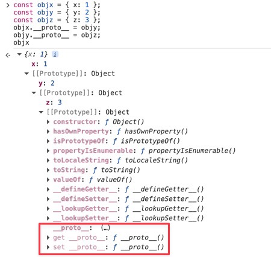
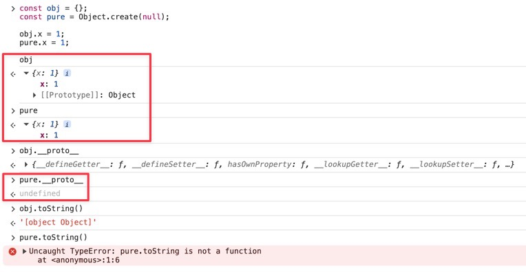

## 参考资料

- [The Modern JavaScript Tutorial](https://javascript.info) / [中文版](https://zh.javascript.info)
- [You Don't Know JS - 1st Edition](https://github.com/getify/You-Dont-Know-JS/blob/1st-ed/README.md)
- [this - MDN](https://developer.mozilla.org/zh-CN/docs/Web/JavaScript/Reference/Operators/this)
- [继承与原型链 - MDN](https://developer.mozilla.org/zh-CN/docs/Web/JavaScript/Guide/Inheritance_and_the_prototype_chain)
- [Object Internal Methods and Internal Slots](https://262.ecma-international.org/16.0/index.html#sec-object-internal-methods-and-internal-slots)

## this指向问题引入

> 这一部分将引入一些例子来讨论普通函数中的`this`指向问题。箭头函数的`this`指向规则与普通函数不同，后面会单独讨论。

### 对象方法中

在对象的方法中，`this`通常指向调用该方法的对象。

```js
function hello() {
    console.log(this.x);
}

const obj1 = {
    x: 1,
    f: hello,
};

const obj2 = { x: 2 };
obj2.f = hello;

obj1.f(); // 1
obj2.f(); // 2
```

### 函数不作为对象方法调用时

如果函数不是作为对象的方法调用，`this`的值（在非严格模式下）指向全局对象（浏览器中为`window`）。

```js
function hello() {
    console.log(this);
}
hello(); // Window {...}
```

```js
function hello() {
    console.log(this);
}
const obj = { f: (callback) => callback() };
obj.f(hello); // Window {...}
```

严格模式下，未作为对象方法调用的函数中的`this`为`undefined`。

```js
'use strict';
function hello() {
    console.log(this);
}
hello(); // undefined
```

### this丢失

`this`的指向由**调用点**决定，即便是对于同一个函数，不同的调用方式（如`obj.f()`和`g = obj.f, g()`）会导致`this`指向不同。

当将对象的方法赋值给一个变量或作为回调函数传递时，`this`可能会丢失其原始指向。

```js
function hello() {
    console.log(this);
}

const obj1 = {
    x: 1,
    f: hello,
};

const g = obj1.f;
g(); // Window {...}

function execute(fn) { fn() };
execute(obj1.f); // Window {...}
```

> 你或许还见过这样的代码：
>
> ```js
> (0, obj1.f)(); // Window {...}
> ```
>
> 这里利用了逗号运算符，尽管表达式`(0, obj1.f)`的值与`obj1.f`是对同一个函数的引用，但由于调用点不再是对象方法调用，此时`this`指向全局对象。这个“解绑定”技巧常用于将对象方法转换为独立函数调用。

## apply/bind/call

`apply`、`bind`和`call`是JavaScript中用于改变函数执行时`this`指向的三种方法。

`apply`和`call`非常相似，只是传递参数的方式不同；`apply`和`call`都会立刻执行函数，而`bind`则返回一个新的函数，供稍后调用。

```js
fn.apply(context, [arg1, arg2, ...])
fn.call(context, arg1, arg2, ...)
const f = fn.bind(context, arg1, arg2, ...)
```

```js
function hello(key1, key2) {
    console.log(this[key1], this[key2]);
}

const obj1 = { x: 1, y: 10 };
const obj2 = { x: 2, y: 20 };
const obj3 = { x: 3, y: 30 };

hello("x", "y") // undefined undefined
hello.apply(obj1, ["x", "y"]); // 1 10
hello.call(obj2, "x", "y"); // 2 20

const f = hello.bind(obj3, "x", "y");
f(); // 3 30
```

### apply/call与装饰器

下面的代码定义了一个简单的装饰器函数`addGoodbye`，它接收一个函数`fn`作为参数，并返回另一个新函数`wrapperFn`。新函数的功能是先执行原函数`fn`，再打印`Goodbye!`。

```js
function greet(text) {
    console.log("Hello, " + text + "!");
}
greet("Alice");
// Hello, Alice!

function addGoodbye(fn) {
    function wrapperFn(...args) {
        fn(...args);
        console.log("Goodbye!");
    }
    return wrapperFn;
}
greet = addGoodbye(greet);
greet("Bob");
// Hello, Bob!
// Goodbye!
```

上述代码在对象方法中不能正常工作。下面的例子中，把`greet`定义为对象方法，参数`text`由`this.text`取得。`addGoodbye`装饰器未做改动，但是装饰后的`obj.greet`方法在调用时丢失了`this`指向，导致`this.text`为`undefined`。

<!-- @xprops highlightLines="19" -->

```js
const obj = {
    text: "Carl",
    greet: function () {
        console.log("Hello, " + this.text + "!");
    }
};
obj.greet();
// Hello, Carl!

function addGoodbye(fn) {
    function wrapperFn(...args) {
        fn(...args);
        console.log("Goodbye!");
    }
    return wrapperFn;
}
obj.greet = addGoodbye(obj.greet);
obj.greet();
// Hello, undefined!
// Goodbye!
```

想修复此问题，仅需将`wrapperFn`中`fn(...args)`改为`fn.call(this, ...args)`：

<!-- @xprops highlightLines="12-13,20" -->

```js
const obj = {
    text: "Carl",
    greet: function () {
        console.log("Hello, " + this.text + "!");
    }
};
obj.greet();
// Hello, Carl!

function addGoodbye(fn) {
    function wrapperFn(...args) {
        // fn(...args);
        fn.call(this, ...args);
        console.log("Goodbye!");
    }
    return wrapperFn;
}
obj.greet = addGoodbye(obj.greet);
obj.greet();
// Hello, Carl!
// Goodbye!
```

> #### 这样做的原理是什么？
>
> 最后一行调用`obj.greet()`时，实际上是在调用`wrapperFn`函数的逻辑。此时`wrapperFn`函数中的`this`指向`obj`对象。
>
> 然而，倒数第二行`obj.greet`作为参数`fn`传入`addGoodbye`，又在`wrapperFn`调用`fn()`，这相当于：
>
> ```js
> const fn = obj.greet;
> fn();
> ```
>
> 这正是前面提到的`this`丢失的问题，由于调用点不是对象方法调用，非严格模式下`this`指向全局对象。
>
> 在`wrapperFn`中使用`fn.call(this, ...args)`时，我们把`wrapperFn`中的`this`绑定给了`fn`，从而修复了`this`丢失的问题。

### bind与偏函数

`bind`方法可以用来预设函数的部分参数，这种技术称为偏函数`(Partial Function)`。

```js
function mul(x, y) {
    return x * y;
}

const mul2 = mul.bind(null, 2);
console.log(mul2(3)); // 6
```

## new表达式：“函数的构造调用”

`new`表达式可以创建一个对象：

```js
function f(val) {
    this.x = val;
    this.text = "hello";
}
const obj = new f(1);
console.log(obj); // {x: 1, text: 'hello'}
```

> 当使用`new`调用一个函数时，函数中的`this`会指向新创建的对象。

<!-- @xprops background="blue" -->

> 当使用`new f(1)`时，我们会把`f`称作“构造函数”。然而JavaScript中的面向对象和真正的OOP语言有所不同，JavaScript中没有真正的“类”的概念（即便是ES6中的`class`关键字也只是语法糖），此处的“构造函数”`f`也与普通函数没什么不同。
>
> 因此对`new f(1)`一个更形象的描述是“对普通函数`f`的构造调用”。
>
> 如果直接调用`f(1)`，由于非严格模式下`this`指向全局对象，此时会在全局对象上创建属性`x`和`text`。

当使用`new`调用的函数有`return`语句时，如果返回的是一个对象，则该对象会作为`new`表达式的结果返回；如果返回的是一个原始类型，则忽略该返回值，仍然返回新创建的对象。

```js
function g(val) {
    this.x = val;
    return { anything: "anything" };
}
console.log(new g(1)); // {anything: 'anything'}

function h(val) {
    this.x = val;
    return 0;
}
console.log(new h(1)); // {x: 1}
```

箭头函数不能使用`new`调用。有关`constructor`后面还会进一步讨论。

```js
const f = () => {};
const obj = new f(); // TypeError: f is not a constructor
```

## 普通函数的this绑定

现在系统地总结一下普通函数的`this`绑定规则。

确定普通函数的`this`绑定时，按照优先级从高到低依次考虑以下几种绑定方式：

1. **`new`绑定**：如果函数是通过`new`调用的，`this`指向新创建的对象；
2. **显式绑定**：`apply`、`bind`和`call`可以显式地改变`this`指向；
3. **隐式绑定**：如果调用点处函数作为对象的方法调用（如`obj.func()`），那么`this`指向该对象；
4. **默认绑定**：在非严格模式下，未通过上述三种方式绑定的函数调用中，`this`指向全局对象；在严格模式下为`undefined`。

## 箭头函数的this绑定

箭头函数不遵循标准的`this`绑定规则。当**创建箭头函数的语句被执行**时，箭头函数会从外层作用域中捕获`this`，此时其`this`值就被确定，且无法被`apply`、`bind`或`call`改变。

> 有些文章会表述为“箭头函数的`this`值在箭头函数定义时即确定”，此处的“定义”应理解为动态的行为（箭头函数被创建时），而非静态的、源代码层面的函数定义。
>
> 另一方面，有些书籍或文档中会提到“箭头函数的`this`是**词法式**绑定”的，“词法”是静态的概念，此处的“绑定”应理解为`this`指向的“来源”可以静态确定（即来源于外层作用域），而非`this`的值确定。

下面的例子对理解箭头函数的`this`绑定很有帮助：

<!-- @xprops highlightLines="2-3" -->

```js
function getFn() {
    // console.log(this);
    const fn = () => { console.log(this) };
    return fn;
}

const fn1 = getFn();
fn1(); // Window {...}

const fn2 = getFn.call({ x: 2 });
const fn3 = getFn.call({ y: 3 });
fn2(); // {x: 2}
fn3(); // {y: 3}
```

注意是当`getFn`被调用后，创建箭头函数的语句才会执行，此时箭头函数从外层作用域中捕获`this`（可以理解为，如果在此处打印`this`，会得到的值）。由于三次对`getFn`的调用中，`getFn`中的`this`分别指向不同的对象，因此创建的箭头函数的`this`也分别指向不同的对象。

箭头函数的`this`一旦捕获后就永久固定下来，不会再被`apply`、`bind`或`call`改变。

```js
fn3.call({ anything: "anything" }); // {y: 3}
```

下面的例子直观对比了箭头函数和普通函数的`this`绑定行为的差异：

```js
const factory = {
    text: "factory",
    getNormalFn: function () {
        return function () { console.log(this) };
    },
    getArrowFn: function () {
        return () => { console.log(this) };
    }
}

const normalFn = factory.getNormalFn();
const arrowFn = factory.getArrowFn();
const obj1 = {
    text: "obj1",
    normalFn: normalFn,
    arrowFn: arrowFn,
};
const obj2 = {
    text: "obj2",
    normalFn: normalFn,
    arrowFn: arrowFn,
};

normalFn();      // Window {...}
obj1.normalFn(); // {text: 'obj1', ...}
obj2.normalFn(); // {text: 'obj2', ...}

arrowFn();       // {text: 'factory', ...}
obj1.arrowFn();  // {text: 'factory', ...}
obj2.arrowFn();  // {text: 'factory', ...}
```

例子中`factory`对象提供了两个函数`getNormalFn`和`getArrowFn`，这两个函数分别返回一个普通函数和一个箭头函数。创建出的两个函数实例为`normalFn`和`arrowFn`，我们给`obj1`和`obj2`也都分别添加上这两个函数实例作为对象方法。为了便于演示我们给涉及到的三个对象`factory`、`obj1`和`obj2`都添加了一个`text`属性。

**普通函数的`this`指向由调用方式确定**。尽管`normalFn`、`obj1.normalFn`和`obj2.normalFn`引用的都是同一个函数，但由于他们的调用方式不同，每次调用时的`this`指向也不同。

**箭头函数的`this`指向在被定义（被创建）时确定**。`arrowFn`以`factory.getArrowFn()`的方式被创建，此时`getArrowFn`中的`this`指向`factory`，因此`arrowFn`的`this`也被永久绑定为`factory`。

## 原型

### 继承与原型链

JavaScript基于对象实现继承。每一个对象都有一个**原型对象**，原型对象要么是另一个对象，要么是`null`。

原型对象也是普通对象，因此也会有自己的原型对象、自己的原型对象的原型对象...，直到到达原型链的顶端`null`。这种通过原型对象形成的链式结构称为**原型链**。当访问一个对象的属性时，如果该对象本身没有这个属性，JavaScript引擎会沿着原型链向上查找原型对象上的属性。

下面的例子手动创造了一条原型链：`objx -> objy -> objz`。

```js
const objx = { x: 1 };
const objy = { y: 2 };
const objz = { z: 3 };
console.log(objx.z); // undefined

objx.__proto__ = objy;
objy.__proto__ = objz;
console.log(objx.z); // 3
```

只有在读取属性时，才会沿着原型链查找；在写入属性时，直接在当前对象上创建或更新该属性。下面的例子中，给`objx`赋值`z`属性，相当于在`objx`上创建了一个新的属性`z`，而不会修改原型链上`objz`的`z`属性。这也被称为**属性遮蔽**。

```js
objx.z = 100;
console.log(objx.z); // 100
console.log(objy.z); // 3
console.log(objz.z); // 3
```

### prototype与constructor

默认情况下，函数对象有一个`prototype`属性，`fn.prototype`是一个普通对象，这个对象又有一个`constructor`属性，指向函数自身。

```js
function fn() {};
console.log(fn.prototype.constructor === fn); // true
console.log(fn.prototype.constructor.prototype.constructor === fn); // true
```

当使用`new`调用函数时，会设置新建对象的原型对象为该函数的`prototype`属性。

```js
function fn() {};
const obj = new fn();
console.log(obj.__proto__ === fn.prototype); // true
```

当有时只能得到一个对象实例，却不知道具体的构造函数时，由于`obj.__proto__`指向`fn.prototype`，而`fn.prototype.constructor`指向`fn`，因此可以通过下面的方式找到一个对象的构造函数：

```js
function fn() {};
const obj = new fn();
console.log(obj.__proto__.constructor === fn); // true
console.log(obj.constructor === fn); // true
```

中间的`__proto__`可以省略。当访问`obj.constructor`时，由于`obj`本身没有`constructor`属性，自然会沿着原型链查找到`obj`的原型对象，而`obj`的原型对象已经被设置为`fn.prototype`，因此最终会得到`fn.prototype.constructor`，也就是`fn`。

注意并不是所有函数都有`prototype`属性，例如箭头函数就没有`prototype`属性。

```js
function fn1() {};
console.log(fn1.prototype); // {...}

const fn2 = () => {};
console.log(fn2.prototype); // undefined
```

### 内建的原型

JavaScript内建了一些构造函数，如`Object`、`Array`、`Number`、`Function`等，这些构造函数都有自己的`prototype`属性，定义了该类型实例对象所共有的方法和属性。当写出`const arr = [];`这样的代码时，内部会使用`new Array()`来创建一个数组对象，并将该对象的原型对象设置为`Array.prototype`。`Array.prototype`上已经定义好了数组实例所共有的方法，如`push`、`pop`等。因此，当我们调用`arr.pop()`时，JavaScript引擎会沿着原型链找到`Array.prototype.pop`方法并执行它。

```js
const arr = [];
console.log(arr.__proto__ === Array.prototype); // true
console.log(arr.pop === Array.prototype.pop); // true
```

创建一个新对象时，该对象的原型对象会指向`Object.prototype`（`Object`是构造函数）。

```js
const obj = {};
console.log(obj.__proto__ === Object.prototype); // true
```

前面提到`Array.prototype`、`Number.prototype`等本质上也是普通对象，因此它们也有原型对象。它们的原型对象指向`Object.prototype`。这也是继承在JavaScript中的一种体现。

```js
console.log(Array.prototype.__proto__ === Object.prototype); // true
console.log(Number.prototype.__proto__ === Object.prototype); // true
console.log(Function.prototype.__proto__ === Object.prototype); // true
```

`Object.prototype`的原型对象是`null`，它位于原型链的顶端。

```js
console.log(Object.prototype.__proto__); // null
```

<!-- @xprops background="blue" -->

> 想一下，`Object.__proto__`是什么？
>
> 这里我们实际上是在查询`Object`的原型对象。`Object`是一个函数，因此它的原型对象是`Function.prototype`。
>
> ```js
> console.log(Object.__proto__ === Function.prototype); // true
> ```

### 深入理解__proto__与[[Prototype]]

> #### 内部属性 (Internal Slot) 和内部方法 (Internal Method)
>
> 在调试工具或一些文档中，可能会看到被双中括号包裹的名称，这些是JavaScript引擎内部使用的属性或方法，无法在JavaScript代码中直接访问。但是对于有些内部属性或方法，JavaScript规范会提供一些接口来读写它们。
>
> 这一节讨论的`[[Prototype]]`就是一个内部属性，它表示对象的原型对象。

在前面的表述中，我刻意回避了“对象的`__proto__`属性”这种说法，因为这会引起歧义，听起来好像每一个对象都天生带有一个`__proto__`属性。

事实上，`__proto__`可以看作是内部属性`[[Prototype]]`的getter/setter，它定义在`Object.prototype`上。我们几乎可以在任意对象上访问`__proto__`，本质上是沿着原型链找到了`Object.prototype`上对应的getter/setter函数，然后以当前对象作为`this`执行。

<!-- @xprops themeAdaptive -->



为什么是“几乎”？我们可以通过`Object.create(null);`直接创建一个原型对象为`null`的对象，它比`const obj = {};`创建的空对象还要“纯净”。注意下面两个对象的区别：

<!-- @xprops themeAdaptive -->



由于`pure`的原型对象是`null`，没有继承`Object.prototype`，也就无法通过`__proto__`访问原型对象`[[Prototype]]`。同理，它也无法使用定义在`Object.prototype`上的方法，如`toString`。

## 杂项

### 创建立即执行函数

也叫立即调用函数表达式`(Immediately-Invoked Function Expressions, IIFE)`。

```js
(function () { console.log("hello") })();
(function () { console.log("hello") }());
+ function () { console.log("hello") }();
- function () { console.log("hello") }();
! function () { console.log("hello") }();
(() => { console.log("hello") })();
```

### var

使用`var`声明的变量具有函数作用域（或全局作用域），它们可以“穿透”块级作用域。`var`可以重复声明同一变量。

```js
if (1) {
    var x = 0;
    var x = 1;
    let y = 0;
    // let y = 1; // SyntaxError: Identifier 'y' has already been declared
}

console.log(x); // 1
// console.log(y); // ReferenceError: y is not defined
```

`var`声明的变量提升，即变量声明会被提升到其作用域的顶部，因此在声明之前访问该变量不会导致错误，而是返回`undefined`。

```js
console.log(x); // undefined
if (0) {
    var x = 1;
}
```

### Symbol

JavaScript中对象的键要么是字符串，要么是一个`Symbol`。`Symbol`表示一个独一无二的标识符，这在需要确保对象属性不会被意外覆盖时非常有用。例如，在大型代码库或使用第三方库时，使用`Symbol`作为键可以避免命名冲突的问题。

```js
const id = Symbol("id");
const x1 = Symbol("x");
const x2 = Symbol("x");
const obj = {
    [id]: 0,
    [x1]: 1,
    [x2]: 2,
};
console.log(obj[id]); // 0
console.log(obj[x1]); // 1
console.log(obj[x2]); // 2
```

`Symbol`可以接收一个字符串参数作为描述，但不会影响其唯一性。即使两个`Symbol`的描述相同，它们仍然是不同的实体。

`Symbol.for`和`Symbol.keyFor`方法用于创建和访问全局注册的`Symbol`。

```js
console.log(Symbol("x") === Symbol("x")); // false
console.log(Symbol.for("x") === Symbol.for("x")); // true
```

使用`Symbol`作为对象的键时，这些属性不会出现在`for...in`循环、`Object.keys`、`JSON.stringify`中。可以通过`Object.getOwnPropertySymbols`和`Reflect.ownKeys`方法访问这些`Symbol`属性。

### 遍历对象属性的方法

这一节系统地测试一下各种类型的对象属性以及遍历对象属性的方法。测试的属性包括：

- `prop_normal`：普通属性
- `prop_method`：方法属性
- `prop_symbol`：`Symbol`属性
- `prop_accessor`：访问器属性
- `prop_non_enumerable`：不可枚举属性
- `prop_proto`：原型对象上的属性

测试的遍历对象属性的方式包括：

- `for...in`循环
- `JSON.stringify`（这个严格来说不是遍历属性的方法，但可以反映出哪些属性会被序列化）
- `Object.keys`
- `Object.getOwnPropertyNames`
- `Object.getOwnPropertySymbols`
- `Reflect.ownKeys`

测试结果见注释。

```js
const obj = {
    prop_normal: 1,
    prop_method: function () {},
    [Symbol("prop_symbol")]: 1,
    get prop_accessor() { return 1; },

};
Object.defineProperty(obj, 'prop_non_enumerable', {
    value: 1,
    enumerable: false,
});
obj.__proto__ = { prop_proto: 1 };

for (let key in obj) console.log(key);          // prop_normal, prop_method, prop_accessor, prop_proto
console.log(JSON.stringify(obj));               // {"prop_normal":1,"prop_accessor":1}
console.log(Object.keys(obj));                  // ['prop_normal', 'prop_method', 'prop_accessor']
console.log(Object.getOwnPropertyNames(obj));   // ['prop_normal', 'prop_method', 'prop_accessor', 'prop_non_enumerable']
console.log(Object.getOwnPropertySymbols(obj)); // [Symbol(prop_symbol)]
console.log(Reflect.ownKeys(obj));              // ['prop_normal', 'prop_method', 'prop_accessor', 'prop_non_enumerable', Symbol(prop_symbol)]
```
