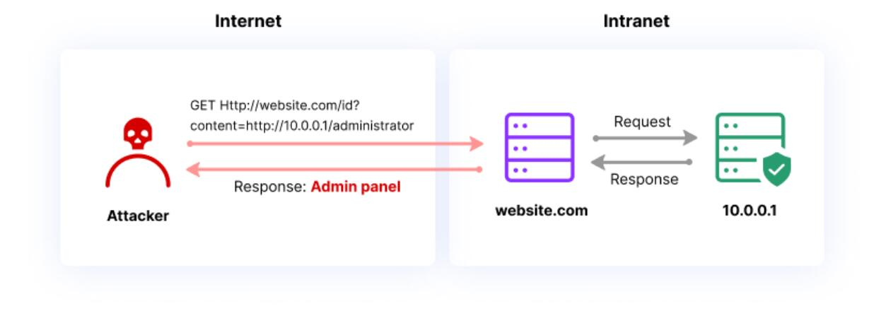
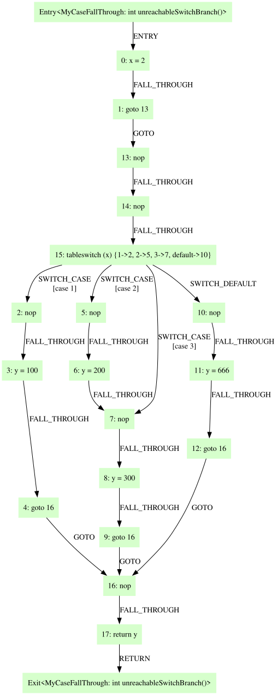

本页是 markdown 文章渲染管线（`remark-gfm` + `remark-math` + `remark-xprops` → `mdx-components.js` → `X` 组件库）的全量回归测试页，覆盖每一个可从 markdown 触达的组件、每一组属性、以及组件之间的嵌套组合。

每个用例下方紧跟一段以 **预期** / **异常** 开头的说明：**预期**描述正确渲染应该是什么样子，**异常**列出一旦看到就说明渲染有问题的特征。没有 **异常** 说明的用例，只要与**预期**不符即为异常。

全局基线（贯穿整页，不再逐条重复）：段落 / 代码块 / 引用块 / 表格 / 图片 / 公式 / 分割线等相邻块级元素之间的间距统一为 24px，行高 28px；相邻列表项之间的间距为 12px。间距机制：组件自身不携带纵向外边距，间距由最近的流容器通过 owl 选择器（`> * + *`）注入，定义集中在 `X/flow.css`。**异常**：任意两个相邻块级元素之间出现明显不等于 24px 的空隙（如 0px 挤在一起、或 48px 的双倍间距）。

本页需要在**亮色和暗色两种主题**下各走查一遍，并在**桌面（>1440px）、平板（600–1440px）、手机（<600px）** 三档视口下各走查一遍。

---

## 一、页面骨架

### 1.1 标题、元信息、目录、点赞

**预期**：页面顶部依次为文章大标题（28px，来自 `archives.json` 而非正文）、一行元信息 `N likes · N views · 2026-08-13`（等宽字体、灰色小字），页面右上/侧边有"本页目录"面板，页面最底部有一个心形点赞按钮。目录里应当只出现 `##` 和 `###` 两级标题（即本页的"一、二、三…"和"1.1、1.2…"），**不应**出现 `####` 级别的条目。**异常**：元信息长时间停留在 `null likes · null views`（Firebase 计数器加载失败）；目录为空或目录里混入了 `####` 标题；滚动时目录高亮项与当前实际阅读位置错位超过一屏。

### 1.2 目录联动

**预期**：向下滚动时目录中的高亮项跟随推进；点击目录任一条目可跳到对应标题；点击"本页目录"标题本身回到页首。滚动到页面最底部时，目录的最后一项应当处于高亮态。**异常**：滚到底部时高亮停在中间某项再也不动（`getMappedOffsetTop` 的末端映射失效）；快速滚动出现明显掉帧卡顿。

---

## 二、标题体系

### 2.1 三级标题与前缀符号

#### 这是 h4（映射为 X.H3，18px，无前缀符号）

**预期**：`##` 渲染为 24px 标题且带一个品牌色 `#` 前缀；`###` 渲染为 20px 标题且带品牌色 `##` 前缀；`####` 渲染为 18px 标题且**没有**任何前缀符号。三级标题与上下内容的间距均为 24px。**异常**：`#` / `##` 前缀是黑色/正文色而非品牌青色；`####` 也长出了前缀符号；三级标题字号看不出层级差异。

### 2.2 标题内含行内元素

### 含 `行内代码` 与 **加粗** 的子标题

#### 含公式 $E = mc^2$ 与[链接](https://example.com)的小标题

**预期**：标题内的行内代码保持 14px 灰底胶囊样式（比标题文字小一号），加粗在已经是粗体的标题里不产生二次变化，公式基线与标题文字对齐，链接为品牌色。**异常**：行内代码把标题行撑高导致行距突变；公式明显下沉或上浮脱离基线；标题里的 `#` 前缀被行内元素挤到第二行。

### 2.3 标题外链（href）

<!-- @xprops href="https://github.com" -->

## 带外链的一级标题（点击跳 GitHub）

<!-- @xprops href="https://nextjs.org" -->

### 带外链的二级标题（点击跳 Next.js）

<!-- @xprops href="https://react.dev" -->

#### 带外链的三级标题（点击跳 React）

**预期**：三个标题外观与普通标题**完全一致**（同样的字号、同样的品牌色前缀、同样的正文色文字），只有鼠标悬停时整行文字变为品牌色，点击在新标签页打开。`#` / `##` 前缀符号**不参与**悬停变色（它在 `::before` 上，始终是品牌色）。**异常**：标题默认就显示为品牌色/带下划线（说明继承了 `x-inline-link` 而不是 `color: inherit`）；悬停无变色；点击在当前标签页跳走。

### 2.4 长标题折行

### 这是一个非常非常长的二级标题，用于验证标题在窄视口下折行时前缀符号是否正确悬挂以及行距是否稳定这是一个非常非常长的二级标题

**预期**：折行后第二行文字左边缘与第一行的**文字**左边缘对齐（前缀 `##` 只占第一行）。**异常**：折行后前缀符号被重复渲染；第二行缩进错乱到与前缀符号对齐。

---

## 三、段落与行内元素

### 3.1 行内元素总览

普通段落包含**加粗文本**、`行内代码`、[超链接](https://example.com)、*斜体*、~~删除线~~、以及自动识别的裸链接 https://example.com 和 www.example.com 。

**预期**：加粗为粗体（无颜色变化）；行内代码为 14px、灰底、圆角 4px、左右各 2px 外边距；超链接为品牌色且**无下划线**，悬停时才出现品牌色下划线；斜体为倾斜；删除线为中划线；两个裸链接自动变成可点击的品牌色链接（注意本句里两个裸链接后面都**刻意留了空格**，原因见 3.7）。所有行内元素都不应改变所在行的行高（28px）。**异常**：链接默认带下划线；行内代码与相邻汉字之间完全没有间隙；某个行内元素把这一行撑高。

### 3.2 行内元素互相嵌套

混合嵌套：**加粗中嵌套`代码`**、`代码中的**星号**不应被解析`、[**加粗链接**](https://example.com)、[`代码链接`](https://example.com)、**[加粗包链接](https://example.com)**、~~[删除线链接](https://example.com)~~、以及公式与代码相邻 `x` $x$ `x`。

**预期**：`代码中的**星号**不应被解析` 里的两对星号原样显示为字符；`代码链接` 这个胶囊里的**文字是品牌色**（`.x-inline-link > .x-inline-highlight` 规则），而普通行内代码的文字是常规灰色 —— 这两者放在一起应当能看出颜色差异。**异常**：代码块胶囊里的星号被吃掉变成了粗体；`代码链接` 的文字颜色与普通 `行内代码` 完全相同（说明品牌色规则失效）。

### 3.3 转义与特殊字符

转义星号 \*not-italic\*、转义反引号 \`not-code\`、转义美元 \$100、反斜杠 \\、尖括号 `<script>alert(1)</script>`、HTML 实体 &amp; &lt; &copy;、以及中文标点「引号」《书名号》——破折号……省略号。

**预期**：所有被转义的符号原样显示为普通字符，不触发任何格式化；`<script>` 以纯文本形式出现在代码胶囊里（页面不应弹窗）；HTML 实体正确解码为 `&`、`<`、`©`。**异常**：出现 alert 弹窗（XSS）；转义符 `\` 自身被显示出来。

### 3.4 硬换行与软换行

这一行以两个空格结尾产生硬换行，  
所以这是新的一行，但仍属于同一段落。
而这一行是软换行，应当与上一行**合并显示**在同一行内。

**预期**：第 1、2 行之间有换行但没有段间距（同一个 `<p>` 内的 `<br>`）；第 2、3 行合并成一行连续文字。**异常**：三行之间出现了 24px 的段间距（说明被拆成了三个段落）；软换行处出现了换行。

### 3.5 长内容折行压力测试

这是一段中英文混排的长文本，用于测试段落在不同视口宽度下的折行表现。The quick brown fox jumps over the lazy dog，段落中穿插 `a-very-long-inline-code-token-that-should-not-break-the-layout` 这样的长行内代码，以及一条超长且不含空格的 URL：<https://example.com/a/very/long/path/that/keeps/going/and/going/and/going/without/any/space/at/all>，还有一个超长英文单词 pneumonoultramicroscopicsilicovolcanoconiosis。

**预期**：所有内容都被约束在正文列宽内，不产生**页面级横向滚动条**。长行内代码折行时，灰色背景会被拆成两段但**每段都保留完整圆角**（`box-decoration-break: clone`）。**异常**：页面出现水平滚动条；长 URL 或长单词把正文列撑宽把侧栏挤变形；折行的行内代码只有第一段有圆角、第二段是齐平的直角。

### 3.6 加粗紧贴中文时解析失败（CommonMark 侧翼规则陷阱）

这是中文博客最容易踩的排版坑。加粗的结束标记只有在"**它前面的字符不是标点**"或"**它后面的字符是空格或标点**"时才生效（CommonMark 的右侧翼规则）。以下五条各占一段，每段末尾标注了应有的结果：

甲、结束标记前是汉字、后是汉字 → **加粗中文**后续（成功）。

乙、结束标记前是右括号、后是汉字 → **桌面（1440px）**三档（失败）。

丙、结束标记前是右括号、后是顿号 → **桌面（1440px）**、三档（成功）。

丁、结束标记前是行内代码、后是汉字 → **含`代码`**后续（失败）。

戊、结束标记前是行内代码、后是句号 → **含`代码`**。后续（成功）。

**预期**：乙、丁两段会出现**裸露的 `**` 字符**且文字**没有**加粗；甲、丙、戊三段正常加粗且不残留星号。**规避方法**：在结束标记后面补一个空格，或让它紧跟中文标点，或干脆把括号/行内代码挪出加粗范围。**异常**：五段全部正常加粗（说明换了更宽松的解析器，本节预期需更新）；或本该成功的三段也漏出了 `**`。

**注意**：这五条**必须写成段落**才能观察到上述现象。同样的内容如果写进紧凑列表项，`XParser` 会把落单的 `*` 当成自己的加粗语法二次处理，结果是星号被悄悄吃掉、文字依然不加粗 —— 反而更难发现问题。相关行为见第十六节。

### 3.7 裸链接吞掉后续中文（GFM 自动链接陷阱）

对照组一，尖括号包裹的安全写法：<https://example.com/path>，后面跟中文逗号和文字。

对照组二，裸写 URL 后紧跟中文标点：https://example.com/path，后面跟中文逗号和文字。

对照组三，裸写域名后紧跟中文句号：www.example.com。

**预期**：对照组一的链接**只包含 URL 本身**，中文部分是普通正文。对照组二和三则会暴露 GFM 自动链接的既定行为：**中文标点和后续中文字符不是链接终止符**，它们会被一路吞进链接，直到遇到空格为止 —— 所以对照组二的链接文字会变成 `https://example.com/path，后面跟中文逗号和文字`（且 href 里带上 URL 编码后的中文），对照组三的链接会带上句号。**结论**：正文里写裸链接时，URL 后面必须跟一个空格，或者用 `<>` 包裹、或者写成 `[文字](url)` 形式。**异常**：对照组一也被吞了中文（说明 `<>` 写法失效）。

**验收方法**：把鼠标悬停在三条链接上看状态栏 URL，或直接观察品牌色下划线的覆盖范围到哪里为止。

---

## 四、公式

### 4.1 行内公式

仿射映射量化中，原数 $d$ 与量化表示 $q$ 的关系为 $d = s(q - z)$，其中 $s$ 是步长、$z$ 是零点。秩不等式 $r(A) + r(B) - n \leq r(AB) \leq \min(r(A), r(B))$ 中假设 $A$ 是 $m \times n$ 矩阵。带上下标的 $\sum_{i=1}^{n} x_i$ 与带分式的 $\frac{a}{b}$ 也在此行。

**预期**：行内公式与周围文字**基线对齐**，字号视觉上与正文接近；带分式和求和号的公式会略微撑高该行，但整段行距仍保持均匀。**异常**：公式明显比正文大一号或小一号；公式相对基线上浮/下沉；含 $\frac{a}{b}$ 的那一行行距被撑开得远大于其他行（KaTeX 的 strut 未生效）。

### 4.2 行内公式与其他行内元素混排

深度可分离卷积参数量 $h \times w \times D_i + D_i \times D_o$ 相比常规卷积的 $h \times w \times D_i \times D_o$ 大幅减少。使用 `8` 位量化时数值范围为 $-128$ ~ $127$，详见[量化综述](https://example.com)，其中 **$\alpha$ 是加粗环境里的公式**，`$100` 是代码里的美元符号（不应被渲染成公式）。

**预期**：`$100` 保持为字面文本（因为它在行内代码里）；加粗环境内的 $\alpha$ 正常渲染为公式（KaTeX 输出不继承粗体是正常的）。**异常**：`$100` 被解析成了公式；`~` 号被吃掉。

### 4.3 块级公式

$$
d = s(q - z)
$$

$$
s = \frac{d_{max} - d_{min}}{q_{max} - q_{min}}
$$

**预期**：块级公式**水平居中**，与上下内容间距 24px，字号比行内公式大。**异常**：块级公式左对齐（说明 `.x-formula` 的 `text-align: center` 失效）；两个连续公式之间的间距不是 24px。

### 4.4 多行环境与矩阵

$$
\begin{aligned}
L &= \alpha L_{soft} + \beta L_{hard} \\
q_i &= \frac{e^{z_i / T}}{\sum_{j=1}^{n} e^{z_j / T}}
\end{aligned}
$$

$$
A = \begin{pmatrix} 1 & 2 & 3 \\ 4 & 5 & 6 \\ 7 & 8 & 9 \end{pmatrix}
\quad
B = \begin{bmatrix} a \\ b \end{bmatrix}
\quad
C = \left| \begin{matrix} x & y \\ z & w \end{matrix} \right|
$$

$$
f(x) = \begin{cases} x^2 & x \geq 0 \\ -x^2 & x < 0 \end{cases}
$$

**预期**：`aligned` 环境的两行在 `&` 处（等号）**竖直对齐**；三种括号矩阵的定界符高度自动包住内容；`cases` 的大括号完整。整块仍然水平居中。**异常**：`aligned` 的等号没对齐；矩阵括号是固定小号括号包不住内容；出现红色的 KaTeX 报错文字。

### 4.5 超长公式横向滚动

$$
\sum_{i=1}^{n} \int_{0}^{\infty} \frac{x^i e^{-x}}{\Gamma(i)} dx = \lim_{k \to \infty} \prod_{j=1}^{k} \left( 1 + \frac{1}{j^2} \right) \cdot \alpha\beta\gamma\delta\epsilon\zeta\eta\theta\iota\kappa\lambda\mu\nu\xi\pi\rho\sigma\tau\upsilon\phi\chi\psi\omega + \oint_{\partial \Omega} \mathbf{F} \cdot d\mathbf{S}
$$

**预期**：公式超出正文宽度时，**公式自身**出现横向滚动条（`.x-formula` 的 `overflow-x: auto`），公式内部**不换行**。**异常**：公式换行断成两截；公式撑破正文列导致整个页面出现横向滚动条；出现纵向滚动条。

### 4.6 公式在其他容器内

- 列表项内的行内公式 $E = mc^2$ 与块级公式：

    $$
    \nabla \cdot \mathbf{E} = \frac{\rho}{\varepsilon_0}
    $$

> 引用块内的行内公式 $\min(rwnd, cwnd)$ 与块级公式：
>
> $$
> r(A) + r(B) - n \leq r(AB)
> $$

| 表格内公式 | 值 |
|---|---|
| $a^2 + b^2 = c^2$ | $\sqrt{2}$ |
| 行内 $\frac{1}{2}$ | $\pi$ |

**预期**：三种容器内的块级公式仍然居中（相对于各自容器的内容区），行内公式与容器内文字基线对齐；表格单元格内的公式不会把单元格撑成异常高度。**异常**：容器内的块级公式跑到容器外面；表格行高因为公式而剧烈跳变；列表项内的公式覆盖了列表标记。

---

## 五、代码块：语言矩阵

以下逐一验证 `languageNameMap` 里登记的全部 18 种语言。**统一预期**：每个代码块右上角悬浮一个圆角标签，内容为"语言显示名"（有 title 时为 `title / 语言名`），标签默认半透明、鼠标移入代码块后变为完全不透明；标签右侧是复制按钮，点击后图标应有反馈且剪贴板拿到**去掉首尾空行后的原始代码**。代码区左右内边距 32px（手机端 18px），行高 24px，字号 15px。**统一异常**：语言名显示为原始小写标识（如 `js` 而不是 `JavaScript`）；标签遮挡了代码首行；代码完全没有语法着色（全部同一颜色）；复制出来的内容带 HTML 标签或带高亮标记。

### 5.1 JavaScript / TypeScript / JSX / TSX

```js
const express = require('express');
async function main(n = 10) {
    const re = /^[a-z]+\d{2,}$/gi;
    return [...Array(n).keys()].map((i) => `item-${i}`).filter((s) => re.test(s));
}
```

```ts
interface User<T extends object = {}> {
    readonly id: number;
    name?: string;
    meta: T;
}
export const pick = <K extends keyof User>(u: User, k: K): User[K] => u[k];
```

```jsx
export default function Badge({count, onClick}) {
    return (
        <button className="badge" onClick={onClick}>
            {count > 99 ? '99+' : count}
        </button>
    );
}
```

```tsx
const List: React.FC<{items: string[]}> = ({items}) => (
    <ul>
        {items.map((it, i) => (
            <li key={i}>{it}</li>
        ))}
    </ul>
);
```

### 5.2 Python / C / C++ / Java

```python
from dataclasses import dataclass

@dataclass
class TreeNode:
    val: int = 0
    left: "TreeNode | None" = None

    def inorder(self) -> list[int]:
        return (self.left.inorder() if self.left else []) + [self.val]
```

```c
#include <stdio.h>
#define MAX(a, b) ((a) > (b) ? (a) : (b))

int main(void) {
    int arr[] = {5, 3, 8, 1, 2};
    for (int i = 0; i < 5; i++) printf("%d ", MAX(arr[i], 4));
    return 0;
}
```

```cpp
#include <vector>
template <typename T>
class Stack {
   public:
    void push(const T& v) { data_.push_back(v); }

   private:
    std::vector<T> data_{};
};
```

```java
public class Main {
    public static void main(String[] args) {
        var list = java.util.List.of("a", "b", "c");
        list.stream().filter(s -> !s.isEmpty()).forEach(System.out::println);
    }
}
```

### 5.3 PHP / Perl / Bash / SQL

```php
<?php
function greet(string $name = 'world'): string {
    return sprintf('Hello, %s!', htmlspecialchars($name));
}
echo greet($_GET['name'] ?? 'world');
```

```perl
use strict;
my %h = (a => 1, b => 2);
foreach my $k (sort keys %h) {
    printf("%s => %d\n", $k, $h{$k});
}
```

```bash
#!/bin/bash
set -euo pipefail
for file in *.log; do
    echo "Processing: ${file}"
    grep -c "ERROR" "$file" || true
done
```

```sql
SELECT u.username, COUNT(o.id) AS order_count
FROM users u
LEFT JOIN orders o ON u.id = o.user_id
WHERE u.created_at > '2024-01-01'
GROUP BY u.username
HAVING COUNT(o.id) > 5;
```

### 5.4 HTML / CSS / JSON / Markdown

```html
<!DOCTYPE html>
<html lang="zh-CN">
    <head>
        <meta charset="UTF-8" />
        <title>Test &amp; Demo</title>
    </head>
    <body>
        <div id="app" data-role="root"><!-- comment --></div>
    </body>
</html>
```

```css
:root {
    --gap: 1rem;
}
.container > .item:hover::after {
    content: '→';
    transform: scale(1.02) translateX(4px);
    transition: transform 0.2s ease-in-out;
}
@media (max-width: 600px) {
    .container {
        display: grid;
    }
}
```

```json
{
    "name": "mdx-test",
    "version": "1.0.0",
    "private": true,
    "nested": {"arr": [1, 2.5, true, null], "unicode": "中文"}
}
```

```markdown
# 标题

- 列表项 **加粗**
- 列表项 `代码`

> 引用

[链接](https://example.com)
```

### 5.5 Plain Text / ASM8086

```text
This is plain text without syntax highlighting.
Special characters: <tag>, "quotes", 'single', &amp;, $var, ${brace}
    Indented line stays indented.
```

```asm8086
MOV AX, 0B800h
MOV DS, AX
MOV BYTE PTR [0], 41h
INT 21h
RET
```

**5.5 预期**：`text` 显示名为 `Plain Text` 且**不着色**（整块同一颜色，仅注释/字符串不应被误染）；`asm8086` 显示名为 `ASM8086`，寄存器/指令有着色。**异常**：`text` 块里的 `<tag>` 被当成 HTML 消失了；`asm8086` 显示为空或报未知语言。

---

## 六、代码块：属性矩阵

### 6.1 title（含空格与特殊字符）

<!-- @xprops title="fibonacci.js" -->

```js
function fibonacci(n) {
    if (n <= 1) return n;
    return fibonacci(n - 1) + fibonacci(n - 2);
}
```

<!-- @xprops title="my report file.py" -->

```python
print("title 里有空格")
```

<!-- @xprops title='single-quoted.sh' -->

```bash
echo "title 用单引号包裹"
```

<!-- @xprops title="/etc/ssh/sshd_config" -->

```text
PermitRootLogin yes
```

**预期**：四个标签依次显示 `fibonacci.js / JavaScript`、`my report file.py / Python`、`single-quoted.sh / Bash`、`/etc/ssh/sshd_config / Plain Text`。**异常**：带空格的标题被截断成 `my / Python`（说明 `parseProps` 的引号解析退化成了按空格切分）；单引号标题连引号一起显示。

### 6.2 highlightLines

<!-- @xprops title="utils.py" highlightLines="3-5" -->

```python
class TreeNode:
    def __init__(self, val=0, left=None, right=None):
        self.val = val
        self.left = left
        self.right = right
```

<!-- @xprops highlightLines="1,4,7" -->

```js
const express = require('express');

const app = express();
const PORT = 3000;

app.get('/', (req, res) => {
    res.send('Hello World');
});

app.listen(PORT);
```

<!-- @xprops title="第一行与最后一行" highlightLines="1,3" -->

```js
const first = 1;
const middle = 2;
const last = 3;
```

**预期**：第一块金色底覆盖第 3、4、5 行（`self.val` 到 `self.right`）；第二块金色底**精确覆盖**第 1、4、7 行（`const express`、`const PORT`、`app.get`），空行不被误染；第三块覆盖首行和末行。高亮条应当与文字行**严丝合缝对齐**（每行 24px），并且**横向铺满整个代码块**（包括左右内边距区域），横向滚动时高亮条跟随内容一起滚动是不需要的、它铺满可视宽度即可。**异常**：高亮条整体上移或下移半行/一行（说明 CSS 行高 24px 或 `pre` 的 24px 上内边距被改过，与 `CodeBlock.js` 的硬编码脱钩）；高亮条高度不是整行；高亮覆盖了错误的行号。

### 6.3 diff 增删标注

<!-- @xprops title="sshd_config" diffRemovedLines="1-2" diffAddedLines="3-4" -->

```text
#PermitRootLogin prohibit-password
#PermitEmptyPasswords no
PermitRootLogin yes
PermitEmptyPasswords yes
```

<!-- @xprops title="sort.js" diffRemovedLines="2" diffAddedLines="3" -->

```js
function swap(arr, i, j) {
    const tmp = arr[i]; arr[i] = arr[j]; arr[j] = tmp;
    [arr[i], arr[j]] = [arr[j], arr[i]];
}
```

**预期**：删除行为红色底、新增行为绿色底，两段颜色**紧邻无缝**（1-2 红、3-4 绿之间没有透明缝隙）。**异常**：红绿之间出现 1px 透明缝；颜色对调；红绿块的高度不等于行数 × 24px。

### 6.4 三种标注组合

<!-- @xprops title="patch.c" highlightLines="1" diffRemovedLines="2-3" diffAddedLines="4-5" -->

```c
if (!ctx->in_seek) {
    if (size > remain) {
        GF_LOG(GF_LOG_WARNING, GF_LOG_MEDIA, "truncated");
    if (bytes_skipped + size > remain) {
        GF_LOG(GF_LOG_WARNING, GF_LOG_MEDIA, "truncated (fixed)");
        break;
    }
}
```

**预期**：第 1 行金色、第 2–3 行红色、第 4–5 行绿色，三段依次紧邻；第 6 行之后无底色。**异常**：三段顺序错乱（`allStartEnd` 排序失效）；某一段消失。

### 6.5 越界与空标注

<!-- @xprops title="越界高亮" highlightLines="99" -->

```js
const onlyOneLine = true;
```

<!-- @xprops title="仅有 title 无高亮" -->

```js
const noHighlight = true;
```

**预期**：`highlightLines="99"` 指向不存在的行，`pre` 上仍会生成渐变背景但色带位于 99 行之外（远在代码块可视区之下），所以**看不到任何底色**且不报错；第二个仅有 title 的代码块则完全不生成 `background` 内联样式。两块外观应当一致。**异常**：越界高亮导致代码块被撑高、底部出现一条孤立色带、或页面 500。

---

## 七、代码块：边界情况

### 7.1 单行、空行、缩进

<!-- @xprops title="one-liner.sql" -->

```sql
SELECT group_concat(schema_name) FROM information_schema.schemata
```

```python
def a():
    pass


def b():
    pass
```

```python
        first_line_is_deeply_indented = True
if True:
    pass
```

**预期**：单行代码块高度约为 24（行高）+ 48（上下内边距）= 72px；中间的两个连续空行被保留（不被压缩成一个）；第三块虽然首行缩进 8 空格而后续行不缩进，但由于 markdown 侧会先 `trim()`，**渲染结果应当是首行顶格、`if True:` 顶格、`pass` 缩进 4 空格**。**异常**：第三块的 `if True:` 变成了 `e:` 之类被截断的内容（说明反缩进逻辑吃掉了正常字符）；空行被吃掉。

### 7.2 超长行与超长标题

<!-- @xprops title="a-very-very-very-long-file-name-used-to-test-header-ellipsis-behavior.py" -->

```python
payload = "AAAAAAAAAAAAAAAAAAAAAAAAAAAAAAAAAAAAAAAAAAAAAAAAAAAAAAAAAAAAAAAAAAAAAAAAAAAAAAAAAAAAAAAAAAAAAAAAAAAAAAAAAAAAAAAAAAAAAAAAAAAAAAAA" + "BBBB" * 32
```

**预期**：代码**不换行**，代码块自身出现横向滚动条；右上角标签宽度不超过代码块的 96%，超出部分以省略号 `…` 收尾。**异常**：长代码换行显示；标签把代码块撑宽或溢出到页面外；标签文字硬生生被裁掉而没有省略号。

### 7.3 特殊字符与制表符

```text
HTML: <script>alert(1)</script>  &  &amp;  &#60;
Quotes: "double" 'single' `backtick` ${template}
Tab	separated	columns
Unicode: 中文 日本語 한국어 🎉 ← 表情符号
```

**预期**：所有字符原样显示，`<script>` 不执行；制表符按制表位展开而不是变成一个空格；表情符号正常显示。**异常**：出现弹窗；尖括号内容整段消失。

### 7.4 连续代码块与紧邻段落

这段话的下一行就是代码块。

```js
const a = 1;
```

```python
b = 2
```

```sql
SELECT 3;
```

这段话紧接在代码块之后。

**预期**：三个代码块彼此间距 24px，且各自的右上角标签**不与上一个代码块的底边重叠**（标签是 `top: -8px` 的绝对定位，24px 间距足够容纳）。**异常**：后一个代码块的标签压在前一个代码块的右下角上；段落与代码块之间的间距明显大于 24px。

---

## 八、引用块（HighlightBlock）

### 8.1 五种背景色

> 默认（不写 background）：golden 金色底。

<!-- @xprops background="golden" -->

> 显式 `golden`：与上一个应当完全同色。

<!-- @xprops background="red" -->

> `red`：危险/警告提示。

<!-- @xprops background="blue" -->

> `blue`：信息提示。

<!-- @xprops background="green" -->

> `green`：成功提示。

<!-- @xprops background="gray" -->

> `gray`：中性备注。

**预期**：六个块依次为 金、金、红、蓝、绿、灰，圆角 12px、内边距上下 24px 左右 32px（手机端左右 18px），块间距 24px。所有背景都是**半透明**的，切到暗色主题后底色应当自动变暗而文字保持可读。**异常**：任意两块颜色相同（除前两块外）；某块没有背景色；暗色主题下底色仍是亮色导致文字看不清；块与块之间粘连没有间距。

### 8.2 非法与缺省 background

<!-- @xprops background="purple" -->

> 传入了一个不存在的颜色 `purple`。

<!-- @xprops background -->

> `background` 作为布尔 flag 传入（值为 `true`）。

**预期**：这两块**没有任何背景色**（透明），但仍保留 12px 圆角的内边距布局 —— 表现为文字左右各内缩 32px、上下各 24px 的"隐形块"。这是当前实现的既定行为（类名拼成了不存在的 `highlight-background-purple` / `highlight-background-true`），不算 bug，但**如果需要容错降级到 golden，这里就是改动点**。**异常**：页面报错；或者非法值意外地渲染成了某种颜色。

### 8.3 空块与连续块

>

> 紧接在空引用块后的普通引用块。

<!-- @xprops background="red" -->

> 再紧接一个红色引用块，验证连续引用块不会被合并。

**预期**：空引用块渲染为一个高度约 48px（上下内边距）的纯色条；三个块彼此独立、间距 24px。**异常**：空块把后面的内容吸进去合并成一块；空块高度塌陷为 0 完全看不见。

### 8.4 引用块内的行内元素与多段落

<!-- @xprops background="blue" -->

> 函数 `apply`、`bind` 和 `call` 是 JavaScript 中用于改变 **this** 指向的三种方法。`apply` 和 `call` 会**立刻执行**函数，而 `bind` 返回一个新函数，详见 [MDN 文档](https://developer.mozilla.org)。
>
> 这是第二段。线性变换后新空间的秩一定不大于原空间的秩，也一定不大于这个变换的秩。
>
> 这是第三段，用于验证段间距。

**预期**：块内三段之间间距 24px；owl 间距规则只作用于相邻元素之间，首末段天然没有多余外边距，所以文字到块边框的上下距离精确等于 24px 的内边距，不是 48px。**异常**：文字与块边缘之间的上下空隙明显大于左右内缩量的比例关系（说明首尾段落多出了额外的外边距）。

---

## 九、引用块内的嵌套组合

### 9.1 引用块 + 标题 + 代码

<!-- @xprops background="blue" -->

> ### 块内的二级标题
>
> #### 块内的三级标题
>
> 下面的代码展示逗号运算符解绑 `this` 的技巧：
>
> ```js
> (0, obj1.f)(); // Window {...}
> ```
>
> 尽管 `(0, obj1.f)` 与 `obj1.f` 指向同一函数，但调用点不再是方法调用。

**预期**：块内标题保留品牌色 `##` 前缀且首个标题上方没有额外空隙（文字紧贴块的 24px 内边距）；块内代码块的右上角标签**完整可见不被引用块裁切**（标签是 `top:-8px right:-8px` 的绝对定位，会略微超出代码块但仍在引用块的 32px 内边距范围内）。**异常**：块内标题也会进入右侧目录（目录只收 `.x-h1`/`.x-h2`，所以块内 `###` 会进目录 —— 这是**已知行为**，如果你不希望引用块内的标题进目录，这里就是需要修的地方）；代码块标签被引用块的圆角裁掉一角。

### 9.2 引用块 + 列表 + 代码

<!-- @xprops background="gray" -->

> 常见的盲注技术：
>
> - **布尔盲注**：通过页面响应差异判断
> - **时间盲注**：通过响应延迟判断
> - `报错注入`：利用数据库报错信息
>
> ```sql
> SELECT if(ascii(substr((SELECT password FROM users LIMIT 1), 1, 1)) > 96, sleep(2), 0);
> ```

**预期**：列表项的圆点标记落在引用块内边距之内（不越界到块外），列表与代码块之间间距 24px。**异常**：列表圆点被引用块左边缘裁掉；列表项左侧缩进量与块外的列表不一致。

### 9.3 引用块 + 表格 + 图片 + 分割线 + 嵌套引用

<!-- @xprops background="green" -->

> 块内表格：
>
> | 参数 | 说明 |
> |------|------|
> | `service` | 固定参数 |
>
> ---
>
> 块内图片：
>
> 
>
> > 这是**嵌套**在引用块内的引用块（默认 golden）。
> >
> > > 三层嵌套引用块。

**预期**：块内表格的单元格底色（灰）与引用块底色（绿）叠加后仍能看出层次；分割线横跨引用块内容区宽度；图片水平居中；嵌套引用块表现为绿底上叠一层金底、金底上再叠一层金底（两层金色叠加会比一层更深）。**异常**：嵌套引用块没有内缩（说明 padding 没生效，看起来像同级）；块内分割线溢出到引用块外面。

---

## 十、列表：基础与嵌套矩阵

### 10.1 无序列表与行内元素

- 纯文本列表项
- 包含 `行内代码` 的列表项
- 包含 **加粗** 的列表项
- 包含 [超链接](https://example.com) 的列表项
- 包含公式 $x^2$ 的列表项
- 混合 `代码`、**加粗**、[链接](https://example.com) 与 $\alpha$ 的列表项

**预期**：所有项的圆点标记左对齐在同一竖线上（标记区固定 32px 宽），内容左边缘也对齐；项与项之间间距 12px；圆点为品牌色的 4px 小圆点，**竖直居中**于该项的第一行文字。**异常**：某一项（尤其是含公式的那项）的圆点相对文字上浮或下沉；含长内容折行后第二行没有与第一行文字对齐而是跑到圆点下面。

### 10.2 有序列表与自定义起始编号

1. 第一步：安装依赖
2. 第二步：配置插件
3. 第三步：编写文章

中间用一个段落把两个有序列表隔开，验证第二个列表**重新从 1 开始**。

1. 新列表第一项
2. 新列表第二项

下面这个列表在 markdown 里写作 `3.` 开头：

3. 从三开始
4. 第四
5. 第五

**预期**：第一组为 1/2/3，第二组**重新从 1 开始**（每个 `<ol>` 有独立的 `counter-reset`），第三组为 3/4/5（`start` 被转成 `counter-reset: oli 2`）。编号为品牌色，右对齐/居中在 32px 的标记区内。**异常**：第二组接着第一组编号变成 4/5（说明计数器作用域丢失）；第三组从 1 开始（说明 `start` 未被处理）；编号是黑色而不是品牌色。

### 10.3 紧凑列表 vs 松散列表

紧凑列表（项之间无空行）：

- 项 A
- 项 B
- 项 C

松散列表（项之间有空行）：

- 项 A

- 项 B

- 项 C

**预期**：两者**视觉上应当完全一致**（都是 12px 项间距）。紧凑列表的项内容（裸文本与行内元素）在渲染层会被统一包装为 `<p>`，与松散列表的 `<p>` 走同一条路径。**异常**：松散列表的项间距明显大于紧凑列表（例如 24px 或 36px），或松散列表首/末项与前后元素的间距塌陷。

### 10.4 嵌套矩阵（四种组合 + 深层）

无序套无序：

- 外层 A
    - 子项 A-1
    - 子项 A-2
- 外层 B
    - 子项 B-1
- 没有子列表的外层项

无序套有序：

- 外层项
    1. 有序子项一
    2. 有序子项二
- 另一个外层项

有序套无序：

1. 外层第一项
    - 无序子项一
    - 无序子项二
2. 外层第二项

有序套有序（编号隔离的关键用例）：

1. 外层一
    1. 内层一
    2. 内层二
2. 外层二
3. 外层三

四层深度嵌套：

- L1
    - L2
        - L3
            - L4 最深层

**预期**：每深入一层，标记与内容整体右移一个标记区宽度（32px）；"有序套有序"中外层必须是 1/2/3、内层必须是 1/2（内层**不能**接着外层数成 2/3，外层第二项也**不能**因为内层而跳号变成 4）；四层嵌套的 L4 相对 L1 缩进 96px。**带子列表的项与它的下一个兄弟项之间的间距同样是 12px**——不应因为项内有嵌套列表而变大（此处曾因嵌套列表尾部的外边距穿透渲染为 24px，是旧间距机制下的已修复缺陷）。**异常**：内外层编号串号；子列表与父项内容之间出现异常大的空隙；带子列表的项与下一项间距明显大于 12px；某一层的标记消失。

### 10.5 任务列表（GFM）

- [x] 已完成的任务
- [ ] 未完成的任务
- [x] 含 `代码` 与 **加粗** 的已完成任务

**预期**：每一项**同时**出现"品牌色圆点"和"复选框"两个标记 —— 这是当前实现的既定行为（`ul` 映射丢弃了 `<li>` 的 `task-list-item` 类名，圆点无法被抑制）。复选框为禁用态、不可点击。**异常**：页面报错；或复选框可被点击（应为 `disabled`）。如果你希望任务列表只显示复选框不显示圆点，这里就是改动点。

### 10.6 长内容折行与列表标记对齐

- 这是一个内容非常长的列表项，用于验证折行后第二行、第三行的左边缘是否与第一行文字对齐而不是跑到标记下方。The quick brown fox jumps over the lazy dog. 中英文混排继续加长以确保在桌面视口下也能折行显示至少两到三行内容。

1. 有序列表的长内容项同样需要验证折行对齐。这里再加一些文字以保证在宽视口下也能折行：Lorem ipsum dolor sit amet, consectetur adipiscing elit, sed do eiusmod tempor incididunt ut labore.

**预期**：折行后所有行的左边缘对齐于内容区起点（距标记区 32px），标记只出现在第一行左侧。**异常**：第二行文字顶到标记正下方（内容区没有独立成列）。

---

## 十一、列表项内的嵌套组合

### 11.1 列表项含多段落

- 第一个列表项的第一段。

    第一个列表项的第二段，验证松散列表下的多段落渲染。

    第三段。

- 第二个列表项仅有一段。

**预期**：同一项内的段落间距 12px（列表上下文收紧，区别于正文的 24px），首末段没有多余的外边距；三个段落都在内容区列内（左边缘对齐）。**异常**：第二、三段跑到了标记正下方；项内段落间距渲染为 24px（说明列表上下文的收紧规则失效）。

### 11.2 列表项含代码块

- 查所有数据库：

    ```sql
    SELECT group_concat(schema_name) FROM information_schema.schemata
    ```

- 查数据库中的表，并附带 xprops：

    <!-- @xprops title="in-list.sql" highlightLines="1" -->

    ```sql
    SELECT group_concat(table_name) FROM information_schema.tables WHERE table_schema='security'
    ```

**预期**：列表项内的代码块宽度受内容区约束（不会溢出到标记区左侧）；xprops 在缩进的列表项内部同样生效（标签显示 `in-list.sql / SQL`，第 1 行金色高亮）。**异常**：xprops 注释以字面文本 `<!-- @xprops ... -->` 显示出来；或注释失效导致标签只显示 `SQL`；代码块右上角标签溢出到列表标记上方。

### 11.3 列表项含段落 + 代码 + 说明（博客典型模式）

- `substr(str, pos, len)`：从第 `pos` 个字符开始截取长度为 `len` 的子串。

    ```sql
    SELECT substr("abcdef", 1, 3);          -- abc
    SELECT substr((SELECT "123456"), 4, 3); -- 456
    ```

    `pos` 从 1 开始计数。

- `ascii(ch)`：返回字符的 ASCII 码值。

    ```sql
    SELECT ascii("A");   -- 65
    ```

    如果传入字符串，则返回第一个字符的 ASCII 码值。

**预期**：每项内部呈"段落 → 代码块 → 段落"三段结构，垂直间距均匀（12px，列表上下文收紧），相邻项之间间距 12px。**异常**：代码块后的说明文字被吸进代码块或另起为新的列表项；项内间距渲染为 24px。

### 11.4 列表项含引用块 / 表格 / 图片 / 分割线

- 列表项内的引用块：

    <!-- @xprops background="red" -->

    > 嵌套在列表项中的红色引用块。

- 列表项内的表格：

    | 列一 | 列二 |
    |---|---|
    | a | b |

- 列表项内的图片：

    

- 列表项内的分割线：

    ---

- 普通列表项，用于验证嵌套后续项渲染正常。

**预期**：四种块级元素都被约束在内容区列内，左边缘与文字对齐；引用块的左内边距（32px）叠加在列表缩进之上；分割线只跨越内容区宽度而不是整个正文宽度。**异常**：任一块级元素越过列表标记向左溢出；分割线横跨整页。

### 11.5 有序列表含代码 + 子列表（博客典型模式）

1. 配置 QEMU 启动参数以实现共享目录和端口转发：

    ```bash
    qemu-system-x86_64 -m 1024 -hda /path/to/debian.qcow2 \
        -virtfs local,path=/shared,mount_tag=shared,security_model=none \
        -netdev user,id=net0,hostfwd=tcp::2222-:22 \
        -nographic
    ```

    - `-virtfs`：启用虚拟文件系统共享
    - `-netdev`：使用 user 网络模式，转发端口

2. 关闭虚拟机，用新命令重新启动。

3. 在虚拟机中挂载共享目录：

    ```bash
    mkdir -p /mnt/shared
    mount -t 9p shared /mnt/shared
    ```

4. 修改 SSH 配置以允许 root 登录：

    <!-- @xprops diffRemovedLines="1-2" diffAddedLines="3-4" -->

    ```text
    #PermitRootLogin prohibit-password
    #PermitEmptyPasswords no
    PermitRootLogin yes
    PermitEmptyPasswords yes
    ```

    保存退出后重启服务：`sudo systemctl restart sshd`

**预期**：外层编号连续为 1/2/3/4（不因内部的无序子列表或代码块而跳号或重置）；第 4 项内的 diff 标注正常上红下绿。**异常**：编号变成 1/2/3/1 或 1/1/1/1（计数器被内容区的 `counter-reset` 误伤）。

### 11.6 深度嵌套：列表 > 引用块 > 代码

- 当发现服务端延迟远大于设置的参数时：

    > 可能是在当前语法中 `sleep` 函数会对每一行数据都调用一次，例如：
    >
    > ```sql
    > SELECT id FROM users WHERE sleep(1);
    > ```
    >
    > 需要用 `LIMIT 1` 约束。

- 正常的列表项，用于验证深度嵌套后续项渲染正常。

**预期**：三层结构（列表内容区 → 引用块内边距 → 代码块）层层内缩，最内层代码块仍有完整的圆角和右上角标签。**异常**：最内层代码块的标签被引用块或列表裁切；层级缩进丢失导致三者左边缘相同。

---

## 十二、表格：属性矩阵

### 12.1 默认表格（无 xprops）

| 列一 | 列二 | 列三 |
|------|------|------|
| a | b | c |
| d | e | f |

**预期**：首行为表头（较深的灰底），数据行为较浅的灰底；单元格之间有 3px 的间隙（`border-spacing`）而**不是**共享边框；所有单元格文字默认**居中**；表格宽度为内容自适应（`fit-content`），不会拉伸到整个正文宽度。**异常**：表格被拉满正文宽度；单元格之间是实线边框而非间隙；表头与数据行底色相同。

### 12.2 GFM 对齐语法

| 左对齐 | 居中 | 右对齐 |
|:-------|:----:|-------:|
| Alice | 97 | ★★★ |
| Bob | 86 | ★★ |
| 长一些的内容 | 中 | 短 |

**预期**：三列分别左/中/右对齐，**表头单元格也跟随该列的对齐方式**。**异常**：只有数据行对齐生效而表头仍然居中；或对齐完全不生效（三列都居中，说明 `remark-xprops` 的 `propagateGfmAlignToCells` 没把 align 传到单元格）。

### 12.3 width（逐列像素宽度，0 表示不设置）

<!-- @xprops width="250,120,80" -->

| 较宽列 | 中等列 | 较窄列 |
|--------|--------|--------|
| 内容一 | 内容二 | 内容三 |

<!-- @xprops width="0,300" -->

| 自适应列 | 固定 300 列 |
|---|---|
| 短 | 内容 |

<!-- @xprops width="[200,200]" -->

| 方括号写法 | 第二列 |
|---|---|
| a | b |

**预期**：第一个表三列宽度依次**精确为** 250/120/80 px；第二个表首列宽度由内容决定（`0` 被当作"不设置"，实测约 89px）、次列 300px；第三个表说明 `width` 支持带方括号的写法，两列各 200px。用 DevTools 选中任一单元格看 Computed 宽度即可核对。三个表**都保留深色表头行** —— 传了 `width` 而不传 `thead` 时，表格虽然走"重建"分支把 `<thead>`/`<tbody>` 拍平成单个 `<tbody>`，但会回退到"原本是 `<th>` 的格子仍然是表头"的判定，所以视觉上与默认表格一致。**异常**：深色表头消失（说明回退判定被改坏了）；方括号写法把 `[200` 解析成 NaN 导致列宽塌陷；某一列的宽度只作用于表头行而没有作用于数据行。

### 12.4 thead 全组合

`thead="row"`（首行为表头，等价于默认表格的视觉效果）：

<!-- @xprops thead="row" -->

| H1 | H2 | H3 |
|---|---|---|
| a | b | c |

`thead="column"`（首列为表头）：

<!-- @xprops thead="column" -->

| 含义 | 值1 | 值2 | 值3 |
|------|-----|-----|-----|
| 闪烁 | 0 | 1 | 0 |
| 高亮 | 1 | 0 | 1 |

`thead="all"`（行列均为表头）：

<!-- @xprops thead="all" -->

| / | 列头1 | 列头2 |
|------|------|------|
| 行头1 | 数据 | 数据 |
| 行头2 | 数据 | 数据 |

`thead="none"`（无表头，全部为数据格）：

<!-- @xprops thead="none" -->

| 参数 | 说明 |
|------|:---|
| `service` | 固定参数 |
| `_eventId` | 固定参数 |

**预期**：四个表依次为"仅首行深色"、"仅首列深色"、"首行+首列深色（左上角格子也是深色）"、"全部浅色"。`thead="none"` 的第二列仍应左对齐（GFM 对齐与 thead 参数互不干扰）。**异常**：`thead="all"` 的左上角格子是浅色；`thead="none"` 仍有深色行；对齐信息在重建分支中丢失。

### 12.5 width + thead + 对齐三者组合

<!-- @xprops width="250,250,250,250" thead="row" -->

| 名称 | 满足 | 部分满足 | 不满足 |
|-----:|:-----|:---------|:-------|
| Promotion. 宣传性 | 网站在创建账户或登录后立刻清晰地引导 2FA 流程 | 以不显眼的方式（如 footer 链接）提供 2FA 支持 | 需要用户自己发现 2FA 设置 |
| Non-Optional. 非可选性 | 2FA 设置是强制性的 | / | 2FA 设置是可选的 |
| Common-Naming. 命名常规性 | 名称和位置较为常规 | 名称和位置有一个不常规 | 名称和位置都不常规 |

**预期**：四列等宽各 250px；首行为深色表头；首列右对齐、后三列左对齐；单元格内文字自动折行且行高 28px。**异常**：三种属性中任意一种被另一种覆盖失效（例如给了 width 后对齐就丢了）。

---

## 十三、表格：内容与边界

### 13.1 单元格内的行内元素

| 方法 | 语法 | 说明 |
|------|------|------|
| `apply` | `fn.apply(ctx, [args])` | 立刻执行，参数为**数组** |
| `call` | `fn.call(ctx, a, b)` | 立刻执行，参数**逐个传入** |
| `bind` | `fn.bind(ctx, a)` | 返回[新函数](https://developer.mozilla.org) |
| 图片 |  | 公式 $\int_0^1 x dx$ |

**预期**：单元格内的行内代码不撑破单元格；含图片的那一行行高被图片撑高但图片水平居中且上下没有多余空隙（图片自身不携带纵向外边距）；链接为品牌色。**异常**：图片单元格上下出现 24px 的多余空隙；行内代码换行时背景断裂。

### 13.2 空单元格、转义竖线、单行单列

| A | B | C |
|---|---|---|
| 有内容 |  | 有内容 |
|  | 有内容 |  |
| `a\|b` 转义竖线 | 尾部空格   | 前导空格 |

| 只有表头 |
|---|

| 单列表格 |
|---|
| 值一 |
| 值二 |

**预期**：空单元格渲染为一个**有底色但无内容**的方块（保留 8px×12px 内边距，所以有可见高度），不塌陷；转义竖线显示为字面 `|`；"只有表头"的表格只有一行深色格。**异常**：空单元格完全塌陷导致该行错位；转义竖线把表格拆成了多余的列。

### 13.3 超宽表格横向滚动

| 列01 | 列02 | 列03 | 列04 | 列05 | 列06 | 列07 | 列08 | 列09 | 列10 | 列11 | 列12 |
|---|---|---|---|---|---|---|---|---|---|---|---|
| 内容内容 | 内容内容 | 内容内容 | 内容内容 | 内容内容 | 内容内容 | 内容内容 | 内容内容 | 内容内容 | 内容内容 | 内容内容 | 内容内容 |
| 这是一个比较长的单元格内容 | b | c | d | e | f | g | h | i | j | k | l |

**预期**：表格超出正文宽度时，**表格外层容器**（`.x-table-wrapper`）出现横向滚动条，正文和页面本身**不出现**横向滚动；表格不被压缩变形。**异常**：整个页面出现横向滚动条；表格被强行压缩到正文宽度导致文字挤成竖排。

### 13.4 表格在其他容器内

> 引用块内的表格：
>
> | 引用内表 | 列二 |
> |---|---|
> | a | b |

- 列表项内的表格：

    | 列表内表 | 列二 |
    |---|---|
    | a | b |

**预期**：两处表格都保留完整的表头深色、3px 间隙与自适应宽度；在窄视口下容器内的表格仍应能独立横向滚动。**异常**：容器内表格丢失表头样式；表格溢出容器边界。

---

## 十四、图片

### 14.1 基础显示与格式矩阵







**预期**：四张图都**水平居中**、与上下内容间距 24px、宽度不超过正文列（`max-width: 100%`）、高度按原比例自动缩放（不变形）。GIF 应当在播放动画。第三张图没有写 alt，其 `alt` 属性会被兜底为字符串 `image`。图片区域不可被文本选中（`user-select: none`）。**异常**：图片被拉伸变形（说明 `height: auto` 失效）；加载过程中页面发生跳动（CLS，说明宽高属性没生效）；超宽图片撑破正文列。

### 14.2 width 属性

<!-- @xprops width="200px" -->


<!-- @xprops width="50%" -->


<!-- @xprops width="200" -->


**预期**：第一张固定 200px 宽；第二张为正文列宽的一半；第三张因为 `200` 没有单位、被浏览器判定为非法 CSS 值而**忽略**，显示为原始尺寸（受 `max-width: 100%` 约束）—— 这是当前实现的既定行为，写 width 时**必须带单位**。**异常**：第三张意外地变成了 200px 宽（那说明实现改了，本条预期需要更新）；前两张比例失真。

### 14.3 themeAdaptive（暗色主题反色）

<!-- @xprops themeAdaptive -->


<!-- @xprops themeAdaptive="false" -->


**预期**：**亮色主题下三张图应当完全一样**（滤镜只在 `:root[data-theme='dark']` 下生效）。切换到**暗色主题**后：第一张的白色背景变为深色、图中彩色元素色相保持大致可辨；第二张保持刺眼的白底；第三张与第一张相同（因为字符串 `"false"` 是 truthy 值，仍会加上反色类）—— 这是既定行为，`themeAdaptive` 只应作为布尔 flag 使用。**异常**：亮色主题下就出现了反色；暗色主题下反色图的文字/线条变得不可读。

### 14.4 图片在其他容器内

- 列表项内的图片：

    

> 引用块内的图片：
>
> 

| 表格内 | 图片 |
|---|---|
|  |  |

段落中的图片  与前后文字混排。

**预期**：前三种容器内的图片都水平居中于各自容器；最后一个用例中，图片虽然写在段落中间，但由于 `.x-image` 是 `display: block`，它会**独占一行**并把段落文字拆成上下两部分 —— 这是既定行为，本站不支持真正的行内图片。**异常**：容器内图片溢出容器；表格内两张图导致该行高度异常。

### 14.5 超高竖图


**预期**：竖图按宽度自适应，高度可以很大但不裁切、不变形，仍然居中。**异常**：竖图被裁切；或撑破容器。

---

## 十五、分割线

上方是一段文字。

---

中间是一段文字。

---

---

上方有两条连续的分割线。

**预期**：分割线为一条 1px 的细线，横跨正文宽度，与上下内容间距各 24px；两条连续分割线之间应有 24px 间距（呈现为两条平行细线）。**异常**：分割线是粗黑线；两条连续分割线粘在一起看起来像一条；分割线颜色在暗色主题下不可见。

---

## 十六、XParser 副作用专区

紧凑列表项中**内容全部是纯文本**时，会走 `XParser` 这条遗留解析路径，对文本进行第二轮格式化（`` ` `` 行内代码、`*` 加粗、`$` 公式、`@文本[链接]@` 超链接、`\n` 换行）。这与段落中的 markdown 语义**不一致**，是本站最容易踩坑的地方。以下用例用于持续观察这些差异。

### 16.1 星号与美元符号的二次解析

- 表达式 3 * 4 * 5 的结果是 60
- 售价从 $5 涨到 $10
- 单个星号 * 不成对时的表现
- 单个美元 $ 不成对时的表现

**预期（当前实现的既定行为，非期望行为）**：
第 1 项中 `* 4 *` 会被 XParser 当作加粗标记，显示为**加粗的" 4 "**且两个星号消失；
第 2 项中 `$5 涨到 $` 会先被 `remark-math` 当作行内公式吃掉，渲染成一个数学排版的"5涨到"，后面孤零零跟着 `10`；
第 3、4 项的单个符号不成对，应当原样显示。
**异常**：第 1、2 项**没有**出现上述畸变 —— 那说明解析链路被改过了（这是好事），请同步更新本节预期；或者出现了页面报错。

### 16.2 反引号与 @链接[]@ 语法

- 反引号包裹 'pseudo-code' 的表现
- XParser 专有链接语法 @点我[https://example.com]@ 的表现
- 换行符字面量 \n 的表现

**预期（既定行为）**：第 1 项中的单引号只是普通字符（XParser 用的是反引号）；第 2 项里 GFM 会先把 `https://example.com]@` 识别成自动链接，导致 `@点我[` 以字面文本残留；第 3 项中的 `\n` 会被 XParser 替换成一个真正的换行（`<br/>`），所以"字面量"和"测试"会分成两行。**异常**：出现未闭合的 HTML 标签文本泄漏到页面上。

### 16.3 不走 XParser 的对照组

- 只要列表项里含有任意一个行内元素（例如这个 `代码`），整项就走 React 渲染路径：3 * 4 * 5 与 $5 到 $10 都保持字面。

**预期**：本项中的 `3 * 4 * 5` 和 `$5 到 $10`……**注意**：`$5 到 $` 仍然会被 `remark-math` 在 markdown 层面解析成公式（这一步发生在 XParser 之前，与是否含行内元素无关），但 `* 4 *` 应当保持字面星号不加粗。**异常**：`* 4 *` 在本项中也被加粗了（说明 `isStringOrStringArray` 的判定失效，非纯文本项也走了 XParser）。

### 16.4 段落中的对照组

段落中的 3 * 4 * 5 与 $5 到 $10 与 'pseudo-code' 与 @点我[https://example.com]@ 与 \n。

**预期**：段落**永远不走** XParser。所以 `* 4 *` 保持字面星号；`'pseudo-code'` 保持字面；`\n` 保持字面的反斜杠加 n；`@点我[...]@` 中的 URL 部分会被 GFM 自动链接化。唯一与列表项一致的是 `$5 到 $` 仍被 `remark-math` 解析为公式。**异常**：段落中出现了加粗或 `<br>` 换行。

---

## 十七、xprops 解析器边界

### 17.1 引号、无值 flag、多属性

<!-- @xprops title="双引号 带空格" highlightLines="1" -->

```js
const doubleQuoted = 1;
```

<!-- @xprops title='单引号带空格 ok' -->

```js
const singleQuoted = 1;
```

<!-- @xprops title=no-quotes-value -->

```js
const noQuotes = 1;
```

**预期**：三个标题依次为 `双引号 带空格`、`单引号带空格 ok`、`no-quotes-value`（均后缀 ` / JavaScript`）。**异常**：带空格的值被截断；引号被当作值的一部分显示出来。

### 17.2 注释与目标元素之间隔了空行

<!-- @xprops background="red" -->

> 注释与引用块之间隔了一个空行，属性**仍应生效**（remark 层面它们是相邻的兄弟节点）。

**预期**：红色引用块。**异常**：金色（默认色），说明空行打断了 props 传递。

### 17.3 连续两条注释

<!-- @xprops background="green" -->
<!-- @xprops background="blue" -->

> 上面连续写了两条 xprops 注释。

**预期（既定行为）**：只有**最后一条**生效，本块应为**蓝色**。第一条注释的 props 会被挂到"下一个兄弟节点"上，而那个兄弟正好是第二条注释本身，随后该注释被删除，props 一并丢失。**异常**：显示为绿色，或两条属性被合并。

### 17.4 注释作用于不支持该属性的元素

<!-- @xprops background="red" -->

这是一个段落，被施加了只有引用块才认识的 `background` 属性。

<!-- @xprops title="段落不认识的属性" -->

普通段落，紧跟在上一个段落之后。

**预期**：两个段落都是**完全普通的段落**，没有任何背景色、没有多余的标签，也不应把属性泄漏成 HTML 属性显示出来。**异常**：段落上出现了红色背景；或页面源码里出现了 `background="red"` 这样的非法 DOM 属性警告（打开控制台确认无 React unknown-prop 警告）。

### 17.5 注释位于文档末尾 / 非 xprops 注释

<!-- 这是一条普通注释，不是 xprops，应当被静默丢弃 -->

上面有一条普通 HTML 注释。

**预期**：普通注释不产生任何可见输出，也不影响前后元素的间距。**异常**：注释文本以字面形式显示在页面上。

---

## 十八、未映射元素与既定限制

以下元素在 `mdx-components.js` 中**没有映射**，会退化为浏览器默认样式。它们出现在文章里通常是**误用**，本节用于确认它们的"退化外观"可被一眼识别。

### 18.1 h1 / h5 / h6（无样式）

# 这是 h1（未映射）

##### 这是 h5（未映射）

###### 这是 h6（未映射）

**预期**：这三行呈现**浏览器默认标题样式**（h1 特别大且粗、h5/h6 很小），**没有**品牌色前缀符号，**不**出现在右侧目录里，字号/间距与本页其他标题体系明显不协调。文章正文中不应使用 `#`、`#####`、`######`。**异常**：它们看起来和 `##`/`###`/`####` 一样（说明有人补了映射，本节预期需更新）。

### 18.2 Setext 标题

Setext 写法的一级标题
===================

Setext 写法的二级标题
-------------------

**预期**：第一个渲染为**未映射的 h1**（同 18.1），第二个渲染为**正常的 X.H1**（带 `#` 前缀、进目录）。注意第二种写法的 `---` 紧跟在文字下方时是"标题下划线"而**不是**分割线 —— 这是 markdown 的经典陷阱：想要分割线，`---` 前面必须有空行。**异常**：第二个变成了"一段文字 + 一条分割线"。

### 18.3 斜体、删除线、行内 HTML

*斜体（em 未映射）*、~~删除线（del 未映射）~~、以及行内 HTML <b>加粗标签</b> 与 <span style="color:red">带样式的 span</span>。

<div align="center">这是一个块级 div。</div>

**预期**：斜体和删除线呈现浏览器默认样式（倾斜、中划线）；**行内 HTML 标签会被剥离但文字保留** —— 所以你会看到"加粗标签"和"带样式的 span"以**普通正文样式**出现，既不加粗也不是红色；**块级 HTML 连同文字一起被整个丢弃** —— 上面那个 div 的文字"这是一个块级 div。"**根本不应该出现在页面上**。这意味着 `.md` 文章里写任何 HTML 都是无效的。**异常**：看到了红色的 span 或加粗的 b（说明 HTML 被执行了，需要检查是否引入了 `rehype-raw` 之类的插件，那会同时带来 XSS 风险）；看到了 div 里的文字。

### 18.4 脚注（GFM）

这是一个带脚注的句子[^note]，脚注区会被自动追加到**整篇文章的末尾**。

[^note]: 脚注的内容，含 `代码` 与[链接](https://example.com)。

**预期**：正文中出现上标数字 `1`（品牌色可点击）；页面最底部自动生成一个 `Footnotes` 区块，其标题是**英文的、且被渲染成带 `#` 前缀的 X.H1**，因此**会混进右侧目录**。脚注条目本身用有序列表编号渲染。**异常**：不接受这个英文标题混进目录的话，这里就是改动点。另外注意脚注末尾的返回箭头 `↩`：本站给**所有**链接强制加了 `target="_blank"`，所以点击 `↩` 会**新开一个标签页**而不是跳回正文 —— 这是一个真实的可用性缺陷，**看到新标签页打开即为异常行为**（虽然是当前代码的必然结果）。

---

## 十九、无法从 markdown 覆盖的组件

以下组件存在于 `X` 组件库中，但**没有任何 markdown 语法能触达**，只能由 `index.js` 形式的旧文章使用。本页无法测试它们，列在这里是为了让覆盖率清单完整：

| 组件 / 属性 | 说明 | 触达方式 |
|---|---|---|
| `X.FlexRow` | 横向弹性布局容器（`gap` / `minWidth` / `justifyContent` / `alignItems` / `flex1`） | 仅 `index.js` |
| `X.FlexCol` | `FlexRow` 内的竖排分组容器（常规流容器，子元素间距 24px） | 仅 `index.js` |
| `X.Table` | 直接组件形式的表格（`fromText` / `fromData` / `align` / `width` / `thead` / `children`） | 仅 `index.js` |
| `X.P` | 走 XParser 的段落组件 | 仅 `index.js` |
| `X.PostTitle` | 文章大标题 | 由 `page.js` 渲染，取自 `archives.json` |
| `X.Formula` 的 `alignLeft` | 公式左对齐 | 仅 `index.js`（markdown 的 `$$` 恒为居中） |
| `X.Oli` 的 `reset` | 手动重置有序列表编号 | 仅 `index.js`（markdown 由 `<ol>` 自动建立计数作用域） |
| `X.Image` 的 `src` 为静态 import | markdown 只能传字符串路径 | 仅 `index.js` |
| 标题的 `excludeFromContents` | 早期文档提到过的"从目录排除"属性 | **当前实现中不存在**，写了也无效 |

**预期**：上表本身也是一个 4 行以上的普通表格，用于再次验证长文本单元格的折行。**异常**：表格溢出正文列。

---

## 二十、禁止使用的写法（会导致构建/渲染失败）

以下写法会**直接抛异常**，使整个页面 500 或构建失败。本页**故意不包含**这些用例（否则整页都打不开），仅在此登记，作为回归测试时的负面清单。若要验证，请单独新建一篇草稿文章逐条试。

````text
1) 不带语言标识的代码围栏
   ```
   code
   ```
   → mdx-components.js 的 pre 映射读取 children.props.className 时为 undefined，
     抛 TypeError: Cannot read properties of undefined (reading 'includes')

2) 使用未登记的语言
   ```go / ```rust / ```yaml / ```diff / ```shell / ```sh / ```xml / ```toml / ```ruby ...
   → CodeBlock 的 assert 抛 "unsupported language: xxx"
   → 已登记的 18 种：c cpp jsx tsx php sql java json perl bash python markdown js ts text html css asm8086

3) 高亮区间重叠
   <!-- @xprops highlightLines="1-3" diffAddedLines="2" -->
   → assert 抛 "highlight lines range overlap: ..."

4) 非法的 LaTeX 命令
   $\undefinedcommand$ 或 $$\begin{unknownenv}...\end{unknownenv}$$
   → KaTeX 默认 throwOnError:true，抛 ParseError 使整页渲染失败
````

**预期**：上面这段是一个 `Plain Text` 代码块（用四个反引号包裹以容纳内部的三反引号），内容原样显示，**不应**被解析成真正的代码块。**异常**：这段内容变成了多个嵌套代码块，或页面直接 500 —— 那说明四反引号围栏没被正确处理。

---

## 二十一、收尾检查

### 21.1 主题切换

**预期**：点击右上角主题按钮，整页在亮/暗之间切换且**不闪烁**；切换后代码块高亮色、引用块底色、表格底色、行内代码底色、分割线、品牌色前缀符号全部同步变化并保持足够对比度；开启了 `themeAdaptive` 的图片在暗色下反色。刷新页面后主题保持不变。**异常**：切换后有任何一类元素颜色没跟着变（尤其是代码块的 diff 红绿底和高亮金底）；刷新瞬间闪白。

### 21.2 响应式

**预期**：窄到手机宽度（<600px）时，引用块左右内边距从 32px 收窄到 18px、代码块左右内边距从 32px 收窄到 18px；侧栏折叠为汉堡菜单；超宽表格/代码块/公式各自内部横向滚动，**页面本身始终没有横向滚动条**。**异常**：任何视口下 `document.body` 出现横向滚动；手机端代码块内容贴边无内边距。

### 21.3 复制按钮

**预期**：本页所有代码块的复制按钮点击后都能拿到纯净的源码（无高亮标签、无行号、无 diff 标记），且首尾无多余空行。**异常**：复制到的内容包含 `<span class="token ...">`。

### 21.4 控制台

**预期**：打开浏览器控制台，整页渲染过程**没有任何 React 警告**（特别是 unknown prop、key 缺失、hydration mismatch）和 404 资源请求。**异常**：出现 `Warning: Received \`true\` for a non-boolean attribute`、`Each child in a list should have a unique "key" prop`、或图片 404。
